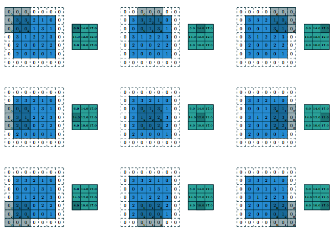

#

## Chapter 1: Introduction

### 1.1 Discrete convolutions

**Affine transformations**: a vector is received as input and is multiplied with a matrix to produce an output (to which a bias vector is usually added before passing the result through a nonlinearity) (y = x * W + b)

But affine transformations only use the input as it is a flattened matrix (all dimensions are consider the same), hence, distoring some vital properties of the input.

This is where discrete linear convolution comes to play. A discrete convolution is a linear transformation that preserves this notion of ordering. It is sparse (only a few input units contribute to a given output unit) and reuses parameters (the same weights are applied to multiple locations in the input).

**Feature maps**: a function to map a space to another one. Example in CNN, a RBG (3 feature maps, space (28, 28 3)) can be mapped to an arbitrary space ((28, 28, 6), using 1x1 convolutions, 1 stride, no padding, 6 filter)

**Kernel** (filter or feature detector): a matrix that is used to slide through input matrix in convolution transformation.

Hyperparameters in convolution layer:
* n: number of output feature maps.
* m: number of input feature maps.
* k<sub>j</sub>: kernel size along axis `j`.
* i<sub>j</sub>: input size along axis `j`.
* k<sub>j</sub>: kernel size along axis `j`.
* s<sub>j</sub>: stride (distance between two consecutive positions of the kernel) along axis `j`.
* p<sub>j</sub>: zero padding (number of zeros concatenated at the beginning and at the end of an axis) along axis `j`.

Example of 3x3 kernel, stride 2, padding 1 convolution on 2D *input feature map*:


### 1.2 Pooling

Pooling operations reduce the size of feature maps by sliding a window across the input and feeding the content of the window to a pooling function which returns the maximum or average value of the window to form subsequent matrix.

Hyperparameters in pooling layer:
* i<sub>j</sub>: input size along axis `j`.
* k<sub>j</sub>: pooling window size along axis `j`.
* s<sub>j</sub>: stride (distance between two consecutive positions of the pooling window) along axis `j`.

In some sense, pooling works very much like a discrete convolution, but replaces the linear combination described by the kernel with some other function.

Example of max pooling:


## Chapter 2 + 3: Convolution and pooling arithmetic

The relationships between convolutional layer properties don’t interact across axes so the choice of kernel size only affect the output size.

General form for calculating output matrix of convolution and pooling layer (pooling layer does not have any padding, so `p` = 0):
```
o = (i + 2p − k) / s + 1
```

## Chapter 4: Transposed convolution arithmetic

Transposed convolution is the opposite of convolution.

### 4.1 Convolution as a matrix operation


As a result of convolution, we have o<sub>0,0</sub> as:

|  |  |  |  |
|---------------|---|---|---|
| w<sub>0,1 </sub> | w<sub>0,1 </sub> | w<sub>0,2 </sub> | 0 |
| w<sub>1,1 </sub> | w<sub>1,1 <  /sub> | w<sub>1,2 </sub> | 0 |
| w<sub>2,1 </sub> | w<sub>2,1 </sub> | w<sub>2,2 </sub> | 0 |
| 0 | 0 | 0 | 0 |

Take example of the above convolution representation. If the input and output were to be unrolled into vectors from left to right, top to bottom, the convolution could be represented as a sparse matrix **C** where the non-zero elements are the elements wi,j of the kernel (with `i` and `j` being the row and column of the kernel respectively):

Note that each row of **C** is unrolled from earlier matrix.


So the convolution can be described in linear algebra form as: 
* Flatten input matrix to produce a 16-dimensional vector (orginally 4x4) denote **I**.
* Perform matrix multiplication between **C** (4x16) and **I** (16x1) to
produce a 4-dimensional vector (4, 1) that is later reshaped as the 2 × 2 output matrix.

Using this representation, the backward pass is easily obtained by transposing **C** as multiplying the loss with **C**<sub>T</sub> using 4-dimensional vector as input to produce a 16-dimensional output vector.

### 4.2 Transposed convolution

**Transposed convolution** (fractionally strided convolutions): maping from a 4-dimensional space to a 16-dimensional space.


General formula for calculating output size from transposes convolution:
```
o' = s(i' - 1) - 2p + k
```