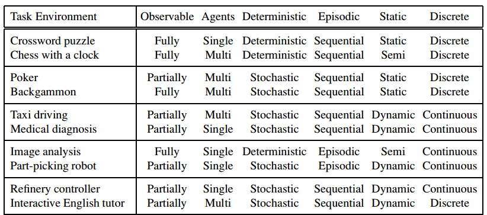

# Artificial Intelligence: A Modern Approach

# Artificial Intelligence

## Chapter 1: Introduction

### 1.1 WHAT IS AI?

Historically, there are four approaches to AI:

1. **Thinking Humanly**
2. **Acting Humanly**
3. **Thinking Rationally**
4. **Acting Rationally**

#### 1.1.1 Acting humanly: The Turing Test approach

The goal of this approach is to pass the **Turing Test** which is proposed by Alan Turing to provide a satisfactory operational definition of intelligence.

**Natural language processing (NLP)** to enable it to communicate successfully in English.

**Knowledge representation**: to store what it knows or hears.

**Automated reasoning**: to use the stored information to answer questions and to draw new conclusions.

**Machine learning**: to adapt to new circumstances and to detect and extrapolate patterns.

## Chapter 2: Intelligent Agents

### 2.1 AGENTS AND ENVIRONMENTS

An agent is anything that can be viewed as perceiving its environment through sensors and **sensor** acting upon that environment through **actuators**. So, in general, *an agent’s choice of action at any given instant can depend on the entire percept sequence observed to date, but not on anything it hasn’t perceived*.

**Agent function**: a function that maps any given percept sequence to an action

### 2.2 GOOD BEHAVIOR: THE CONCEPT OF RATIONALITY

A **rational agent** is one that does the right thing—conceptually speaking, every entry in the table for the agent function is filled out correctly.

#### 2.2.1 Rationality

What is rational at any given time depends on four things:
• The performance measure that defines the criterion of success.
• The agent’s prior knowledge of the environment.
• The actions that the agent can perform.
• The agent’s percept sequence to date.

#### 2.2.2 Omniscience, learning, and autonomy

An **omniscient** agent knows the actual outcome of its actions and can act accordingly

Rationality maximizes *expected* performance, while perfection maximizes *actual* performance

An agent relies on the prior knowledge of its designer rather than on its own percepts, we say that the agent lacks **autonomy**. Such agents are very fragile because only one change occurs in the process can ultimately fail the whole plan because agents cann't perceive new thinks.

Just like evolution provides animals with enough built-in reflexes to survive long enough to learn for themselves, an artificial intelligent agent should have ability to learn. Hence, the incorporation of learning allows one to design a single rational agent that will succeed in a vast variety of environments.

### 2.3 THE NATURE OF ENVIRONMENTS

#### 2.3.1 Specifying the task environment

**PEAS** (Performance, Environment, Actuators, Sensors): four entities in **task environment**.

1. **Performance**: how we measure preformance: accuracy, speed, safety...
2. **Environment**: 
3. **Actuators**: robotic mechanism to perform a given task.
4. **Sensors**: devices that allow AI to perceive the environment.

#### 2.3.2 Properties of task environments

Some dimensions of task environments:

* **Fully observable** vs. **partially observable**:
  * A task environment is effectively **fully observable** if the sensors detect all aspects that are relevant to the choice of action; *relevance*, in turn, depends on the performance measure
  * A task environment, in which sensors can't detect one or more than one relevant aspects that means AI needs to operate based on those missing data, is called **partially observable**.
  * If the agent has no sensors, it is **unobservable**.
* **Single agent** vs. **multiagent**: number of agents involve in a task.
  * In **multiagent** environment, agents can be **competitive** or **cooperative** with each other. While in **cooperative** environment agents require **communication** to produce rational behavior, in **competitive** environments **randomized behavior** or local rational behavior is sufficient.
* **Deterministic** vs. **stochastic**: 
  * In **deterministic** environment, the next state is fully determined by the current state and the action executed by the agent.
  * In **stochastic** environment, this computation involves **randoness**.
* **Episodic** vs. **sequential**:
  * In **episodic** environment, the  next episode does not depend on the actions taken in previous episodes.
  * In **sequential** environment, the current decision could affect all future decisions. As we say short-term actions can have long-term consequences.
* **Static** vs. **dynamic**:
* **Discrete** vs. **continuous**:
* **Known** vs. **unknown**:
  * In a **known** environment, the outcomes for all actions are given.
  * In a **unknown** environment,the agent will have to learn how it works in order to make good decisions.

Examples of task environments and their characteristics.

 

### 2.4 THE STRUCTURE OF AGENTS

```
agent = architecture + program
```

#### 2.4.1 Agent programs

**Agent program**: takes the current percept as input.

**Agent function**: takes the entire percept history.

Basic kinds of agent programs that embody the principles underlying almost all intelligent systems:
• Simple reflex agents.
• Model-based reflex agents.
• Goal-based agents.
• Utility-based agents.

#### 2.4.2 Simple reflex agents

**Simple reflex agents** select actions on the basis of the current percept, ignoring the rest of the percept history. These agent relies on **condition–action rule**.


**Simple reflex agents** work only if the correct decision can be made on the basis of only the current percept—that is, only if the environment is fully observable.

#### 2.4.3 Model-based reflex agents

The most effective way to handle partial observability is for the agent to *keep track of the part of the world it can’t see now*.

Therefore, model-based reflex agents need to keep information about theirs environment as time goes by. 

There are 2 kinds of knowledge they need:

1. How the world evolves **independently** of the agent.
2. How the agent's own actions affect the world (world **dependent** on agent)


#### 2.4.4 Goal-based agents

**Goal-based agents**: the agent needs some goal information that describes situations and take actions accordinglly.

In this type of agent, we need to calculate how a state get us to a specific goal, aka scores, and then chose the state that bring us closer to the goal, aka higher scores.


#### 2.4.5 Utility-based agents


TODO: come back

#### 2.4.6 Learning agents


**Critic**: feedback on how the agent is doing.

**Learning element**: responsible for making improvements based on **critic**.

**Performance element**: responsible for selecting external actions.

**Problem generator**: responsible for suggesting actions that will lead to new and informative experiences.