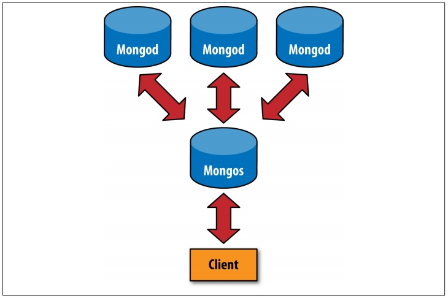

# ObjectId format

ObjectIds use 12 bytes of storage, which gives them a string representation that is 24
hexadecimal digits: 2 digits for each byte. 

<table>
  <tr>
    <td>1</td>
    <td>2</td>
    <td>3</td>
    <td>4</td>
    <td>5</td>
    <td>6</td>
    <td>7</td>
    <td>8</td>
    <td>9</td>
    <td>10</td>
    <td>11</td>
    <td>12</td>
  </tr>
  <tr style="text-align: center">
    <td colspan="4">Timestamp</td>
    <td colspan="4">Machine</td>
    <td colspan="2">PID</td>
    <td colspan="2">Increment</td>
  </tr>
</table>

# Array modifiers

### Adding

##### Adding one with $push

````
    {
        '$push': {
            'array': {
                array_element
            }
        }
    }
````

##### Adding many with $each

````
    {
        '$push': {
            'array': {
                '$each': [array_element,array_element,array_element],
            }
        }
    }
````

##### Keep array length with $slice

`$slice` value must be negative. Keeping the last pushed items

````
    {
        '$push': {
            'array': {
                '$each': [array_element,array_element,array_element],
                '$slice' : -10
            }
        }
    }
````
##### Sorting before slice

Possible sorts (`value`) are 1 (for ascending) and −1 (for descending).

````
    {
        '$push': {
            'array': {
                '$each': [array_element,array_element,array_element],
                '$slice': -10,
                '$sort': {array_value: value}
            }
        }
    }
````

###### P/S: 
Note that you must include "$each"; you cannot just "$slice" or "$sort" an array with "$push".

##### Prevent duplications with $ne and $addToSet

```
    {
        "$addToSet" : {
            "emails" : "joe@gmail.com"
        }
    }
```

`$addToSet` can be used with `$each`

```
    {
        "$addToSet" : {
            "emails" : {
                "$each" :["joe@php.net", "joe@example.com", "joe@python.org"]
            }
        }
    }
```

##### Removing elements with $pop, $pull

`$pop` treats array as a queue. `key` takes 1 (poping from the end of array) and -1.

```
     {"$pop" : {"key" : 1}}
```

`$pull` remove a specific item(s) in array

Pulling one:

```
    {
        "$pull" : {
            "todo" : "laundry"
        }
    }
```

Pulling many:

```
    {
        "$pull" : {
            "todo" : [
                 "dishes",
                 "dry cleaning"
            ]
        }
    }
```

##### Positional array modifications

Increment `votes` of the `comments[0]` by 1.

```
    {"$inc" : {"comments.0.votes" : 1}}
```

Find John in `comments.author` and change it to Jim.

```
    db.blog.update(
        {
            "comments.author" : "John"
        },  
        {
            "$set" : {
                "comments.$.author" : "Jim"
            }
        }
    )
```

This only change the first match.

##### Modifier speed
Typically, documents are stored next to each other, so if your documents get 
bigger, they will be moving to the end. Moving is slow
Beware of "paddingFactor" in MongoDB. If you change the size of a document,  
it will leave a hole in memory which will lead to memory inefficiency.

MongoDB is currently not great at reusing free spaces left by moving.
 
TODO: Compacting data and schema design solutions


# Upsert

If no document is found that matches the update criteria, a new document will
 be created by combining the criteria and updated documents.
 
Use "$setOnInsert` to seed document when it is created and not will not updated.

```
    db.users.update(
        {},
        {
            "$setOnInsert" : {
                "createdAt" : new Date()
            }
        },
        true)
```

# Write Concern

Write concern is a client setting used to describe how safely a write should 
be stored before the application continues. By default, inserts, removes, and
 updates wait for a database response—did the write succeed or not?—before continuing.
 

# Queries

### Conditional queries

"$lt", "$lte", "$gt", "$ne", "$gte", "$mod", "$not"

### OR queries

OR condition for a single key: `$in` or `$nin` (not in)

```
    db.users.find(
        {
            "user_id" : {
                "$in" : [12345, "joe"]
            }
        })
```

OR condition with '$or'

```
    db.raffle.find(
        {
            "$or" : [{"ticket_no" : 725}, {"winner" : true}]
        })
        
    db.raffle.find(
        {
            "$or" : [
                {
                    "ticket_no" : {"$in" : [725, 542, 390]}
                },{
                    "winner" : true
                }]
        })
```

### Regular Expressions

Mongo uses  Perl Compatible Regular Expression to match regex. Should check 
with js shell before using in queries.

Find case-insensitive 

```
    db.users.find({"name" : /joe/i})
    return joe and Joe
    
    db.users.find({"name" : /joey?/i})
    return joe and Joe and joey and Joey
```

### Querying Arrays

Query an item in array

```
    db.food.find(
        {
            "fruit" : "banana"
        })
```

Query many items in array

```
    db.food.find(
        {
            fruit : {
                $all : ["apple", "banana"]
            }
        })
```

Query exact match

```
    db.food.find(
        {
            "fruit" : ["apple", "banana", "peach"]
        })
```

Query with specific item value. `fruit[2]` == "peach"

```
    db.food.find(
        {
            "fruit.2" : "peach"
        })
```

### Array and range query interactions

For example, we have:

```
    {"x" : 5}
    {"x" : 15}
    {"x" : 25}
    {"x" : [5, 25]}
```

##### Query with $lt and $gt

Query

```
    db.test.find(
        {
            "x" : {
                "$gt" : 10, "$lt" : 20
            }
        })
```

Return

```
    {"x" : 15}
    {"x" : [5, 25]}
```

Becasue 5 < 20 and 25 > 10.

##### Query with "$elemMatch"

Query

```
    db.test.find(
        {
            "x" : {
                "$elemMatch" : {
                    "$gt" : 10, "$lt" : 20
                }
            }
        })
```

Return

```
    no results
```

Because `$elemMatch` won’t match non-array elements.

##### Query with min() and max()

Query

```
    db.test.find(
        {
            "x" : {
                "$gt" : 10, "$lt" : 20
            }
        }).min({"x" : 10}).max({"x" : 20})
```

Return

```
    {"x" : 15}
```

### Querying on Embedded Documents

##### Querying for the whole document

The following is order sensitive

```
    db.people.find(
        {
            "name" : {
                "first" : "Joe", "last" : "Schmoe"
            }
        })
```

##### Querying for its individual key/value pairs

```
    db.people.find(
        {
            "name.first" : "Joe", 
            "name.last" : "Schmoe"
        })
```

##### Querying in nested embedded documents

Example: want to find comments by Joe that were scored at least a 5

```
{
    "content" : "...",
    "comments" : [
        {
            "author" : "joe",
            "score" : 3,
            "comment" : "nice post"
        },
        {
            "author" : "mary",
            "score" : 6,
            "comment" : "terrible post"
        }
    ]
}
```

These queries won't work
```
    // Match exact document
    db.blog.find(
        {
            "comments" : {
                "author" : "joe",
                "score" : {
                    "$gte" : 5}
                }
            }
        })
        
    // Return the both ??? why both ???
    db.blog.find(
        {
            "comments.author" : "joe",
            "comments.score" : {
                "$gte" :5
            }
        })
```


```
    db.blog.find(
        {
            "comments" : {
                "$elemMatch" : {
                    "author" : "joe",
                    "score" : {
                        "$gte" : 5
                    }
                }
            }
        })
```

# $where Queries

Use aggregation instead

# Server-Side Scripting

```js
    func = "function() { print('Hello, "+name+"!'); }"
```

Might turn to 

```js
    func = "function() { print('Hello, '); db.dropDatabase(); print('!'); }"
```

Which will run `db.dropDatabase()` and you lose entire database.
To prevent this, use scope to pass in a name.

```python
    func = pymongo.code.Code(
        "function() {
            print('Hello, '+username+'!'); 
        }",{
            "username": name
        })
```

# Comparison order

1. Minimum value
2. null
3. Numbers (integers, longs, doubles)
4. Strings
5. Object/document
6. Array
7. Binary data
8. Object ID
9. Boolean
10. Date
11. Timestamp
12. Regular expression
13. Maximum value

# Avoiding Large Skips

Skip is slow and should be avoided

This is a bad implementation. Never do it.

```
    var page1 = db.foo.find(criteria).limit(100)
    var page2 = db.foo.find(criteria).skip(100).limit(100)
    var page3 = db.foo.find(criteria).skip(200).limit(100)
```

Using conditional query instead. For example.

```
    var page1 = db.foo.find().sort({"date" : -1}).limit(100)
    var latest = page1[100]
    
    // Query the next 100 items by querying based on date 
    var page2 = db.foo.find({"date" : {"$gt" : latest.date}}).sort({"date" : -1}).limit(100)
```

# Getting Consistent Results

It is very important to know that if you update your documents, chances are 
they will get bigger and no longer fit to the space they were before. MongoDB
 will move those documents to the end of the collection, so that in some 
 cases for program will run into a loop in which it tries to update the 
 updated objects.

You might want to use 

```
    db.foo.find().snapshot()
```

for updating objects once. Snapshotting makes queries slower.

Inconsistencies arise only when the collection changes under a cursor while 
it is waiting to get another batch of results.

# Chap 5: Indexing

## Introduction

Index dramatically reduces query time by minimizing scanned objects. Indexing comes with a price. It will slows down INSERT, UPDATE, DELETE operations because mongo needs to update index afterward. Should only use a couple of indexes in a collection althought mongoDB support up to 64.

### Create an index

```
	db.users.ensureIndex({"username" : 1})
```

### Create compound indexes

```
	db.users.ensureIndex({"age" : 1, "username" : 1})
```

What it does is that it will sort the collection based on `age` first and then `username`.

Example without indexes

```
	{
		{ "username" : "user0", "age" : 69 },
		{ "username" : "user1", "age" : 50 },
		{ "username" : "user2", "age" : 88 },
		{ "username" : "user3", "age" : 52 },
		{ "username" : "user4", "age" : 74 },
		{ "username" : "user5", "age" : 104 },
		{ "username" : "user6", "age" : 59 },
		{ "username" : "user7", "age" : 102 },
		{ "username" : "user8", "age" : 94 },
		{ "username" : "user9", "age" : 7 },
		{ "username" : "user10", "age" : 80 }
	}
```

With compound index `{"age" : 1, "username" : 1}`

```
	[0, "user100309"] -> 0x0c965148
	[0, "user100334"] -> 0xf51f818e
	[0, "user100479"] -> 0x00fd7934
	...
	[0, "user99985" ] -> 0xd246648f
	[1, "user100156"] -> 0xf78d5bdd
	[1, "user100187"] -> 0x68ab28bd
	[1, "user100192"] -> 0x5c7fb621
	...
	[1, "user999920"] -> 0x67ded4b7
	[2, "user100141"] -> 0x3996dd46
	[2, "user100149"] -> 0xfce68412
	[2, "user100223"] -> 0x91106e23
```

Sorted by `age` and then `username` and each has a pointer to memory location.

### Three most common ways to query with index

##### Point query

Very efficient because it can jump directly to the correct age and return already sorted list.

```
	db.users.find(
		{
			"age" : 21
		}
	).sort(
		{
			"username" : -1
		}
	)
```

##### Multi-value query

Still efficient.

```
	db.users.find({
		"age" : {
			"$gte" : 21, "$lte" : 30
		}
	})
```

##### Multi-value query with sort

Less efficient than the previous one because returning result is not in sorted order. `sort()` depends on how big the result is.

```
	db.users.find({
		"age" : {
			"$gte" : 21,
			"$lte" : 30
		}
	}).sort({
		"username" :1
	})
```

##### Index in reverse order

```
	{"username" : 1, "age" : 1}
```

### Compound Indexes

This matters if you oftern apply sorting on mutiple keys.
For example index:

```
	{"age" : 1, "username" : 1}
```

These sorts are good

```
	{"age" : 1, "username" : 1}
	{"age" : 1, "username" : -1}
	{"age" : -1, "username" : -1}
	{"age" : -1, "username" : 1}
```

But these will take longer

```
	{"username" : 1, "age" : 1}
	{"username" : 1, "age" : -1}
	{"username" : -1, "age" : -1}
	{"username" : -1, "age" : 1}
```

### Covered Indexes
When an index contains all the values requested by the user, it is considered to be covering a query. This type of query is faster because it does not need to follow the pointer to fetch the whole document.

### How $-Operators Use Indexes

##### Inefficient operators

`$where`, `$exists`, `$ne`

##### Ranges

When designing an index with multiple fields, put fields that will be used in exact matches first (e.g., "x" : "foo" ) and ranges last (e.g., "y": {"$gt" : 3, "$lt" : 5} ). This allows the query to find an exact value for the first index key and then search within that for a second index range. Using this way, the query can save time by eliminating documents that to be search for range later.

Example query:

```
	{
		"age" : 47, 
        "username" : {
            "$gt" : "user5", 
            "$lt" : "user8"
        }
    }
```

With index `{"age" : 1, "username" : 1}`, it will return users with `age` 47 very quickly and then do search on those returned documents. It is efficient.

With index `{"username" : 1, "age" : 1}`, it searches for `username` between "user5" and "user8" and then pick out the ones with `age` 47. This forces DB to scan more items and searching for range takes more time than searching for exact value so this approach for inefficient.

##### OR queries

As of this writing, MongoDB can only use one index per query. That is, if you create one index on {"x" : 1} and another index on {"y" : 1} and then do a query on {"x" : 123, "y" : 456} , MongoDB will use one of the indexes you created, not use both. This only exception to this rule is "$or" . "$or" can use one index per $or clause, as $or preforms two queries and then merges the results.

But in general, doing 2 seperate queries is much less efficient than doing one because MongoDB has to loop through the results and remove duplicates. So, prefer `$in` to `$or` whenever possible.

##### Indexing Objects and Arrays

Not sure why you want to do this. Not recommended.

##### Index Cardinality

**Cardinality** refers to how many distinct values there are for a field in a collection. 

As a rule of thumb, try to create indexes on high-cardinality keys or at least put high-cardinality keys first in compound indexes (before low-cardinality keys).

### explain() and hint()

`explain()` is a function that describes how the query works. `explain()` must be called last. Two type of explains:

1. For non-indexed queries
2. For indexed queries

##### Indexed queries

Returned keys:

* **cursor**: Indicate index in query.
* **isMultiKey**: If this query used a multikey index.
* **n**: The number of documents returned by the query.
* **nscannedObjects**: The number of times MongoDB had to follow an index pointer to the actual document on disk
* **nscanned**: The number of documents examined.
* **scanAndOrder**: If MongoDB had to sort results in memory.
* **indexOnly**: If MongoDB was able to fulfill this query using only the index entries.
* **nYields**: The number of times this query yielded (paused) to allow a write request to proceed.
* **millis**: Time to execute the query.
* **indexBounds**: Describes how the index was used.

Call `hint()` to force index. If not, MongoDB will automatically choose an index.

##### The Query Optimizer

MongoDB also provides the query optimizer which will choose a subset of possible indexes, run your query with those indexes in parallel. The first plan returns 100 results is the "winner" and MongoDB will cache that index for this query. That index will be reevaluated after a index is created or after every 1000 queries.

##### When Not to Index

Indexes become less and less efficient as you need to get larger percentages of a collection because using an index requires two lookups:

1. Look at the index entry.
2. Following the index’s pointer to the document.

A table scan only requires one: 

1. Looking at the document.


**Caution**: if a query is returning 30% or more of the collection, start looking at whether indexes or table scans are faster. However, this number can vary from 2% to 60%.

You can force it to do a table scan by hinting {"$natural" : 1}

```
    db.entries.find({"created_at" : {"$lt" : hourAgo}}).hint({"$natural" : 1})
```

### Types of Indexes

##### Unique Indexes

Enforce uniqueness.

```
    db.users.ensureIndex({"username" : 1}, {"unique" : true})
```

**Caution**: 

1. If a key does not exist, the index stores its value as null for that document. This means that if you create a unique index and try to insert more than one document that is missing the indexed field, the inserts will fail because you already have a document with a value of null.

2. All fields must be smaller than 1024 bytes to be included in an index. This means that keys longer than 8 KB will not be subject to the unique index constraints: you can insert identical 8 KB strings, for example.

##### Compound unique indexes

You can do that. For example, we have unique index on `{"username" : 1, "age" : 1}`, so the following is legal but a second copy of any of these documents would cause a duplicate key exception.

```
    db.users.insert({"username" : "bob"})
    db.users.insert({"username" : "bob", "age" : 23})
    db.users.insert({"username" : "fred", "age" : 23})
```

##### Dropping duplicates

If you apply unique index on existing collection, you might key a duplicate key exception. You and force this operation by adding `dropDups` which will only keep one of the duplicate items and remove the rest. 

```
    db.people.ensureIndex({"username" : 1}, {"unique" : true, "dropDups" : true})
```

**Caution**: You have no control over which to keep and which to remove so do not use it with important data.

### Sparse Indexes

**Def**

MongoDB **sparse indexes**: indexes that need not include every document as an entry.

Apply unique key name `email` but do not require it.

```
    db.ensureIndex({"email" : 1}, {"unique" : true, "sparse" : true})
```

Sparse indexes do not necessarily have to be unique.

**Caution**: The same query can return different results depending on whether or not it uses the sparse index.

Example collection:

```
    {"_id" : 0 }
    {"_id" : 1, "x" : 1 }
    {"_id" : 2, "x" : 2 }
    {"_id" : 3, "x" : 3 }
```

We use query

```
    db.foo.find({"x" : {"$ne" : 2}})
```

1. With no index:

```
    {"_id" : 0 }
    {"_id" : 1, "x" : 1 }
    {"_id" : 3, "x" : 3 }
```

2. With index db.ensureIndex({"x" : 1}, {"sparse" : true})

```
    {"_id" : 1, "x" : 1 }
    {"_id" : 3, "x" : 3 }
```

Because `{"_id" : 0 }` does not have key `x` so it is not included in the index.

### Index Administration

* All indexes are stored in *system.indexes* collection.
* *system.indexes* is reserved so you cannot modify or remove items directly
* Modify or remove indexes by calling `ensureIndex` or `dropIndexes`.

Get indexes in a collection:

```
    db.collectionName.getIndexes()
```

**Caution**: The "v" field is used internally for index versioning. If you have any indexes that do not have a "v" : 1 field, they are being stored in an older, less efficient format. You can upgrade them by ensuring that you’re running at least MongoDB version 2.0 and dropping and rebuilding the index.

##### Identifying Indexes

**Caution**: By default, when MongoDB build an index, it blocks all reads and writes on a database until the index build has finished.

**Tips**: Use the background option when building an index. This will yield to other operations but still have severe impact. It is much slower.

**TIPS**: If you have the choice, creating indexes on existing documents is slightly faster than creating the index first and then inserting all documents.

---
## Part II: Design Your Apllication

### Chapter 6: Special Index and Collection Types

#### Capped Collections

Unilike "normal" collections which grow dynamically, **capped colection** is created in advance and is fixed in size. 

Capped collection: 

1. Behaves like a circular queues.
If we’re out of space, the oldest document will be deleted, and the new one will take its place.
2. Moved, deleted, and updates that would cause documents to grow are not allowed.

**Tips**: Capped collections cannot be sharded.

#####Creating Capped Collections

Capped Collections has `size` of 100000 bytes and `max` number of documents is 100.

```
    db.createCollection(
        "my_collection", {
            "capped" : true, 
            "size" : 100000,
            "max" : 100
        });
```

**Caution**: Once a capped collection has been created, it cannot be changed.

#####Sorting Au Naturel

Sort oldest to newest.

```
    db.my_collection.find().sort({"$natural" : 1})
```

Sort newest to oldest.

```
    db.my_collection.find().sort({"$natural" : -1})
```

#####Tailable Cursors

**Tailable cursors**: a special type of cursor that are not closed when their results are exhausted. 

Tailable cursors:
1. Can be used only on capped collections, since insert order is not tracked for normal collections.
2. Will time out after 10 minutes of no results.
3. *mongo* shell does not allow you to use tailable cursors.

#####No-_id Collections

**Trap**: Do not create a collection with `_id`.

#### Time-To-Live Indexes (TTL)

**TTL** indexes allow you to set a timeout for each document.

This type of index is useful for caching problems like session storage.

This creates a TTL index on the "lastUpdated" field. If a document’s "lastUpdated" field exists and is a date, the document will be removed once the server time is expireAfterSecs seconds ahead of the document’s time.

```
    db.foo.ensureIndex({
            "lastUpdated" : 1
        }, 
        {
            "expireAfterSecs" : 60*60*24
        })
```

#### Full-Text Indexes

Full-text indexes is used for indexing text in documents. They are particularly heavyweight.

**Trap**: Use full-text indexes with caution because this type of index will slow down your application serverely.

```
    db.adminCommand({"setParameter" : 1, "textSearchEnabled" : true})
```

TODO: read this section again.

#### Geospatial Indexing

TODO: read this section again.

#### Storing Files with GridFS

**GridFS**:  a mechanism for storing large binary files in MongoDB.

Upsides:

*   Simplify your stack.
*   Will leverage any existing replication or autosharding that you’ve set up.
*   Alleviate some of the issues that certain filesystems can exhibit when
being used to store user uploads.
*   Great disk locality.

Downsides:

*   Slower performance.
*   Can only modify documents by deleting them and resaving the whole thing.

**Tips**: GridFS is generally best when you have large files you’ll be accessing in a sequential fashion that won’t be changing much.

#####mongofiles

Access GridFS with `mongofiles` cli.

```sh
    $ echo "Hello, world" > foo.txt                                       // Write a file name 'foo.txt'
    $ mongofiles put foo.txt                                            // Write it to mongo
    connected to: 127.0.0.1
    added file: { _id: ObjectId('4c0d2a6c3052c25545139b88'),
     filename: "foo.txt", length: 13, chunkSize: 262144,
     uploadDate: new Date(1275931244818),
     md5: "a7966bf58e23583c9a5a4059383ff850" }
    done!
    $ mongofiles list                                                   // List all files in mongo
    connected to: 127.0.0.1
    foo.txt 13
    $ rm foo.txt
    $ mongofiles get foo.txt                                            // Get file name in 'foo.txt' and write it to current directory
    connected to: 127.0.0.1
    done write to: foo.txt
    $ cat foo.txt
    Hello, world
```

#####Under the Hood

* The basic idea behind GridFS is that we can store large files by splitting them up into chunks and storing each chunk as a separate document.
* In addition to storing each chunk of a file, we store a single document that groups the chunks together and contains metadata about the file.
* The chunks for GridFS are stored in their own collection.
* By default chunks will use the collection fs.chunks.
* By default, the metadata for each file is stored in fs.files collection.

Structure of the individual documents in chunks collection:

```
    {
        "_id" : ObjectId("..."),
        "n" : 0,
        "data" : BinData("..."),
        "files_id" : ObjectId("...")
    }
```

**files_id**: The "_id" of the file document that contains the metadata for this chunk.

**n**: The chunk’s position in the file, relative to the other chunks.

**data**: The bytes in this chunk of the file.

Keys that are mandated by the GridFS specification:

* **_id**: A unique id for the file—this is what will be stored in each chunk as the value for the "files_id" key.
* **length**: The total number of bytes making up the content of the file.
* **chunkSize**: The size of each chunk comprising the file, in bytes. The default is 256K, but this can be adjusted if needed.
* **uploadDate**: A timestamp representing when this file was stored in GridFS.
* **md5**: An md5 checksum of this file’s contents, generated on the server side.

**Tips**: Users can check the value of the "md5" key to ensure that a file was uploaded correctly.

### Chapter 7: Aggregation

#### The Aggregation Framework

The **aggregation framework** lets you transform and combine documents in a collection. Basically, you build a pipeline that processes a stream of documents through several building blocks: filtering, projecting, grouping, sorting, limiting, and skipping.

For example, if you had a collection of magazine collection, you might want find out who your most prolific authors were. You could create a pipeline with several steps:

1. Project the authors out of each article document.
2. Group the authors by name, counting the number of occurrences.
3. Sort the authors by the occurrence count, descending.
4. Limit results to the first five.

Detail:

1. {"$project" : {"author" : 1}}

    This selects only `author` field in documents.

    **Result**: ` {"_id" : id, "author" : "authorName"}`

2. {"$group" : {"_id" : "$author", "count" : {"$sum" : 1}}}

    This groups the authors by name and increments "count" for each document an author appears in.

    - `"_id" : "$author"`

        Specify the field we want to group by.

    - `"count" : {"$sum" : 1}`

        Increment article count by 1.

    **Result**: ` {"_id" : "authorName", "count" : articleCount}.`

3. {"$sort" : {"count" : -1}}

    This reorders the result documents in descending order.

4. {"$limit" : 5}

    This limits the result set to the first five result documents.

**Caution**: Aggregation results are limited to 16 MB of data

#### Pipeline Operations

#####$match

`$match` filters documents so that you can run an aggregation on a subset of documents.

* Can be used with usual query operators ("$gt", "$lt", "$in", etc).
* Cannot be used with geospatial operators.

```
    db.collection.aggregate(
        {
            $match : {
                "state" : "OR"
            }
        })
```

**Tips**: Good practice is to put "$match" expressions as early as possible in the pipeline. It lightens workload by filtering unecessary documents.

#####$project

"$project" allows you to extract fields from subdocuments, rename fields, and perform interesting operations on them.

```
    db.collection.aggregate(
        {
            "$project" : {
                "author" : 1, "_id" : 0
            }
        })
```

You can also rename the projected field. For example, you want to return the "_id" of each user as  "userId".

```
    db.collection.aggregate(
        {
            "$project" : {
                "userId" : "$_id", 
                "_id" : 0
            }
        })
```

The `$fieldname` syntax is used to refer to fieldname’s value in the aggregation framework.

######Pipeline expressions

**Mathematical expressions**: let you manipulate numeric values.

```
    db.collection.aggregate(
        {
            "$project" : {
                "totalPay" : {
                    "$add" : ["$salary", "$bonus"]
                }
            }
        })
```

Expression syntax:

* `$add` : [expr1[, expr2, ..., exprN]]

    Takes one or more expressions and adds them together.
* `subtract` : [expr1, expr2]

    Takes two expressions and subtracts the second from the first.
* `$multiply` : [expr1[, expr2, ..., exprN]]

    Takes one or more expressions and multiplies them together.
* `$divide` : [expr1, expr2]

    Takes two expressions and divides the first by the second.
* `$mod` : [expr1, expr2]

    Takes two expressions and returns the remainder of dividing the first by the second.

**Date expressions**

"$year", "$month", "$week", "$dayOfMonth", "$dayOfWeek", "$dayOfYear", "$hour", "$minute", and "$second".

**String expressions**

Basic string operations:

* `$substr` : [expr, startOffset, numToReturn]

    This returns a substring of the first argument, starting at the startOffset-th byte and including the next numToReturn bytes (note that this is measured in bytes, not characters, so multibytes encodings will have to be careful of this). expr must evaluate to a string.

* `$concat` : [expr1[, expr2, ..., exprN]]

    Concatenates each string expression (or string) given.

* `$toLower`: expr

    Returns the string in lower case. expr must evaluate to a string.


* `$toUpper`: expr

    Returns the string in upper case. expr must evaluate to a string.

Example that generates email addresses of the format j.doe@example.com:

```
    db.collection.aggregate(
        {
            "$project" : {
                "email" : {
                    "$concat" : [
                        {
                            "$substr" : ["$firstName", 0, 1]
                        },
                        ".",
                        "$lastName",
                        "@example.com"
                        ]
                    }
            }
        })
```

**Logical expressions**

There are several comparison expressions:

* `$cmp` : [expr1, expr2]

    Compare expr1 and expr2. Return 0 if the two expressions are equal, a negative number if expr1 is less than expr2, and a positive number if expr2 is less than expr1.

* `$strcasecmp` : [string1, string2]

    Case insensitive comparison between string1 and string2. Only works for Roman characters.

* `$eq`/`$ne`/`$gt`/`$gte`/`$lt`/`$lte` : [expr1, expr2]

    Perform the comparison on expr1 and expr2, returning whether it evaluates to true or false.

There are a few boolean expressions:

* `$and` : [expr1[, expr2, ..., exprN]]

    Returns true if all expressions are true.

* `$or` : [expr1[, expr2, ..., exprN]]

    Returns true if at least one expression is true.

* `$not` : expr

    Returns the boolean opposite of expr.

Finally, there are two control statements:

* `$cond` : [booleanExpr, trueExpr, falseExpr]

    If booleanExpr evaluates to true, trueExpr is returned; otherwise falseExpr is returned.

* `$ifNull` : [expr, replacementExpr]

    If expr is null this returns replacementExpr; otherwise it returns expr.

**Tips**: Pipelines are particular about getting properly formed input, so these operators can be invaluable in filling in default values. If your data set is inconsistent, you can use this conditionals to detect missing values and populate them.

**A projection example** 

Suppose a professor wanted to generate grades using a somewhat complex calculation: the students are graded 10% on attendance, 30% on quizzes, and 60% on tests (unless the student is a teacher’s pet, in which case the grade is set to 100).

```
    db.collection.aggregate(
    {
        "$project" : {
            "grade" : {
                "$cond" : [                                                     // conditional operator
                    "$teachersPet",
                    100,                                                        // if
                    {                                                           // else
                        "$add" : [
                            {"$multiply" : [.1, "$attendanceAvg"]},
                            {"$multiply" : [.3, "$quizzAvg"]},
                            {"$multiply" : [.6, "$testAvg"]}
                        ]
                    }
                ]
            }
        }
    })
```

#####$group

Grouping allows you to group documents based on certain fields and combine their values. 

Example:

If we had a collection of students and we wanted to organize student into groups based on grade, we could group by their "grade" field.

```
    db.collection.aggregate(
    {
        "$group" : {
            "_id" : "$day"
        }
    })
```

This will return

```
 {
    "result" : [
        {"_id" : "A+"}, 
        {"_id" : "A"}, 
        {"_id" : "A-"}, 
        ..., 
        {"_id" : "F"}
    ],
    "ok" : 1
}
```

**Grouping operators**

* **$sum** : value
* **$avg** : value

```
    db.sales.aggregate(
    {
        "$group" : {
            "_id" : "$country",
            "totalRevenue" : {
                "$average" : "$revenue"
            },
            "numSales" : {
                "$sum" : 1
            }
        }
    })
```

* **$max** : expr

    Returns the greatest value of any of the inputs.

* **$min** : expr

    Returns the smallest value of any of the inputs.

* **$first** : expr

    This returns the first value seen by group, ignoring subsequent values. This is only sensible to use when you know the order that the data is being processed in: that is, after a sort.

* **$last** : expr

    This is the opposite of the previous; it returns the last value seen by the group.

* **$addToSet** : expr

    Keeps an array of values seen so far and, if expr is not present in the array, adds it. Each value appears at most once in the resulting array and ordering is not guaranteed.

* **$push** : expr

    Indiscriminately adds each value seen to the array. Returns an array of all values.


**Note**:  with sharding, **$group** will first be run on each shard and then the individual shards’ groups will be sent to the
mongos to do the final grouping and the remainder of the pipeline will be run on the mongos (not the shards).

#####$unwind

`$unwind` turns each field of an array into a separate document.

Example, we have a document like this:

```
    {
        "_id" : ObjectId("50eeffc4c82a5271290530be"),
        "author" : "k",
        "post" : "Hello, world!",
        "comments" : [
            {
                "author" : "mark",
                "date" : ISODate("2013-01-10T17:52:04.148Z"),
                "text" : "Nice post"
            },
            {
                "author" : "bill",
                "date" : ISODate("2013-01-10T17:52:04.148Z"),
                "text" : "I agree"
            }
        ]
    }
```

Running `db.blog.aggregate({"$unwind" : "$comments"})` will return:

```
    {
        "results" :[
            {
                "_id" : ObjectId("50eeffc4c82a5271290530be"),
                "author" : "k",
                "post" : "Hello, world!",
                "comments" : {
                    "author" : "mark",
                    "date" : ISODate("2013-01-10T17:52:04.148Z"),
                    "text" : "Nice post"
                }
            },
            {
                "_id" : ObjectId("50eeffc4c82a5271290530be"),
                "author" : "k",
                "post" : "Hello, world!",
                "comments" : {
                    "author" : "bill",
                    "date" : ISODate("2013-01-10T17:52:04.148Z"),
                    "text" : "I agree"
                }
            }
        ],
        "ok" : 1
    }

```

Notice that the original document has been splitted into two documents with the same `_id`, `author`, and `post`.

**Tips**: This is particularly useful if you want to return certain subdocuments from a query: `$unwind` the subdocuments and then `$match` the ones you want.

**Tips**: Attempt to filter out as many documents (and as many fields from the documents) as possible at the beginning of your pipeline before hitting any `$project`, `$group`, or `$unwind` operations. This will reduce the workload for aggregation.

#### MapReduce

MapReduce:

+ Can solve some problems that are too complex to express using the aggregation framework’s query language.

+ Can be easily parallelized across multiple servers

    It splits up a problem, sends chunks of it to different machines, and lets each machine solve its part of the problem. When all the machines are finished, they merge all the pieces of the solution back into a full solution.

- Tends to be fairly slow and should not be used for real-time data analysis.

MapReduce steps:

1. **map**

    It maps an operation onto every document in a collection.

2. **shuffle**

    Keys are grouped and lists of emitted values are created for each key.

3. **reduce**

    Takes this list of values and reduces it to a single element.

4. **result**

    The element from step 3 is returned to the shuffle step until each key has a list containing a single value.

#####MongoDB and MapReduce

TODO: read this section again.

#### Aggregation Commands

#####count

```
    db.foo.count({"x" : 1})

```

#####distinct

```
    db.runCommand({"distinct" : "people", "key" : "age"})

```

Returns

```
    {  
        "values" : [20, 35, 60],
        "ok" : 1
    }
```

#####group

You choose a key to group by, and MongoDB divides the collection into separate groups for each value of the chosen key. 

**Tips**: If you are familiar with SQL, group is similar to SQL’s GROUP BY.

Example data:

```
    {"day" : "2010/10/03", "time" : "10/3/2010 03:57:01 GMT-400", "price" : 4.23}
    {"day" : "2010/10/04", "time" : "10/4/2010 11:28:39 GMT-400", "price" : 4.27}
    {"day" : "2010/10/03", "time" : "10/3/2010 05:00:23 GMT-400", "price" : 4.10}
    {"day" : "2010/10/06", "time" : "10/6/2010 05:27:58 GMT-400", "price" : 4.30}
    {"day" : "2010/10/04", "time" : "10/4/2010 08:34:50 GMT-400", "price" : 4.01}
```

We want our results to be a list of the latest time and price for each day:

```
    db.runCommand(
        {
            "group" : {
                "ns" : "stocks",
                "key" : "day",
                "initial" : {
                    "time" : 0
                },
                "$reduce" : function(doc, prev) {
                    if (doc.time > prev.time) {
                        prev.price = doc.price;
                        prev.time = doc.time;
                    }
                }
            }
        })
```

* `"ns" : "stocks"`

    This determines which collection we’ll be running the group on.

* `"key" : "day"`

    This specifies the key on which to group the documents in the collection. In this case, all the documents with a "day" key of a given value will be grouped together.

* `"initial" : {"time" : 0}`

    The first time the reduce function is called for a given group, it will be passed the initialization document. This same accumulator will be used for each member of a given group, so any changes made to it can be persisted.

* `"$reduce" : function(doc, prev) { ... }`

    This will be called once for each document in the collection. It is passed the current document and an accumulator document: the result so far for that group. In this example, we want the reduce function to compare the current document’s time with the accumulator’s time. If the current document has a later time, we’ll set the accumulator’s day and price to be the current document’s values. Remember that there is a separate accumulator for each group, so there is no need to worry about different days using the same accumulator.

**Note**: Some documentation refers to a "cond" or "q" key, both of which are identical to the "condition" key (just less descriptive).

#####Using a finalizer

Finalizers can be used to minimize the amount of data that needs to be transferred from the database to the user, which is important because the `group` command’s output needs to fit in a single database response.

Example, we want to find the most popular tag for each day. We group by day (again) and keep a count for each tag

```
db.posts.group(
    {
        "key" : {"day" : true},
        "initial" : {
            "tags" : {}
        },
        "$reduce" : function(doc, prev) {
            for (i in doc.tags) {
                if (doc.tags[i] in prev.tags) {
                    prev.tags[doc.tags[i]]++;
                } else {
                    prev.tags[doc.tags[i]] = 1;
                }
            }
        }
    })
```

That will return 

```
    [
        {"day" : "2010/01/12", "tags" : {"nosql" : 4, "winter" : 10, "sledding" : 2}},
        {"day" : "2010/01/13", "tags" : {"soda" : 5, "php" : 2}},
        {"day" : "2010/01/14", "tags" : {"python" : 6, "winter" : 4, "nosql": 15}}
    ]
```

But this will return tag counts on everyday to the client which is extremely heavyload. We can use finalize to eliminate uneccessary items.

```
    db.runCommand({
        "group" : {
            "ns" : "posts",
            "key" : {"day" : true},
            "initial" : {"tags" : {}},
            "$reduce" : function(doc, prev) {
                for (i in doc.tags) {
                    if (doc.tags[i] in prev.tags) {
                        prev.tags[doc.tags[i]]++;
                    } else {
                        prev.tags[doc.tags[i]] = 1;
                    }
                }
            },
            "finalize" : function(prev) {
                var mostPopular = 0;
                for (i in prev.tags) {
                    if (prev.tags[i] > mostPopular) {
                        prev.tag = i;
                        mostPopular = prev.tags[i];
                    }
                }
                delete prev.tags
            }
        }
    })
```

This will return a simpler result.

```
    [
        {"day" : "2010/01/12", "tag" : "winter"},
        {"day" : "2010/01/13", "tag" : "soda"},
        {"day" : "2010/01/14", "tag" : "nosql"}
    ]
```

#####Using a function as a key

Example, query that is case-insensitive `MongoDB` and `mongodb`

```
    db.posts.group({
        "ns" : "posts",
        "$keyf" : function(x) { 
            return x.category.toLowerCase(); 
        },
        "initializer" : ... 
    })
```

* `$keyf` (key function) allows you can group by arbitrarily complex criteria.

### Chapter 8: Application Design

#### Normalization versus Denormalization

**Normalization** is dividing up data into multiple collections with references between collections.
**Denormalization** is the opposite of normalization: embedding all of the data in a single document. 

**Note**: MongoDB has no joining facilities, so gathering documents from multiple collections will require multiple queries.
**Note**: Typically, normalizing makes writes faster and denormalizing makes reads faster. 

#####Examples of Data Representations

Example:

Suppose we are storing information about students and the classes that they are taking. There are couple ways to store information.

######1. Three collections
 One way to represent this would be to have a **students** collection (each student is one document) and a **classes** collection (each class is one document). Then we could have a third collection (**studentClasses**) that contains references to the student and classes he is taking.

If we wanted to find the classes a student was taking, we would query for the student in the **students** collection, query **studentClasses** for the course "_id"s, and then query the **classes** collection for the class information. Hence, it is **3** trips to he server.

Benefits:

* Light load for **students** collection.

Drawbacks:

* Slow

######2. Two collections

We can remove one of the dereferencing queries by embedding class references in the student's documents which gets rid of the **studentClasses** collection. In this case, we would query for the student in the **students** collection which will return class ids and then we query for those classes in **classes** collection. It only takes 2 queries.

Benefits:

* Faster the previous

Drawbacks:

* Heavy load for **students** collection.
* Array should not store many entries.

This is fairly popular way to structure data that does not need to be instantly accessible and changes, but not constantly.

######3. One collections

We can also embed documents in **classes** into **students** so that it only tooks one query.

Benefits:

* Faster the previous

Drawbacks:

* Super heavy load for **students** collection.
* If a class is changed, you have to update many students.

This is fairly popular way to structure data that does not need to be instantly accessible and changes, but not constantly.

######4. Hybrid of embedding and referencing

Create an array of subdocuments with the frequently used information, but with a reference to the actual document for more information

Benefits:

* Easier to update.
* Fast for frequently used information.

**Tips**: If data will be updated regularly, then normalizing it is a good idea. However, if it changes infrequently, then there is little benefit to optimize the update process at the expense of every read your application performs. Therefore, embeb documents that are not changed frequently, and suer reference to the other.

**Tips**: To some extent, the more information you are generating the less of it you should embed. If the embedded fields or number of embedded fields is supposed to grow without bound then they should generally be referenced, not embedded. Things like comment trees or activity lists should be stored as their own documents, not embedded.


| Embedding is better for                                        | References are better for                       |
|----------------------------------------------------------------|-------------------------------------------------|
| Small subdocuments                                             | Large subdocuments                              |
| Data that does not change regularly                            | Volatile data                                   |
| When eventual consistency is acceptable                        | When immediate consistency is necessary         |
| Documents that grow by a small amount                          | Documents that grow a large amount              |
| Data that you’ll often need to perform a second query to fetch | Data that you’ll often exclude from the results |
| Fast reads                                                     | Fast writes                                     |

#### Cardinality

**Cardinality** is how many references a collection has to another collection. Common relationships are one-to-one, one-to-many, or many-to-many.

MongoDB, it can be conceptually useful to split *many* into subcategories: *many* and *few*. 

* **one-to-few**: each author only writes a few posts.
* **many-to-few**: many more blog posts than tags.

Generally, *few* relationships will work better with embedding, and *many* relationships will work better as references.

#####Friends, Followers, and Other Inconveniences

> Keep your friends close and your enemies embedded.

**Ways to implement subscribing**:

* **Put the producer in the subscriber’s document**

So a user's document looks like:

```
    {
        "_id" : ObjectId("51250a5cd86041c7dca8190f"),
        "username" : "batman",
        "email" : "batman@waynetech.com"
        "following" : [
            ObjectId("51250a72d86041c7dca81910"),
            ObjectId("51250a7ed86041c7dca81936")
        ]
    }
```

To find all activities that have been published that she’d be interested in, the query would be:

```
    db.activities.find({
        "user" : {
            "$in" : user["following"]
        }
    }) 
``` 

To find everyone who is interested in a newly published activity,  the query would be::

```
    db.users.find({
        "following": "user"
    }) 
``` 

* **Append the followers to the producer’s document**

So a producers's document looks like:

```
    {
        "_id" : ObjectId("51250a7ed86041c7dca81936"),
        "username" : "joker",
        "email" : "joker@mailinator.com"
        "followers" : [
            ObjectId("512510e8d86041c7dca81912"),
            ObjectId("51250a5cd86041c7dca8190f"),
            ObjectId("512510ffd86041c7dca81910")
        ]
    }
```

The downside is that now you need to query the whole users collection to find everyone a user follows (opposite case as above).

Either of these options comes with an additional downside: they make your user document larger and more volatile.

* **Subscriptions in another collection**

So a subscriptions's document looks like:

```
    {
        "_id" : ObjectId("51250a7ed86041c7dca81936"),       // followee's "_id"
        "followers" : [
            ObjectId("512510e8d86041c7dca81912"),
            ObjectId("51250a5cd86041c7dca8190f"),
            ObjectId("512510ffd86041c7dca81910")
        ]
    }
```

This keeps your user documents svelte but takes an extra query to get the followers.

**Tips**: If you put this `subscriptions` collection in another database, you can also compact it without affecting the `users` collection too much.

#####Dealing with the Wil Wheaton effect

Regardless of which strategy you use, embedding only works with a limited number of subdocuments or references. 

The typical way of compensating this is to have a “continuation” document, if necessary. The following shows the structure for a user's document:

```
    {
        "_id" : ObjectId("51252871d86041c7dca8191a"),
        "username" : "wil",
        "email" : "wil@example.com",
        "tbc" : [
            ObjectId("512528ced86041c7dca8191e"),
            ObjectId("5126510dd86041c7dca81924")
        ]
        "followers" : [
            ObjectId("512528a0d86041c7dca8191b"),
            ObjectId("512528a2d86041c7dca8191c"),
            ObjectId("512528a3d86041c7dca8191d"),
            ...
        ]
    }
    {
        "_id" : ObjectId("512528ced86041c7dca8191e"),
        "followers" : [
        ObjectId("512528f1d86041c7dca8191f"),
        ObjectId("512528f6d86041c7dca81920"),
        ObjectId("512528f8d86041c7dca81921"),
        ...
        ]
    }
    {
        "_id" : ObjectId("5126510dd86041c7dca81924"),
        "followers" : [
        ObjectId("512673e1d86041c7dca81925"),
        ObjectId("512650efd86041c7dca81922"),
        ObjectId("512650fdd86041c7dca81923"),
        ...
        ]
    }
```

Then add application logic to support fetching the documents in the "to be continued" (`tbc`) array.

#### Optimizations for Data Manipulation

Optimizations:
* Bottleneck is by evaluating its read and write performance.

-  Optimizing reads:
    * Having the correct indexes.
    * Returning as much of the information as possible in a single document.
-  Optimizing writes:
    * Minimizing the number of indexes you have.
    * Making updates as efficient as possible

#####Optimizing for Document Growth

Factors:

1. Whether your documents are going to growth.
2. And by how much.

**Manually padding**

If your documents have predictable size, manually padding by creating the document with a large field that will later be removed will prevent moving documents around. Thus, it makes writes fater.

**Tips**: If your document has one field that grows, try to keep is as the last field in the document (but before "garbage") so that MongoDb does not have to rewrite the growing field.

#####Removing Old Data

Three popular options for removing old data:

1. Capped collections. (LINKTO Capped collections)
2. TTL collections. (LINKTO TTL collections)
3. Dropping collections per time period.

#### Planning Out Databases and Collections

**Tips**: If there are documents that need to be queried or aggregated together, those are good candidates for putting in one big collection.

For databases, the big issues to consider are **locking** (you get a read/write lock per database) and storage. Each database resides in its own files and often its own directory so that you could mount different databases to different volumes. Thus, you may want all items within a database to be of similar “quality,” similar access pattern, or similar traffic levels.

For example, suppose we have an application with 3 components: a **logging** (a huge amount of not-very-valuable data), a **users** collection (a small amount of important data), a **activities** collections for user-generated data (high traffic, medium valuable, huge amount).

Splitting these up by importance, we have 3 databases: **logs**, **activities**, and **users** and store those databases in proper dishes.

#### When Not to Use MongoDB

* MongoDB does not support transactions.
* Joining many different types of data across many different dimensions.

---
## Part III: Replication

### Chapter 9: Setting Up a Replica Set

#### Introduction to Replication

**Replication** is a way of keeping identical copies of your data on multiple servers and is recommended for all production deployments. Replication keeps your application runing and your data safe, even if something happens to one or more of your servers.

With MongoDB, you set up replication by creating a replica set. A replica set is a group of servers with one primary, the server taking client requests, and multiple secondaries, servers that keep copies of the primary’s data. If the primary crashes, the secondaries can elect a new primary from amongst themselves. If the data on a server is damaged or inaccessible, you can make a new copy of the data from one the other members of the set.

#### A One-Minute Test Setup

**Note**: This quick-start method stores data in /data/db, so make sure that directory exists and is writable by your user before running this code.

Start up a mongo shell with the `--nodb` option, which allows you to start a shell that is not connected to any mongod:

```sh
    $ mongo --nodb
```

1. Create a replica

```sh
    // setup replica with 3 servers: 1 primary and 2 secondaries
    $ replicaSet = new ReplSetTest({"nodes" : 3})

    // starts three mongod processes
    $ replicaSet.startSet()

    // configures replication
    $ replicaSet.initiate()

    // connect to one of the servers
    $ conn1 = new Mongo("localhost:31000")

    // after this, "$"" will change to "testReplSet:PRIMARY$ "
```

2. Check if a master replica

```sh
    testReplSet:PRIMARY$ primaryDB.isMaster()
    {
        "setName" : "testReplSet",
        "ismaster" : true,
        "secondary" : false,
        "hosts" : [
            "wooster:31000",
            "wooster:31002",
            "wooster:31001"
        ],
        "primary" : "wooster:31000",
        "me" : "wooster:31000",
        "maxBsonObjectSize" : 16777216,
        "localTime" : ISODate("2012-09-28T15:48:11.025Z"),
        "ok" : 1
    }
```

Secondaries may fall behind the primary (or lag) and not have the most current writes, so secondaries will refuse read requests by default to prevent applications from accidentally reading stale data. In this case, you will get an error:

```
    secondaryDB.coll.find()
    error: { "$err" : "not master and slaveok=false", "code" : 13435 }
```

To query from secondaries, you have to call `conn.setSlaveOk()`. Notice that slaveOk is set on the connection, not the database.

**Note**: The secondary will only perform writes that it gets through replication, not from clients.

**Automatic failover**: If the primary goes down, one of the secondaries will automatically be elected primary.

3. Shutdown replica set:

```
    replicaSet.stopSet()
```

**Keys concepts**:

* Clients can send a primary all the same operations they could send a standalone server (reads, writes, commands, index builds, etc.).
* Clients cannot write to secondaries.
* Clients, by default, cannot read from secondaries. By explicitly call `conn.setSlaveOk()`, clients can read from secondaries.

#### Configuring a Replica Set

Start server 1 with `<name>` is your replica set name and `mongod.conf` is your config file.

```sh
    $ mongod --replSet <name> -f mongod.conf --fork
```

Start up two more mongod servers with the replSet option

```sh
    $ ssh server-2
    server-2$ mongod --replSet <name> -f mongod.conf --fork
    server-2$ exit
    $
    $ ssh server-3
    server-3$ mongod --replSet <name> -f mongod.conf --fork
    server-3$ exit
```

However, at this time, each mongod does not yet know that the others exist so we have to tell it.

```
    // Create config document
    > config = {
        "_id" : <name>,
        "members" : [
            {"_id" : 0, "host" : "server-1:27017"},
            {"_id" : 1, "host" : "server-2:27017"},
            {"_id" : 2, "host" : "server-3:27017"}
        ]
    }

    > // connect to server-1
    > db = (new Mongo("server-1:27017")).getDB("test")
    >
    > // initiate replica set
    > rs.initiate(config)
    {
     "info" : "Config now saved locally. Should come online in about a minute.",
     "ok" : 1
    }
```

**Tips**: You cannot convert a standalone server to a replica set without some downtime for restarting it and initializing the set. Thus, even if you only have one server to start out with, you may want to configure it as a one-member replica set. That way, if you want to add more members later, you can do so without downtime.

**Caution**: You must use the mongo shell to configure replica sets. There is no way to do file-based replica set configuration.

#### Changing Your Replica Set Configuration

Add a new replica member:

```
    > rs.add("server-4:27017")
```

Remove a replica member:

```
    > rs.remove("server-4:27017")
    Fri Sep 28 16:44:46 DBClientCursor::init call() failed
    Fri Sep 28 16:44:46 query failed : admin.$cmd { replSetReconfig: {
     _id: "testReplSet", version: 2, members: [ { _id: 0, host: "ubuntu:31000" },
     { _id: 2, host: "ubuntu:31002" } ] } } to: localhost:31000
    Fri Sep 28 16:44:46 Error: error doing query:
     failed src/mongo/shell/collection.js:155
    Fri Sep 28 16:44:46 trying reconnect to localhost:31000
    Fri Sep 28 16:44:46 reconnect localhost:31000 ok
```

**Note**: When you remove a member or do any configuration change except adding a new member, you will get an error about not being able to connect to the database in the shell. This is okay; it actually means the reconfiguration succeeded. When you reconfigure MongoDB forces the primary server to close all connect for reconfiguration but it will automatically reconnect on your next operation.

**Caution**: Your replica will not have a primary, which means you can not perform writes, for a moment or two after reconfiguring.

You can can check your reconfiguration by running:

```
    > rs.config()
    {
    "   _id" : "testReplSet",
        "version" : 2,
        "members" : [
            {
                "_id" : 1,
                "host" : "server-2:27017"
            },
            {
                "_id" : 2,
                "host" : "server-3:27017"
            },
            {
                "_id" : 3,
                "host" : "server-4:27017"
            }
        ]
    }
```

**Note**: `version` is incremented for each reconfiguration starts from 1.

Change an existing server.

```
    // Get configuration
    > var config = rs.config()

    // Set new configuration
    > config.members[1].host = "server-2:27017"

    // Reconfig
    > rs.reconfig(config)
```

#### How to Design a Set

> Replica sets are all about majorities: you need a majority of members to elect a primary, a primary can only stay primary so long as it can reach a majority, and a write is safe when it’s been replicated to a majority

**Majority**:

* More than half of all members in the set.
* Is based on the set’s configuration.

Recommended configurations:

* A majority of the set in one data center. 
* An equal number of servers in each data center, plus a tie-breaking server in a third location. 

#####How Elections Work

If a member seeking election receives “ayes” from a majority of the set, it becomes primary. If even one server vetoes the election, the election is canceled. A member vetoes an election when it knows any reason that the member seeking election shouldn’t become primary.

#### Member Configuration Options

#####Creating Election Arbiters

**Arbiter** whose only purpose is to participate in elections. Arbiters hold no data and aren’t used by clients: they just provide a majority for two-member sets.

```
    $ ssh server-5
    server-5$ mongod --replSet <name> -f mongod.conf --fork

    > rs.add({
        "_id" : 4, 
        "host" : "server-5:27017", 
        "arbiterOnly" : true
    })
```

**Note**: An arbiter, once added to the set, is an arbiter forever: you cannot reconfigure an arbiter to become a nonarbiter, or vice versa.

**Use at most one arbiter**: it takes longer to do an election and if you have an even number of nodes because you added an arbiter, your arbiters can cause ties.

#####Priority

**Priority** is how strongly this member “wants” to become primary.

Priority:
* Range from 0 to 100.
* Default is 1.
* 0 priority can never become primary (**passive member**).
* The highest-priority member tends to be elected primary.

Add replica member with priority:

```
    rs.add({
        "_id" : 4, 
        "host" : "server-4:27017", 
        "priority" : 1.5
    })
```

In this case, if all other members have default priority 1, `server-4` will be elected primary as soon as it catch up with other members. If `server-4` can't catch up, it will not be elected.

**Note**: Reconfigurations must always be sent to a member that could be primary with the new configuration. (Not sure how it works, cannot set priority to 0???)

#####Hidden

Clients do not route requests to hidden members and hidden members are not preferred as replication sources (although they will be used if more desirable sources are not available).

A hidden member must have 0 priority. Hidden a member:

```
    // Get config data
    > var config = rs.config()

    // Set hidden be 0
    > config.members[2].hidden = 0
    0

    // Set priority to 0
    > config.members[2].priority = 0
    0

    // Reconfigure
    > rs.reconfig(config)
```

**Note**: `rs.status()` and `rs.config()` will still show the member; it only disappears from `isMaster()`.

#####Slave Delay
(LINKTO Restoring from a Delayed Secondary)
slaveDelay requires the member’s priority to be 0. If your application is routing reads to secondaries, you should make slave delayed members hidden so that reads are not routed to them.

#####Building Indexes

If you don't want a secondary to have the same indexes on the primary, you can turn it off by setting `"buildIndexes" : false` in the member’s configuration.

Required 0 priority.

**Caution**: if you set `buildIndexes` to `false`, you can not reconfigure it to normal. You have to remove the member and reconnect it again.

### Chapter 10: Components of a Replica Set

#### Syncing

Replication is concerned with keeping an identical copy of data on multiple servers  by keeping a log of operations, or oplog, containing every write that a primary performs. 

Each secondary maintains its own **oplog**, recording each operation it replicates from the primary.

#####Initial Sync

When a member of the set starts up, it will check if it is in a valid state to begin syncing from someone. If not, it will attempt to make a full copy of data from another member of the set. This is call **initial sync**.

1. Chooses a member to sync from, creates an identifier for itself in local.me, and drops all existing databases to start with a clean slate.

2. Clone initial data of all records from the sync source. 

3. Then the **first** oplog application occurs, which applies any operations that happened during the clone. MongoDB will reclone if there is missing data.

4. Then the **second** oplog applies operations that happened during the first oplog application.

5. At this point, the data should exactly match the data set as it existed at some point on the primary so that the secondary can start building indexes. 

6. The **third** oplog is merely to prevent the member from becoming a secondary while it is still far behind the sync source. It applies all operations happened while indexes were building.

7. The member finishes the initial sync process and transitions to normal syncing.

**Tips**: The best way to track an initial sync’s progress is by watching the server’s log.
**Tips**: Restoring from backup is often faster than copying all of your data through mongod.

**Caution**: Also, cloning can ruin the sync source’s working set.

#####Handling Staleness

If a secondary falls too far behind the actual operations being performed on the sync source, the secondary will go **stale**. 
A stale secondary:

* Unable to continue catch up because every operation in the sync source’s oplog is too far ahead.

* Skip perations if it continued to sync.

Causes:

* The secondary has had downtime.
* More writes than it can handle.
* Too busy handling reads.

Solution: (LINKTO  “Resizing the Oplog”)

To avoid stale secondaries, it’s important to have a large oplog so that the primary can store a long history of operations. A larger oplog use more disk space but this is a good trade-off because the disk space tends to be cheap and little of the oplog is usually in use, and therefore it doesn’t take up much RAM.

#### Heartbeats

A **heartbeat request** is a short message that checks everyone’s state.

One of the most important functions of heartbeats is to let the primary know if it can reach a majority of the set.

#####Member States

Members also communicate what state they are in via heartbeats.

Normal states for a member:

* **STARTUP**

    This is the state MongoDB goes into when you first start a member. It’s the state when MongoDB is attempting to load a member’s replica set configuration. Once the configuration has been loaded, it transitions to STARTUP2.

* **STARTUP2**

    This state will last throughout the initial sync process but on a normal member, it should only ever last a few seconds. It just forks off a couple of threads to handle replication and elections and then transitions into the next state: RECOVERING.

* **RECOVERING**

    This state means that the member is operating correctly but is not available for reads. This state is a bit overloaded: you may see it in a variety of situations.

* **DOWN**

    If a member was up but then becomes unreachable. Note that a member reported as "down" might, in fact, still be up, just unreachable due to network issues.

* **UNKNOWN**

    If a member has never been able to reach another member, it will not know what state it’s in, so it will report it as unknown. This generally indicates that the unknown member is down or that there are network problems between the two members.

* **REMOVED**

    This is the state of a member that has been removed from the set. If a removed member is added back into the set, it will transition back into its "normal" state.

* **ROLLBACK**

    This state is used when a member is rolling back data, as described in **Rollbacks** (LINKTO rollback). At the end of the rollback process, a server will transition back into the recovering state and then become a secondary.

* **FATAL**

    Something uncorrectable has gone wrong and this member has given up trying to function normally. You should take a look at the log to figure out what has caused it to go into this state (grep for "replSet FATAL" to find the point where it went into the FATAL state). You generally will have to shut down the server and resync it or
    restore from backup once it’s in this state.

#####Rollbacks

If a primary does a write and goes down before the secondaries have a chance to replicate it, the next primary elected may not have the write. 
    
**Rollback** is used to undo ops that were not replicated before failover.

TODO: come back

### Chapter 11: Connecting to a Replica Set from Your Application

#### Client-to-Replica-Set Connection Behavior

You don't have to list all replica members, when your application connect to a member, it will automatically dis cover other members. Connection might look like this `"mongodb://server-1:27017,server-2:27017"`.

#### Waiting for Replication on Writes

In cases that the primary is down and a secondary will be eclected and start taking new writes. But when the former primary comes back up and finds out it has writes that the new primary doesn't have. To correct this, it will undo any writes that do not match the sequence of operations on the current primary. These operations are not lost, but they are written to special rollback files that have to be **manually** applied to the current primary.

**Note**: MongoDB cannot automatically apply these writes, since they may conflict with other writes
that have happened since the crash.

To prevent this situation, you can set **write concern**:

```
    db.products.insert(
       { item: "envelopes", qty : 100, type: "Clasp" },
       { writeConcern: { w: 2, wtimeout: 5000 } }
    )
```
**wtimeout** specifys a time limit to prevent write operations from blocking indefinitely.

The above code make sure that the primary and a secondary have a copy of the new write. Therefore, even if the primary goes down, as long as the secondary is not down, the to be elected primary will have a copy of the new write.

Or you can set `w: "majority"` in the mongo configuration, which means majority of replicas will have a copy of new write so that the problem above will not exist anymore.

#### Custom Replication Guarantees

#####Guaranteeing One Server per Data Center

One common technique for storing data is that you should store a local copy for each data center. Since failover between data centers are more common than within so that if each center have a local copy, your data is relatively safe.

To set this up:

1. Classify the members by data center by adding `tags` to the replica set configuration.

```
    > var config = rs.config()
    > config.members[0].tags = {"dc" : "us-east"}
    > config.members[1].tags = {"dc" : "us-east"}
    > config.members[2].tags = {"dc" : "us-east"}
    > config.members[3].tags = {"dc" : "us-east"}
    > config.members[4].tags = {"dc" : "us-west"}
    > config.members[5].tags = {"dc" : "us-west"}
    > config.members[6].tags = {"dc" : "us-west"}
```

2. Add a rule by creating a "getLastErrorMode" field in our replica set config. 

Rule form:

```
    "name" : {
        "key" : number
    }
```

Where:
...**"name" **: the name of rule.
...**"key" **: the key field from the tags.
...**number**: the number groups that are needed to fulfil this rule. **number** also means "at least one server from each of **number** groups."

Based on the previous example, the have a rule defined like:

```
    "eachDC" : {
        "dc" : 2                               // One from us-east and another from us-west 
    }
```

3. Reconfig the replica set.

```
    > config.settings = {}
    > config.settings.getLastErrorModes = [{"eachDC" : {"dc" : 2}}]
    > rs.reconfig(config)
```

Now we can use this rule for writes:

```
    > db.foo.insert({"x" : 1})
    > db.runCommand({"getLastError" : 1, "w" : "eachDC", "wtimeout" : 1000})
```

#### Sending Reads to Secondaries

By default, drivers will route all requests to the primary. This is generally what you want, but you can configure other options by setting read preferences in your driver. Read preferences let you specify the types of servers queries should be sent to.

#####Reasons NOT to Read from Secondaries

######Consistency Considerations

1. Applications that require strongly consistent reads should not read from secondaries because secondaries might fall back far behind primary.

2. If your application needs to read its own writes. Secondaries might not replicate the write yet.

######Load Considerations

Many users send reads to secondaries to distribute load but it is dangerous when a member is down. Since a member is down, you might want to set a new member to handle your payload but a new member has to replicate other members. Hence all other members will be overwhelm and lag behind.

#####Reasons to Read from Secondaries

There are a few cases in which it’s reasonable to send application reads to secondaries:

1. You may want your application to still be able to perform reads if the primary goes down (by setting ** Primary preferred**).
2. Get low-latency reads by specifying **Nearest** which will route the request to the nearest server.

    If your application needs to access the same document with low latency in multiple data centers, this is the only way to do it.

    If, however, your documents are more location-based this should be done with sharding.

**Secondary preferred** will send read requests to a secondary, if one is available. If no secondaries are available, requests will be sent to the primary.

You read-only secondaries might also have a different set of indexes than write-only primary. This makes sense because indexes makes write slower and makes reads faster so that having different set of indexes for primary and secondaries makes reads and writes faster.

### Chapter 12: Administration

#####Starting Members in Standalone Mode

A lot of maintenance tasks cannot be performed on secondaries (because they involve writes) and shouldn’t be performed on primaries so that we need a server in *standalone mode* for this sittuation.

Start a server in standalone mode:

```
> db.serverCmdLineOpts()
    {
        "argv" : [ "mongod", "-f", "/var/lib/mongod.conf" ],
        "parsed" : {
        "replSet": "mySet",
        "port": "27017",
        "dbpath": "/var/lib/db"
        },
        "ok" : 1
    }
```

To perform maintenance on this server we can restart it without the `replSet` option which will allow reads and writes as normal server.

And start it as:

```
    $ mongod --port 30000 --dbpath /var/lib/db
```

The port must not be 27017 or other members will try to manipulate the new server.

#### Replica Set Configuration

Configuration is always kept in a document in the *local.system.replset* collection.

#####Creating a Replica Set

Set configuration for to be member servers:

```
    > var config = {
    ... "_id" : setName,
    ... "members" : [
    ... {"_id" : 0, "host" : host1},
    ... {"_id" : 1, "host" : host2},
    ... {"_id" : 2, "host" : host3}
    ... ]}
    > rs.initiate(config)
```

**Caution**: You should always pass a config object to `rs.initiate`. If you do not, MongoDB will attempt to automatically generate a config for a one-member replica set. It may not use the hostname that you want or correctly configure the set.

You only need to call `rs.initiate` on one member of the set. The member that receives the initiate will pass the configuration on to the other members.

#####Changing Set Members

When you add a new set member, it should either:

* Have nothing in its data directory.
* Have a copy of the data from another member.

Connect to the primary and add the new member:
```
    > rs.add("spock:27017")
```

Alternatively, you can specify a more complex member config as a document:
```
    > rs.add({"_id" : 5, "host" : "spock:27017", "priority" : 0, "hidden" : true})
```
You can also remove members by their "host" field:
```
    > rs.remove("spock:27017")
```

Restrictions in changing a member’s settings:

* You cannot change a member’s `_id`.
* You cannot make the member you’re sending the reconfig to (generally the primary) priority 0.
* You cannot turn an arbiter into a nonarbiter and visa versa.
* You cannot change a member with `"buildIndexes" : false` to `"buildIndexes" : true`.

#####Creating Larger Sets

**Note**: Replica sets are limited to 12 members and only 7 voting members.

However, it can be too restrictive: (LINKTO MasterSlave) if you require more that 11 secondaries.

If you are creating a replica set that has more than 7 members, every additional member must be given 0 votes.
```
    > rs.add({"_id" : 7, "host" : "server-7:27017", "votes" : 0})
```

**Caution**: Do not alter votes if you can possibly avoid it. Votes have weird, non-intuitive implications for elections and consistency guarantees.

#####Forcing Reconfiguration

When you permanently lose a majority of your set, which means that you will never have a primary elected, you might want to reconfigure the set without a primary by calling `forcing reconfig` on a secondary.
```
    > rs.reconfig(config, {"force" : true})
```
When the secondary receives the reconfig, it will update its configuration and pass the new config along to the other members.

Forced reconfigurations bump the replica set `version` number by a large amount to prevent version number collisions.

#### Manipulating Member State 

#####Turning Primaries into Secondaries

```
    > rs.stepDown()                     // stepdown for 60s, if no primary is elected, it will attempt a reelection

    > rs.stepDown(600)                  // stepdown for 600s
```

And let it back by:

```
    > rs.freeze(0)
```

#####Preventing Elections

If you need to do some maintenance on the primary but don’t want any of the other eligible members to become primary in the interim.

```
    > rs.freeze(10000)
```

And let them back by:

```
    > rs.freeze(0)
```

#####Using Maintenance Mode

**Maintenance mode** occurs when you perform a long-running op on a replica set member: it forces the member into **RECOVERING** state.

You might want to do this if a member begins to fall behind and you don’t want any read load on it.

Scripts to check if a member is behind and then puts it in maintenance mode:

```js
    function maybeMaintenanceMode() {
        var local = db.getSisterDB("local");

        // Return if this member isn't a secondary (it might be a primary
        // or already in recovering)
        if (!local.isMaster().secondary) {
            return;
        }

        // Find the last optime written on this member
        var last = local.oplog.rs.find().sort({"$natural" : -1}).next();
        var lastTime = last['ts']['t'];

        // If more than 30 seconds behind
        if (lastTime < (new Date()).getTime()-30) {
            db.adminCommand({"replSetMaintenanceMode" : true});
        }
    };
```

To get out of maintenance mode, pass the command false:
```
    > db.adminCommand({"replSetMaintenanceMode" : false});
```

#### Monitoring Replication

#####Getting the Status

`replSetGetStatus` command gets the current information about every member of the set.

```
> rs.status()

// Will returns

{
    "set" : "spock",
    "date" : ISODate("2012-10-17T18:17:52Z"),
    "myState" : 2,
    "syncingTo" : "server-1:27017",
    "members" : [
        {
            "_id" : 0,
            "name" : "server-1:27017",
            "health" : 1,
            "state" : 1,
            "stateStr" : "PRIMARY",
            "uptime" : 74824,
            "optime" : { "t" : 1350496621000, "i" : 1 },
            "optimeDate" : ISODate("2012-10-17T17:57:01Z"),
            "lastHeartbeat" : ISODate("2012-10-17T17:57:00Z"),
            "pingMs" : 3,
        },
        {
            "_id" : 1,
            "name" : "server-2:27017",
            "health" : 1,
            "state" : 2,
            "stateStr" : "SECONDARY",
            "uptime" : 161989,
            "optime" : { "t" : 1350377549000, "i" : 500 },
            "optimeDate" : ISODate("2012-10-17T17:57:00Z"),
            "self" : true
        },
        {
            "_id" : 2,
            "name" : "server-3:27017",
            "health" : 1,
            "state" : 3,
            "stateStr" : "RECOVERING",
            "uptime" : 24300,
            "optime" : { "t" : 1350411407000, "i" : 739 },
            "optimeDate" : ISODate("2012-10-16T18:16:47Z"),
            "lastHeartbeat" : ISODate("2012-10-17T17:57:01Z"),
            "pingMs" : 12,
            "errmsg" : "still syncing, not yet to minValid optime 507e9a30:851"
        }
    ],
    "ok" : 1
}
```

* **self**

    This field is only present in the member rs.status() was run on, in this case, server-2.

* **stateStr**

    A string describing the state of the server (LINKTO Member States).

* **uptime**
    
    The number of seconds a member has been reachable.

* **optimeDate**

    The last optime in each member’s oplog.

* **lastHeartbeat**

    The time this server last received a heartbeat from the member.

* **pingMs**

    The running average of how long heartbeats to this server have taken.

* **errmsg**

    Merely informational, not error messages


#####Visualizing the Replication Graph

MongoDB determines who to sync to based on ping time thus when it has to choose a member to sync from, it looks for the member that is closest to it and ahead of it in replication.

Therefor, if you bring up a new member in a secondary data center, it is more likely to sync from the other members in that data center than a member in your primary data center.

Check from where a member sync fom
```
    > server1.adminCommand({replSetGetStatus: 1})['syncingTo']
    server0:27017
```

Force source server:
```
    > secondary.adminCommand({"replSetSyncFrom" : "server0:27017"})
```

#####Disabling Chaining

Chaining is when a secondary syncs from another secondary (instead of the primary).

By default, secondaries look for it closest member but you can disable chaining by:

```
    > var config = rs.config()
    > // create the settings subobject, if it does not already exist
    > config.settings = config.settings || {}
    > config.settings.allowChaining = false
    > rs.reconfig(config)
```

#####Calculating Lag

**Lag** is how far behind a secondary is, which means the difference in timestamp between the last operation the primary has performed and the timestamp of the last operation the secondary has applied.

You can use `rs.status()` to see a member’s replication state.

You also can get a quick summary (along with oplog size) by running `db.printReplicationInfo()` (on a primary) and `db.printSlaveReplicationInfo()` on a .

On primary:

```
    > db.printReplicationInfo();

    // Result
    configured oplog size: 10.48576MB
    log length start to end: 34secs (0.01hrs)
    oplog first event time: Tue Mar 30 2010 16:42:57 GMT-0400 (EDT)
    oplog last event time: Tue Mar 30 2010 16:43:31 GMT-0400 (EDT)
    now: Tue Mar 30 2010 16:43:37 GMT-0400 (EDT)
```

In this example, the oplog is about 10 MB and is only able to fit about 30 seconds of operations.

If this were a real deployment, the oplog should be much larger (see LINKTO “Resizing the Oplog” on page 220 for instructions on changing oplog size).

On sencondary:

```
    > db.printSlaveReplicationInfo();

    // Result
    source: server-0:27017
    syncedTo: Tue Mar 30 2012 16:44:01 GMT-0400 (EDT)
    = 12secs ago (0hrs)
```

This shows who the slave is syncing from and the secondary is 12 seconds behind the primary.

#####Resizing the Oplog:

If your primary has an oplog that is an hour long, then you only have one hour to fix anything that goes wrong before your secondaries fall too far behind and must be resynced from scratch. Thus, you generally want to have an oplog that can hold a couple days to a week’s worth of data, to give yourself some breathing room if something goes wrong.

You can't resize oplog while server is running so you have to go to each member, take it offline, resize it, and then add it back into the set.

**Note**: Each server that could become a primary should have a large enough oplog to give you a sane maintenance window.

Increase the size of your oplog steps:

1. If this is currently the primary, step it down and wait for the other servers to catch up.
2. Shut down the server.
3. Start it up as a standalone server
4. Temporarily store the last insert in the oplog in another collection:
```
    > use local
    // op: "i" finds the last insert
    > var cursor = db.oplog.rs.find({"op" : "i"})
    > var lastInsert = cursor.sort({"$natural" : -1}).limit(1).next()
    > db.tempLastOp.save(lastInsert)
    >
    // make sure it was saved! It's very important that you don't lose this op
    > db.tempLastOp.findOne()
```

5. Drop the current oplog:
```
    > db.oplog.rs.drop()
```

6. Create a new oplog:
```
    > db.createCollection("oplog.rs", {"capped" : true, "size" : 10000})
```

7. Put the last op back in the oplog:
```
    > var temp = db.tempLastOp.findOne()
    > db.oplog.rs.insert(temp)
    >
    > // make sure that this was actually inserted
    > db.oplog.rs.findOne()
```

8. Finally, restart the server as a member of the replica set.

**Tip**: You should not decrease the size of oplog because there is usually ample disk space for it and it does not use up any valuable resources like RAM or CPU.

#####Restoring from a Delayed Secondary

Suppose someone accidentally drops a database but, luckily, you had a delayed secondary. Now you need to get rid of the data on the other members and use the delayed slave as your definitive source of data. 

######The simplest way

1. Shut down all the other members.
2. Delete all the data in their data directories. Make sure every member (other than the delayed secondary) has an empty data directory.
3. Restart all the members. They will begin making a copy of the delayed secondary’s data.

This is the easiest way but it might take times for other members to initial sync.

######The other option may or may not work better, depending on your amount of data:

1. Shut down all the members, including the delayed secondary.
2. Delete the data files from the non-delayed servers.
3. Copy the delayed secondary’s data files to the other servers.
4. Start up everyone.

This means your database will down for a while and copying data also means oplog size will be copied to other server.

#####Building Indexes

When you apply an index to the primary, all secondaries will be notify and build it to. But building index is a resource intensive operation so your secondaries might be down while building. Therefore, you might not want all secondaries to build indexes add the same time.

Therefore, you may want to build an index on one member at a time to minimize impact on your application. To accomplish this, do the following:

1. Shut down a secondary.
2. Restart it as a standalone server.
3. Build the index on the standalone server.
4. When the index build is complete, restart the server as a member of the replica set.
5. Repeat steps 1 through 4 for each secondary in the replica set.

Then, all secondaries will have the same new indexes, but not the primary. Now there are two options, and you should choose the one that will impact your production system the least:

1. Build the index on the primary. If you have an “off ” time when you have less traffic, that would probably be a good time to build it. You also might want to modify read preferences to temporarily shunt more load onto secondaries while the build is in progress.

The primary will replicate the index build to the secondaries, but they will already have the index so it will be a no-op for them.

2. Step down the primary, then follow steps 1 through 4 as outlined earlier. This requires a failover, but you will have a normally-functioning primary while the old primary is building its index. After its index build is complete, you can reintroduce it to the set.

You can have a secondary will a different set of indexes but make sure that it will never be a primary (priority 0) sinece if becomes primary, all other member will build indexes based on it.

#####Replication on a Budget

If it is difficult get more than one high-quality server, consider getting a secondary server that is only used for recovery. The good server will always be your primary and the cheaper server will never handle any client traffic.

Optons for cheaper one:

* `"priority" : 0`

    You do not want this server to ever become primary.

* `"hidden" : true`

    You do not want clients ever sending reads to this secondary.

* `"buildIndexes" : false`

    This is optional, but it can decrease the load this server has to handle considerably. If you ever need to restore from this server, you’ll need to rebuild indexes.

* `"votes" : 0`

    If you only have two machines, set the votes on this secondary to 0 so that the primary can stay primary if this machine goes down. If you have a third server (even just your application server), run an arbiter on that instead of setting votes to 0.


# Part IV: Sharding

### Chapter 13: Introduction to Sharding

#### Introduction to Sharding

**Sharding** refers to the process of splitting data up across machines; the term **partitioning** is also sometimes used to describe this concept. This technique make it  becomes possible to store more data and handle more load without requiring larger or more powerful machines, just a larger quantity of less-powerful machines.

**Manual sharding** is when an application maintains connections to several different database servers, each
of which are completely independent.

MongoDB automates balancing data across shards and makes it easier to add and remove capacity.

#### Understanding the Components of a Cluster

MongoDB’s sharding allows you to create a cluster of many machines and break up your collection across them, putting a subset of data on each shard. 

**Note**: **Replication** creates an exact copy of your data on multiple servers, so every server is a mirror-image of every other server. Conversely, every **shard** contains a different subset of data.

#### A One-Minute Test Setup

1. Start mongo with `--nodb` option:
```
    $ mongo --nodb
```

2. To create a cluster, use the ShardingTest class:
```
    > cluster = new ShardingTest({"shards" : 3, "chunksize" : 1})
```

The `chunksize` option (LINKTO Chapter16).




Interacting with `mongos` works the same way as interacting with a standalone server does.

You can get an overall view of your cluster by running `sh.status()`:
```
    > sh.status()

    // Result
    --- Sharding Status ---
        sharding version: { "_id" : 1, "version" : 3 }
        shards:
        { "_id" : "shard0000", "host" : "localhost:30000" }
        { "_id" : "shard0001", "host" : "localhost:30001" }
        { "_id" : "shard0002", "host" : "localhost:30002" }
        databases:
        { "_id" : "admin", "partitioned" : false, "primary" : "config" }
        { "_id" : "test", "partitioned" : false, "primary" : "shard0001" }
```

As we can see, we have three shards and two databases (admin is created automatically).

**Note**: A primary shard is different than a replica set primary. A primary shard refers to the entire replica set composing a shard. A primary in a replica set is the single server in the set that can take writes.

To shard a particular collection, first enable sharding on the collection’s database.
```
    > sh.enableSharding("test")
```

Now sharding is enabled on the `test` database, which allows you to shard collections within the database.

When you shard a collection, you choose a **shard key**. This is a field or two that MongoDB uses to break up data. Choosing a shard key can be thought of as choosing an ordering for the data in the collection and the shard key becomes the most important index on your collection as it gets bigger.

Before enabling sharding, we have to create an index on the key we want to shard by:
```
    > db.users.ensureIndex({"username" : 1})
```
Now we’ll shard the collection by `username`:
```
> sh.shardCollection("test.users", {"username" : 1})
```

See (LINKTO Chapter 15) for advice on choosing shard key.

Once you are finished experimenting, shut down the set and run `cluster.stop()` to clean up all servers.

### Chapter 14: Configuring Sharding

#### Starting the Servers

Components of sharding:

1. Mongos
1. Shards
1. Config servers
    
    Which store:
        * Who the shards are
        * What collections are sharded by
        * The chunks

##### Config Servers

Config servers  hold all of the metadata about which servers hold what data, so they must be set up first and the data they hold is extremely important.

The config servers must be started before any of the mongos processes, as mongos pulls its configuration from them. Config servers are standalone mongod processes so you can start them as a normal one:
```
    $ # server-config-1
    $ mongod --configsvr --dbpath /var/lib/mongodb -f /var/lib/config/mongod.conf
    $
    $ # server-config-2
    $ mongod --configsvr --dbpath /var/lib/mongodb -f /var/lib/config/mongod.conf
```

The `--configsvr` option indicates to the mongod that you are planning to use it as a config server.

Config servers don’t use many resources, you can deploy config servers on machines running other things, like app servers, shard mongods, or mongos processes.

**Tips**: Take frequent backups of config server data, if not, you will have to dig through your shards data to find which data is stored where. Always take a backup of your config servers before performing any cluster maintenance.

##### The mongos Processes

Once you have three config servers running, start a mongos process for your application to connect to. mongos processes need to know where the config servers are, so you must always start mongos with the `--configdb` option:
```
    $ mongos --configdb config-1:27019,config-2:27019,config-3:27019 \
    > -f /var/lib/mongos.conf
```

You can have multiple mongos processes but each mongos must use **the exact same list of config servers, down to the order** in which they are listed.

##### Adding a Shard from a Replica Set

Two possibilities:

* Add an existing replica set 
* Start from scratch

###### 1. Start from scratch:

    Initialize an empty set and add it as an existing replica set.

###### 2. Add an existing replica set :

Convert them to shards

```
    > sh.addShard("spock/server-1:27017,server-2:27017,server-4:27017")
    {
        "added" : "spock/server-1:27017,server-2:27017,server-4:27017",
        "ok" : true
    }
```

You don't need to specify all member, MongoDb will automatically do that.

**Caution**: Once you have added a shard, you must set up all clients to send requests to the mongos instead of contacting the replica set. Switch all clients to contacting the mongos immediately after adding the shard and set up a firewall rule to ensure that they are unable to connect directly to the shard.

To add a single mongod as a shard simply specify the hostname of the standalone server in the call to addShard:

    > sh.addShard("some-server:27017")

##### Adding Capacity

If your database growth bigger you can add a new empty shard by creating a replica set. Once it is initialized and has a primary, add it to your cluster by running the `addShard` command through mongos, specifying the new replica set’s name and its hosts as seeds.

If you want to add more capacity, make sure replica sets do not have any database with the same name. Joining 3 sets with 2 databases each set means you have 3 shards with 6 databases.

##### Sharding Data

MongoDB won’t distribute your data automatically until you tell it how to do so. You must explicitly tell both the database and collection that you want them to be distributed.

Suppose we want to shard the artists collection in the music database on the "name" key. First, we enable sharding for the database, music:
    
    > db.enableSharding("music")

Then, you can shard a collection by running sh.shardCollection:

    > sh.shardCollection("music.artists", {"name" : 1})

Now the collection will be sharded by the "name" key.

#### How MongoDB Tracks Cluster Data

MongoDB groups documents into **chunks**, which are documents in a given range of the shard key. A chunk always lives on a single shard, so MongoDB can keep a small table of chunks mapped to shards.

As writes occur, the number and size of the documents in a chunk might change.  Thus, once a chunk grows to a certain size, MongoDB automatically splits it into two smaller chunks. 

A document always belongs to one and only one chunk so that that you cannot use an array field as your shard key, since MongoDB creates multiple index entries for arrays. 

Chunk information is stored in the `config.chunks` collection.

###### How Mongo handle split

`mongos` has a split threshold and if the threshold is reached, it will send request to other shards asking for a split. Shards will calculate their chunk and reply back to `mongos`. If a shard accepts the split, `mongos` will send metadata to config server to indicate where to find data. But if the config server is down, the split process fails, too. And since the threshold has been reached, every new write will trigger split and the config server is down so it will continue forever.

The process of mongos repeatedly attempting to split a chunk and being unable to is called a **split storm**. The only way to prevent split storms is to ensure that your config servers are up and healthy as much of the time as possible. You can also restart a mongos to reset its write counter.

##### The Balancer

The `balancer` is responsible for migrating data. It regularly checks for imbalances between shards and, if it finds an imbalance, will begin migrating chunks. 

Every few seconds, a mongos will attempt to become the balancer. If there are no other balancers active, the mongos will take a cluster-wide lock from the config servers and do a balancing round.

The `config.locks` collection keeps track of all cluster-wide locks. 

Once a mongos has become the balancer, it checks its table of chunks for each collection to see if any shards have hit the **balancing threshold** meaning that a shard has significantly more chunks than the other shards. If an imbalance is detected, the balancer will redistribute chunks until all shards are within one chunk of one another.

