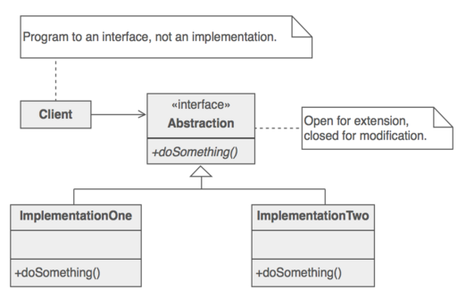

Design Principles:
* Identify the aspects of the application that vary and separate them from what stays the same.
* Program to a super type (an interface), not a concrete implementation
* Favor composition over inheritance
* HAS-A can be better than IS-A
* Allows changing behavior at run time
* Strive for loosely coupled designs between objects that interact.

### The Observer Pattern

> Mainly used to implement distributed event handling systems

### Strategy pattern

Define a family of algorithms, encapsulates each one, and makes them interchangeable. 

> Strategy lets the algorithm vary independently from clients that use it.

Example like above:
Keep `doSomething()` as a composition that can b override depends on Clien specification.

### Adapter pattern

In software engineering, the adapter pattern is a software design pattern that allows the interface of an existing class to be used from another interface.

> It is often used to make existing classes work with others without modifying their source code.

Example like above:
Having methodA call methodB reduces effort for reimplementing what's already exist.

