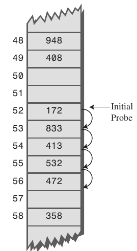
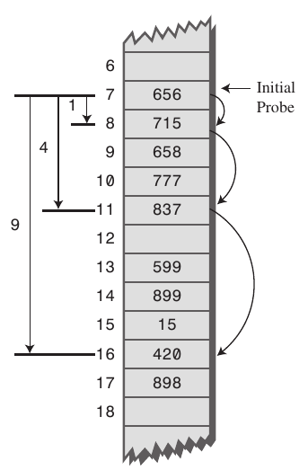
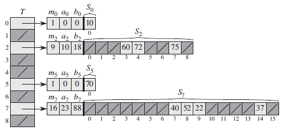

## Chaper 11

### 11.1 Direct-address tables

Store every key in array and access them by their index.

Insert, search, delete operation is O(1) since it acts as a normal array.

Ineffecient because direct-address table size has to be as big as the universe of keys but we only use a fraction of it -> space ineffecciency

#### Exercises

##### 11.1-1

Suppose that a dynamic set S is represented by a direct-address table T of length m.
Describe a procedure that finds the maximum element of S. What is the worst-case
performance of your procedure?

Have to iterate from the end until the first non-Null key is encountered. Worst-case time complexity: O(m) when there is no element in S

##### 11.1-2

A bit vector is simply an array of bits (0s and 1s). A bit vector of length m takes
much less space than an array of m pointers. Describe how to use a bit vector
to represent a dynamic set of distinct elements with no satellite data. Dictionary
operations should run in O.1/ time.

No answer

##### 11.1-3

Suggest how to implement a direct-address table in which the keys of stored elements
do not need to be distinct and the elements can have satellite data. All
three dictionary operations (INSERT, DELETE, and SEARCH) should run in O.1/
time. (Don’t forget that DELETE takes as an argument a pointer to an object to be
deleted, not a key.)

Using double linkedlist to solve same key storage. INSERT and SEARCH would have the same time complexity. Since DELETE take a pointer as argument, that can be solved in O(1) time with double linked list. Example:
```cpp
node.previous = node.next;
delete node;
```

This can also be solved using ordinal linked list as:
```cpp
Node* tmp = node.next;
node.data = node.next.data;
node.next = node.next.next;
delete tmp;
```

##### 11.1-4

We wish to implement a dictionary by using direct addressing on a huge array. At
the start, the array entries may contain garbage, and initializing the entire array
is impractical because of its size. Describe a scheme for implementing a directaddress
dictionary on a huge array. Each stored object should use O.1/ space;
the operations SEARCH, INSERT, and DELETE should take O.1/ time each; and
initializing the data structure should take O.1/ time. (Hint: Use an additional array,
treated somewhat like a stack whose size is the number of keys actually stored in
the dictionary, to help determine whether a given entry in the huge array is valid or
not.)

No answer

### 11.2 Hash tables

Better than direct addressing because hash table reduces storage to K on average case where K is the number of needed keys but still maintains O(1) time complexity on average case. In wost-case, time complexity can be O(n) because of collision solving.

With direct addressing, an element with key `k` is stored at `k` slot. In hash table, the element is stored at slot `h(k)` where `h` is the hash function. Hash function maps the universe of keys into `m`, the sizeof array.

#### 11.2.1 Collision resolution by chaining

This appoach uses linkedlists to resolve collision. Instead of storing a pointer to an object in th array, it store a pointer to a linked list.

Operations:
* CHAINED-HASH-INSERT (`T`, `x`) O(1)
  * insert `x` at the head of list `T[h(x, key)]`
* CHAINED-HASH-SEARCH (`T`, `k`) O(n) - worst case
  * search for an element with key `k` in list `T[h(k)]`
*CHAINED-HASH-DELETE (`T`, `x`) O(1)
  * delete `x` from the list `T[h(x.key)]`

### 11.3 Hash functions

SKIP

### 11.4 Open addressing

If there is collision, move the inserting element to the next non-NULL slot. For searching, it examines table slots from its hashed location until either it finds that element or ascertains that the element is not in the table. 

No element is store outside the table so eventually the table will be filled. In that case we need to resize the table.

To perform insertion using open addressing, we successively examine, or probe, the hash table until we find an empty slot in which to put the key.

#### Operations

```
HASH-INSERT (T, k)
i = 0
repeat
  j = h(k, i)
  if T[j] == NIL
    T[j] = k
    return i
  else i = i + 1
until i == m
error “hash table overflow”
```

```
HASH-SEARCH (T, k)
i = 0
repeat
  j = h(k, i)
  if T[j] == k
    return j
  i = i + 1
until T[j] == NIL or i == m
return NIL
```

DELETE: delete the element and replace it with `DELETE` value because if we replace it if `NIL`, SEARCH operation will stop when it encounters a deleted slot.

#### 11.4.1 Linear probing

```
h(k,i) = (h'(k) + i) mod m
```

Easy to implement but suffers **primary clustering**.

Primary clustering means that if there is a cluster and the initial position of a new record would fall anywhere in the cluster so the cluster size increases.



#### 11.4.2 Quadratic probing

h(k,i) = (h'(k) + c<sub>1</sub>i + c<sub>2</sub>i<sup>2</sup>) mod m

Better than linear probing but still suffers **secondary clustering**.

Secondary clustering is less severe, two records do only have the same collision chain if their initial position is the same.



#### 11.4.3 Double hashing

h(k,i) = (h<sub>1</sub>(k) + ih<sub>2</sub>(k)) mod m


h<sub>2</sub>(k) must be relatively prime to the hash-table size m for the entire hash table to be searched. To ensure this, let `m` be a power of 2 and to design h<sub>2</sub> so that it always produces an odd number. Another way is to let `m` be prime and to design h<sub>2</sub> so that it always returns a positive integer less than `m`.

### 11.5 Perfect hashing

**Perfect hashing**: performing a search in the worst case only requires O(1) memory accesses.

To create a perfect hashing scheme, we use two levels of hashing, with universal hashing at each level.



The first level is hashing with chaining. Instead of using linked list for chaining, we use a secondary hash table S<sub>j</sub> with hash function h<sub>j</sub>. h<sub>j</sub> needs to be chosen carefully that there are no collisions at the second level.

To guarantee there are collisions at the second level, size of S<sub>j</sub> needs to be the  squared of n<sub>j</sub>, number of keys hashing to slot `j`. This excessive storage at the second level can be made up by limiting the size of the first level which results O(n) space overall.

