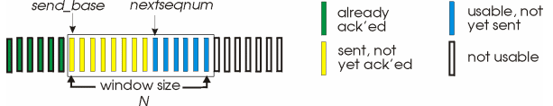
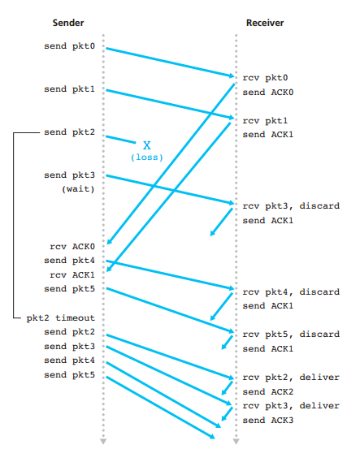
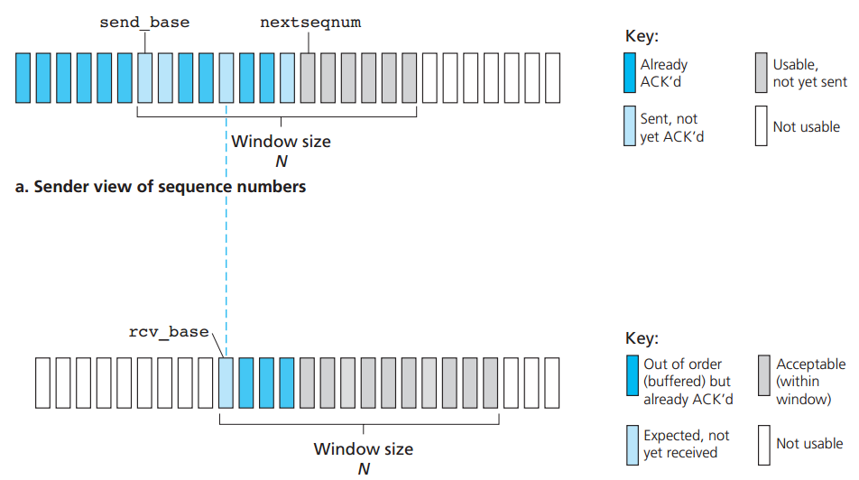
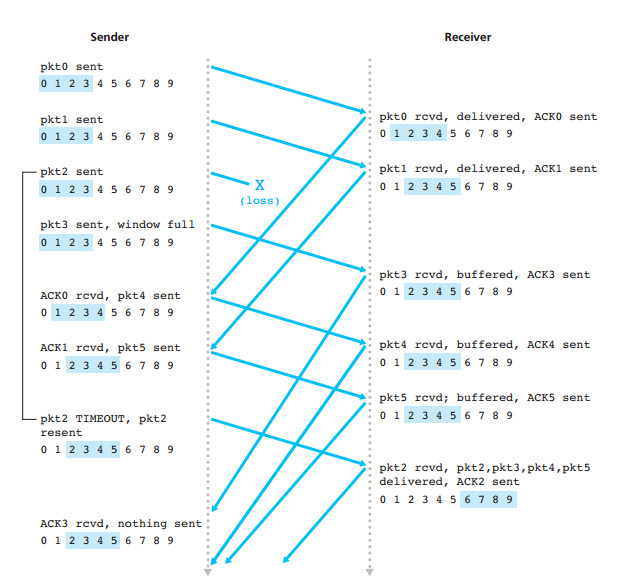

# Chapter 1: Computer Networks and the Internet

## 1.1 What is the Internet?

### 1.1.1 A Nuts-and-Bolts Description

> The **Internet** is a computer network that interconnects hundreds of millions of computing devices.

End systems (**hosts**) are connected together by a network of **communication links** and **packet switches**.

When one end system has data to send to another end system, the sending end system segments the data and adds header bytes to each segment. The resulting **packages** of information are then sent through the network to the destination end system, where they are reassembled into the original data.

A **packet switch** takes a packet arriving on one of its incoming communication links and **forwards** that packet on one of its outgoing communication links. Two most prominent types of packet switch in
today’s Internet are **routers** and **link-layer** switches.

1. Link-layer switches are typically used in access networks,
2. Rrouters are typically used in the network core.

The sequence of communication links and packet switches traversed by a packet from the sending end system to the destination is called a **route** or **path** through the network.

End systems access the Internet through **Internet Service Providers** (**ISPs**). Each ISP is in itself a network of:

1. Packet switches and
2. Communication links

End systems, packet switches, and other pieces of the Internet run **protocols** that control the sending and receiving of information within the Internet. Two most important protocols in the Internet are:

1. The **Transmission Control Protocol** (**TCP**)

2. The **Internet Protocol** (**IP**). 

	Specifies the format of the packets that are sent and received among routers and end systems.

The Internet’s principal protocols are collectively known as **TCP/IP**.

### 1.1.2 A Services Description

> The **Internet** is an infrastructure that provides services to applications.

### 1.1.3 What Is a Protocol?

> A **protocol** defines the format and the order of messages exchanged between
two or more communicating entities, as well as the actions taken by them.

## 1.2 The Network Edge

Hosts are sometimes further divided into two categories: **clients** and **servers**. 

### 1.2.1 Access Networks

The **access network** is the network that physically connects an end system to the first router (also known as the “edge router”) on a path from the end system to any other distant end system. 

#### Home Access: DSL, Cable, FTTH, Dial-Up, and Satellite

Today, the two most prevalent types of broadband residential access are **digital subscriber line** (**DSL**) and **cable**. 

##### 1. DSL 

> DSL Internet access can be obtained from the same local telephone company (telco) that provides its wired local phone access. Thus, when DSL is used, a customer’s telco is also its ISP.

##### 2. Cable 

> Cable Internet access makes use of the cable television company’s existing cable television infrastructure. 

One important characteristic of cable Internet access is that it is a shared broadcast medium: 

* So if several users are simultaneously downloading a video file, the actual rate at which each user receives will be significantly lower than the aggregate cable downstream rate.

* On the other hand, if there are only a few active users, then each of the users may actually receive data at the full cable downstream rate.

* A distributed multiple access protocol is needed to coordinate transmissions and avoid collisions.

An up-and-coming technology that promises even higher speeds is the deployment of **fiber to the home** (**FTTH**).

FTTH distribution networks:

* Direct fiber: one fiber leaving the central office for each home.
* Shared fiber: one fiber leaving the central office for mutilple home.

Two competing optical-distribution network architectures that perform this splitting:

1. **Active optical networks** (**AONs*)
	(LINKTO Ethernet Chapter 5)

2. **Passive optical networks** (**PONs**)
	* Each home has an optical network terminator (ONT) is connected by dedicated optical fiber to a neighborhood splitter.
	* The splitter combines a number of homes into a single, shared optical fiber.
	* The shared fiber connects to an optical line terminator (OLT) in the telco’s CO.
	* The OLT connects to the Internet via a telco router.

##### 3. Satellite

> A **satellite** link can also be used to connect a residence to the Internet
at speeds of more than 1 Mbps.

##### 4. Dial-up access

> **Dial-up access** over traditional phone lines is based on the same model as DSL—a home modem connects over a phone line to a modem in the ISP.

#### Access in the Enterprise (and the Home): Ethernet and WiFi

On corporate and university campuses, and increasingly in home settings, a local area network (LAN) is used to connect an end system to the edge router. 

### 1.2.2 Physical Media

Consider a bit traveling from one end system, this bit is transmitted from router to router (**transmitter-receiver pair**) many times to get to the destination. For each transmitter-receiver pair, the bit is sent by propagating electromagnetic waves or optical pulses across a **physical medium** (cable, wire, radio spectrum,... ). 

Physical media fall into two categories:

1. Guided media.

	Waves are guided along a **solid** medium, such as a fiber-optic cable, a twisted-pair copper wire, or a coaxial cable

2. Unguided media.

	Waves propagate in the atmosphere and in outer space, such as in a **wireless** LAN or a digital satellite channel.


## 1.3 The Network Core

Two fundamental approaches to moving data through a network of links and switches:

1. Packet Switching.
2. Circuit Switching.

### 1.3.1 Packet Switching

Packet Switching:

* To send a message from a source end system to a destination end system, the source breaks long messages into smaller chunks of data known as **packets**.

* Between source and destination, each packet travels through communication **links** and **packet switches** (for which there are two predominant types, **routers** and **linklayer switches**).

* If a source end system or a packet switch is sending a packet of **L** bits over a link with transmission rate **R** bits/sec, then the time to transmit the packet is **L/R** seconds.

#### Store-and-Forward Transmission

**Store-and-forward transmission**: the packet switch must receive the entire packet before it can begin to transmit the first bit of the packet onto the
outbound link.

Delay formula

> d(end-to-end) = (N-1)*L/R + L/R = N*L/R

Which:
	**N**: number of links or packages.
	**L**: length.
	**R**: tranmission rate.

`(N-1)*L/R` are the time it takes to transmit N packages and `L/R` for forwarding delay.

#### Queuing Delays and Packet Los

Each packet switch has multiple links attached to it. For each attached link, the packet switch has an output buffer (also called an output queue), which stores packets that the router is about to send into that link. 

If an arriving packet needs to be transmitted onto a link but finds the link busy with the transmission of another packet, the arriving packet must wait in the output buffer. This is called **queuing delays**. 

If the buffer is completely full with other packets waiting for transmission, either the arriving packet or one of the already-queued packets will be dropped. This is called **packet loss**. 

#### Forwarding Tables and Routing Protocols

Forwarding process: 

* When a source end system wants to send a packet to a destination end system, the source includes the destination’s IP address in the packet’s header.

* When a packet arrives at a router, the router examines the address and searches its **forwarding table**, using this destination address, to find the appropriate outbound link. 

* Then the router directs the packet to this outbound link.

The Internet has a number of special **routing protocols** that are used to automatically set the forwarding tables. Routing protocols determine the shortest path and use the shortest path results to configure the forwarding tables in the routers.

### 1.3.2 Circuit Switching

Circuit Switching:

* The resources needed along a path to provide for communication between the end systems are reserved for the duration of the communication session.

TODO: Come back to this

### Packet Switching Versus Circuit Switching

Packet switching:

* Not suitable for real-time services.
* Better sharing of transmission capacity.
* Simpler, more efficient, and less costly to implement.
* Allocates link use on demand.

### 1.3.3 A Network of Networks

Users are connected to each other through ISPs and ISPs are also interconnected. This is called a ** network of networks**.

Network structures:

1. **Network Structure 1**, interconnects all of the access **ISPs** with a **single global transit ISP**.

2. **Network Structure 2** consists of the hundreds of thousands of access ISPs and multiple global transit ISPs.
	* Global transit providers (**tier-1 ISPs**):
		* **Regional ISP** provides Interter to access ISPs in the region.
	* Access ISPs

3. **Network Structure 3** is a multi-tier hierarchy.

A **points of presence** (**PoP**) is simply a group of one or more routers (at the same location) in the provider’s network where customer ISPs can connect into the provider ISP. 

**Multi-home** means that ISP can to connect to two or more provider ISPs. 

**Internet Exchange Point** (**IXP**) is a meeting point where multiple ISPs can peer together.

4. **Network Structure 4** consists of:
	Access ISPs, regional ISPs, tier-1 ISPs, PoPs, multi-homing, peering, and IXPs

5. **Network Structure 5** built on top of Network Structure 4 and **content provider networks**.

## 1.4 Delay, Loss, and Throughput in Packet-Switched Networks

### 1.4.1 Overview of Delay in Packet-Switched Networks

**Total nodal delay** formula:

> **Total nodal delay** = **nodal processing delay** + **queuing delay** + **transmission delay** + **propagation delay**

#### Processing Delay

Processing delay:

* Time required to examine the packet’s header and determine where to direct the packet.
* Check for bit-level errors in the packet that occurred in transmitting the packet’s bits.

#### Queuing Delay

Queuing delay it is a delay that occurs when packets wait to be transmitted onto the link.

* If the queue is empty and no other packet is currently being transmitted, then our packet’s queuing delay will be zero.
* On the other hand, if the traffic is heavy and many other packets are also waiting to be transmitted, the queuing delay will be long.

#### Transmission Delay

Since our packet can be transmitted only after all the packets that have arrived before it have been transmitted. Transmission delay is amount of time required to push (that is, transmit) all of the packet’s bits into the link. 

> **Transmission delay** = **L**/**R**

Which:

**L**: packet length (bits)

**R**: transmission rate(bits/sec)

#### Propagation Delay

**propagation delay** is the time required to propagate from the beginning of the link to router B.

> **Propagation delay** = **d**/**s**

Which:

**d**: distance (m)

**s**: speed (m/sec)

#### Comparing Transmission and Propagation Delay

Remember that **transmission delay** does not dependent on physical distance between 2 routers, it based on amount data can be process at a time. On the other hand, **propagation delay** is based on physical length of the two routers.

### 1.4.2 Queuing Delay and Packet Loss

Queuing delay factors:

* Traffic rate arrives at the queue.
* The transmission rate of the link.
* The nature of the arriving traffic
	Whether the traffic arrives periodically or arrives in bursts.

**Traffic intensity** formula:

> **Traffic intensity** = **La**/**R**

Which:

**a**: The average rate at which packets arrive at the queue (packets/sec)

**L**: packages length (bits).

**R**: Tranmission rate.

**Traffic intensity**:
	
* **La**/**R** > 1:

	- The average rate at which bits arrive at the queue exceeds the rate at which the bits can be transmitted from the queue.
	- Delay is infinity.

* **La**/**R** <= 1:
	* Packets arrive periodically:

		- If a packet arrives, it will be transmitted before another one arrives.
		- So, very packet will arrive at an empty queue and there will be no queuing delay.

	* Packets arrive in bursts but periodically:

		- The first packet will be transmitted with no queueing delay, but the second one has L/R seconds delay, and the *n*th will have (n-1)*L/R seconds delay.
		- A significant average queuing delay.

	1. **La**/**R** close to 0:

		* Queuing delay is close to 0.

	2. **La**/**R** close to 1:

		* Queuing delay is large.

#### Packet Loss

If a packet arrive and find out that the queue is full, with no place to store such a packet, the router will **drop** that packet and the packet will be **lost**.

### 1.4.3 End-to-End Delay

**End-to-End delay**: (assume that there is no queueing delay since it is more difficult to measure)

> **End-to-End delay** = (**nodal processing delay** + **transmission delay** + **propagation delay**)*N

Which:

	**N**-1: the number of nodes between source and destination.

### 1.4.4 Throughput in Computer Networks

The **instantaneous throughput** at any instant of time is the rate (in bits/sec) at which a host is receiving the file.

Think of bits as *fluid* and communication links as *pipes*. Clearly, the server cannot pump bits through its link at a rate faster than R*s* bps; and the router cannot forward bits at a rate faster than R*c* bps. If Rs < Rc, then the bits pumped by the server will “flow” right through the router and arrive at the client at a rate of R*s* bps, giving a **throughput** of R*s* bps and vice versa. This sittuation is called **bottleneck link**.

**Throughput formula**:

> **Throughput formula** = F/min{R*s*, R*c*}

## 1.5 Protocol Layers and Their Service Models

### 1.5.1 Layered Architecture

#### Protocol Layering

Network designers organize protocols — and the network hardware and software that implement the protocols— in **layers** and each protocol belongs to one of the layers.

Each layer provides its service by:

1. Performing certain actions within that layer, and by
2. Using the services of the layer directly below it

**Drawback of layering**:

1. Duplicate lower-layer functionality.
2. One layer may need information that is present only in another layer.


| Application  |							| Application  |
| Transport    |							| Presentation |
| Network      |							| Session      |
| Link         |							| Transport    |
| Physical     |							| Network      | 
											| Link         |
											| Physical     |

a.  Five-layer IPS 						b.  OSI reference model

Internet protocol stack

##### Internet protocol stack

Five layer:
* Application
* Transport
* Network
* Link
* Physical

###### 1. Application Layer

> **Application layer** is where network applications and their application-layer protocols reside.

Application protocols:

* HTTP: Web document request and transfer.
* SMTP: e-mail messages transfer.
* FTP: transfer of files between two end systems.

**Message** is packet of information at the application layer.

###### 2. Transport Layer

> The Internet’s **transport layer** transports application-layer messages between application endpoints. 

Transport protocols:

* TCP: provides connection-oriented service to its applications

	- Guarantee delivery 
	- Provides flow control 
	- Breaks long messages into shorter
	- Provides a congestion-control mechanism

* UDP: provides a connectionless service to its applications
	
	- No reliability
	- No flow control
	- No congestion control

**Segment**: a transport-layer packet.

###### 3. Network Layer

> The Internet’s **network layer** (simply referred as ** IP layer**) is responsible for moving network-layer packets known as **datagrams** from one host to another. 

Network protocols:

* IP Protocol: 

	- Defines the fields in the datagram as well as how the end systems and routers act on these fields.
	- Only one IP Protocol

* Routing protocols:

	- Determine the routes that datagrams take between sources and destinations.
	- Many routing protocols.

###### 4. Link Layer

> The network layer passes the datagram down to the **link layer**, which delivers the datagram to the next node along the route. 

Link-layer protocols:

	* Ethernet
	* WiFi

**Frames**: linklayer packets.

###### 5. Physical Layer

> Move individual bits from end to end

##### The OSI Model

Five layers are similar as above.

###### 6. Presentation layer

> **Presentation layer** provides services that allow communicating applications to interpret the meaning of data exchanged.

Services:

* Data compression
* Data encryption

###### 7. Session layer

> **Session layer** provides for delimiting and synchronization of data exchange, including the means to build a checkpointing and recovery scheme.

### 1.5.2 Encapsulation

Routers and link-layer switches are both packet switches and they do not implement all of the layers in the protocol stack; they typically implement only the bottom layers. 

* Link-layer switches implement layers 1 and 2
* Routers implement layers 1 through 3.

Routers are capable of implementing the IP protocol and links are not.


### 1.6 Networks Under Attack

**Botnet**: compromised devices.

**Self-replicating**: Once it infects one host, from that host it seeks entry into other hosts over the Internet, and from the newly infected hosts, it seeks entry into yet more hosts.

#### Malware

* **Viruses**: malware that require some form of user interaction to infect the user’s device (You have to actually run a application or click on a link that contains virus).
* **Worms**: malware that can enter a device without any explicit user interaction.

#### Server and network attacks

> **Denial-of-service** (**DoS**) attacks.

Most Internet DoS attacks fall into one of three categories:

* **Vulnerability attack** 

	This involves sending a few well-crafted messages to a vulnerable application or operating system running on a targeted host. If the right sequence of packets is sent to a vulnerable application or operating system, the service can stop or, worse, the host can crash

* **Bandwidth flooding**

	The attacker sends a deluge of packets to the targeted host—so many packets that the target’s access link becomes clogged, preventing legitimate packets from reaching the server.

* **Connection flooding**

	The attacker establishes a large number of half-open or fully open TCP connections (TCP connections are discussed in Chapter 3) at the target host. The host can become so bogged down with these bogus connections that it stops accepting legitimate connections.


##### Bandwidth-flooding attacks

If the server has an access rate of *R* bps, then the attacker will need to send traffic at a rate of approximately *R* bps to cause damage. If *R* is very large, a single attack source may not be able to generate enough traffic to harm the server. 

In a **distributed DoS** (**DDoS**) attack the attacker controls multiple sources and has each source blast traffic at the target.

#### Packet sniffer

> A passive receiver that records a copy of every packet that flies by is called a **packet sniffer**.

#### Attackers can masquerade as someone you trust

> The ability to inject packets into the Internet with a false source address is known as **IP spoofing**.


# Chapter 2: Application layer

## 2.1 Principles of Network Applications

The core of network application development is writing programs that run on different end systems and communicate with each other over the network. Thus, when developing your new application, you need to write software that will run on multiple end systems.

### 2.1.1 Network Application Architectures

Two predominant architectural paradigms in modern network applications:

1. The client-server architecture.
1. The peer-to-peer (P2P) architecture.

In a **client-server architecture**, there is an always-on host, called the **server**, which services requests from many other hosts, called **clients**. With the client-server architecture, clients do not directly communicate with each other but instead through the server. Another characteristic of the client-server architecture is that the server has a fixed, well-known address, called an IP address because the server is always on so that a client can always contact the server by sending a packet to the server’s IP address.

Often in a client-server application, a single-server host is incapable of keeping up with all the requests from clients. Fot that reason, a **data center**, housing a large number of hosts, is often used to create a powerful virtual server.

In a **P2P** architecture, there is minimal (or no) reliance on dedicated servers in data centers. Instead the application exploits direct communication between pairs of intermittently connected hosts, called peers

One of the most compelling features of P2P architectures is their **self-scalability** because each new user will automatically add the capacity of the network. P2P architectures are also cost effective, since they normally don’t require significant server infrastructure and server bandwidth.

Three major challenges of P2P:

* ISP Friendly: P2P network put a significant stress on residential ISP by using upstream traffic which is designed for more downstream traffic.

* Security: Because of their highly distributed and open nature, P2P applications can be a challenge to secure.

* Incentives: The success of future P2P applications also depends on convincing users to volunteer bandwidth, storage, and computation resources.

### 2.1.2 Processes Communicating

#### The Interface Between the Process and the Computer Network

As noted above, most applications consist of pairs of communicating processes, with the two processes in each pair sending messages to each other. Any message sent from one process to another must go through the underlying network. A process sends messages into, and receives messages from, the network through a software interface called a **socket**. 

A process is analogous to a house and its socket is analogous to its door.

The only control that the application developer has on the transport-layer side is:

1. The choice of transport protocol and 
2. The ability to fix a few transport-layer parameters such as maximum buffer and maximum segment sizes.

#### Addressing Processes

To identify the receiving process, two pieces of information need to be specified:

1. The address of the host and 
2. An identifier that specifies the receiving process in the destination host.

In the Internet, the host is identified by its **IP address**. The sending process must also identify the receiving process running in the host, **port number**.

### 2.1.3 Transport Services Available to Applications

#### 1. Reliable Data Transfer

A protocol provides a guaranteed data delivery service, it is said to provide **reliable data transfer**. One important service that a transport-layer protocol can potentially provide to an application is process-to-process reliable data transfer.

When a transport protocol provides this service, the sending process can just pass its data into the socket and know with complete confidence that the data will arrive without errors at the receiving process.

When a transport-layer protocol doesn’t provide reliable data transfer, some of the data sent by the sending process may never arrive at the receiving process. This may be acceptable for **loss-tolerant applications**. For example in multimedia application, some amount of data loss only results a small glitch.

#### 1. Throughput

Because other sessions will be sharing the bandwidth along the network path, and because these other sessions will be coming and going, the available throughput can fluctuate with time. 

Another natural service that a transport-layer protocol could provide, namely, guaranteed available throughput at some specified rate. Applications that have throughput requirements are said to be **bandwidth-sensitive** applications.

While bandwidth-sensitive applications have specific throughput requirements, **elastic applications** can make use of as much, or as little, throughput as happens to be available.

#### 1. Timing

A transport-layer protocol can also provide timing guarantees. 

#### 1. Security

A transport protocol can provide an application with one or more security services like encryption.

### 2.1.4 Transport Services Provided by the Internet

The Internet makes two transport protocols available to applications: **UDP** and **TCP**. When you (as an application developer) create a new network application for the Internet, one of the first decisions you have to make is whether to use UDP or TCP.

#### TCP Services

The **TCP** service model includes:

1. Connection-oriented service:
	
	* TCP has the client and server exchange transport-layer control information with each other before the application-level messages begin to flow. This is called handshaking procedure alerts the client and server.

	* Then, a **TCP connection** is said to exist between the sockets of the two processes. The connection is a full-duplex connection.

	* When the application finishes sending messages, it must tear down the connection.

2. Reliable data transfer service:

	The communicating processes can rely on TCP to deliver all data sent without error and in the proper order. 

TCP also includes a **congestion-control** mechanism which throttles a sending process (client or server) when the network is congested between sender and receiver. Congestion-control also ensures that everyone across a network has a "fair" amount of access to network resources, at any given time.

TCP also provides **flow control** which ensures that the sender send data at a rate that the receiver can handle. For example, the sender uses fiber cable but the receiver uses DSL, without flow control, the sender will send data so too fast for the receiver to handle. Flow control will make sure that the sender send at a rate that it can be received.

#### UDP Services

**UDP** is a no-frills, lightweight transport protocol, providing minimal services. It is connectionless, so there is no handshaking before the two processes start to communicate. UDP provides an unreliable data transfer service and message received may arrive out of order.

UDP does not include a congestion-control mechanism or flow control.

#### Services Not Provided by Internet Transport Protocols

TCP and UDP do not provide security but TCP can use SSL to enhance security.

Today’s Internet transport protocols do not provide timing and throughput (LINKTO 2.1.3). 

In summary, today’s Internet can often provide satisfactory service to time-sensitive applications, but it cannot provide any timing or throughput guarantees.

### 2.1.5 Application-Layer Protocols

An **application-layer protocol** defines how an application’s processes, running on different end systems, pass messages to each other.

An application-layer protocol defines:

* The types of messages exchanged, for example, request messages and response messages
* The syntax of the various message types, such as the fields in the message and how the fields are delineated
* The semantics of the fields, that is, the meaning of the information in the fields
* Rules for determining when and how a process sends messages and responds to messages

It is important to distinguish between network applications and application-layer protocols. An application-layer protocol is only one piece of a network application.

### 2.1.6 Network Applications Covered in This Book

Five important applications:

1. The Web
1. File transfer
1. Electronic mail
1. Directory service
1. P2P applications

## 2.2 The Web and HTTP

### 2.2.1 Overview of HTTP

The **HyperText Transfer Protocol (HTTP)** is implemented in two programs: a client program and a server program. The client program and server program, executing on different end systems, talk to each other by exchanging HTTP messages. HTTP defines the structure of these messages and how the client and server exchange the messages.

A **Web page** (also called a document) consists of objects. An object is simply a file—such as an HTML file, a JPEG image, a Java applet, or a video clip—that is addressable by a single URL. 

When a user requests a Web page (for example, clicks on a hyperlink), the browser sends HTTP request messages for the objects in the page to the server. The server receives the requests and responds with HTTP response messages that contain the objects.

HTTP uses TCP as its underlying transport protocol:

It is important to note that the server sends requested files to clients without storing any state information about the client. If a particular client asks for the same object twice in a period of a few seconds, the server does not respond by saying that it just served the object to the client; instead, the server resends the object, as it has completely forgotten what it did earlier. Because an HTTP server maintains no information about the clients, HTTP is said to be a **stateless protocol**.

#### 2.2.2 Non-Persistent and Persistent Connections

Two type of HTTP connections:

**Non-persistent connections**: each request/response pair be sent over a separate TCP connection.
**Persistent connections**:  all of the requests and their corresponding responses be sent over the same TCP connection

HTTP uses persistent connections in its default mode, but HTTP clients and servers can be configured to use non-persistent connections instead.

##### HTTP with Non-Persistent Connections

Suppose you want to get a web page, example.com/page.html, that has 10 images. Therefore, in total there are 11 objects on the server.

What happens:

1. The HTTP client process initiates a TCP connection to the server on port 80 to get to server socket.
2. The HTTP client sends an HTTP request message to the server via its socket.
3. The HTTP server process receives the request message via its socket, retrieves `page.html` and sends the response message to the client via its socket.
4. The HTTP server process tells TCP to close the TCP connection.
5. The HTTP client receives the response message and find out that it needs 10 objects for images. So it repeat from step 1 to 4 for 10 more times.

Users can configure modern browsers to control the degree of parallelism. In their default modes, most browsers open 5 to 10 parallel TCP connections, and each of these connections handles one request-response transaction.

The **round-trip time (RTT)**, which is the time it takes for a small packet to travel from client to server and then back to the client including packet-propagation delays, packet delays.

For non-persistent connections, time to get the whole page is:

	T = 2 * (1 + objects/parallel) * RTT

**Note**: request for base html can not be parallel because it only knows the number of objects in the html file after recieving and scanning the file.

2: 1 for handshaking and 1 for actual request

1: base html file

##### HTTP with Persistent Connections

Non-persistent connections have some shortcomings:

1. A brand-new connection must be established and maintained for each requested object which creates TCP buffers on both client and server => memory problem

2. Each object suffers a delivery delay of two RTTs

With **persistent connections**, the server leaves the TCP connection open after sending a response so subsequent requests and responses between the same client and server can be sent over the same connection.

For persistent connections, time to get the whole page is:

	T = (1 + 1 + objects) * RTT

First 1: for handshaking
Second 1: for getting base html file

#### 2.2.3 HTTP Message Format

##### HTTP Request Message

Typical request message:

```
GET /somedir/page.html HTTP/1.1
Host: www.someschool.edu
Connection: close
User-agent: Mozilla/5.0
Accept-language: fr
```

The first line of an HTTP request message is called the **request line** the subsequent lines are called the **header lines**

The request line, `GET /somedir/page.html HTTP/1.1` has three fields: 

* The method field
	
	This field can be:  GET, POST, HEAD, PUT, or DELETE

* The URL field, and 
* The HTTP version field

`Connection: close` header line, the browser is telling the server that it doesn’t want to bother with persistent connections; it wants the server to close the connection after sending the requested object.

`User-agent: Mozilla/5.0` indicates browser that the request is sent from so that the server can serve with a proper version of the object

`Accept-language: fr` indicates that the user prefers to receive a French version of the object, if such an object exists on the server; otherwise, the server should send its default version.

##### HTTP Response Message

```
HTTP/1.1 200 OK
Connection: close
Date: Tue, 09 Aug 2011 15:44:04 GMT
Server: Apache/2.2.3 (CentOS)
Last-Modified: Tue, 09 Aug 2011 15:11:03 GMT
Content-Length: 6821
Content-Type: text/html
(data data data data data ...)
```

It has three sections: an initial status line, six header lines, and then the entity body.

#### 2.2.4 User-Server Interaction: Cookies

It is often desirable for a Web site to identify users, either because the server wishes to restrict user access or because it wants to serve content as a function of the user identity so it uses **cookies** for this purpose. 

Cookie technology has four components:

1. A cookie header line in the HTTP response message
2. A cookie header line in the HTTP request message
3. A cookie file kept on the user’s end system and managed by the user’s browser; and 
4. A back-end database at the Web site. 

Although cookies often simplify the Internet shopping experience for the user, they are controversial because they can also be considered as an invasion of privacy. As we just saw, using a combination of cookies and user-supplied account information, a Web site can learn a lot about a user and potentially sell this information to a third party.

#### 2.2.5 Web Caching

A **Web cache**—also called a **proxy server**—is a network entity that satisfies HTTP requests on the behalf of an origin Web server. The Web cache has its own disk storage and keeps copies of recently requested objects in this storage. A user’s browser can be configured so that all of the user’s HTTP requests are first directed to the Web cache. Once a browser is configured, each browser request for an object is first directed to the Web cache.

Example:

1. The browser establishes a TCP connection to the Web cache and sends an HTTP request for the object to the Web cache.
2. The Web cache checks to see if it has a copy of the object stored locally. If it does, the Web cache returns the object within an HTTP response message to the client browser.
3. If the Web cache does not have the object, the Web cache opens a TCP connection to the origin server, that is, to www.someschool.edu. The Web cache then sends an HTTP request for the object into the cache-to-server TCP connection. After receiving this request, the origin server sends the object within
an HTTP response to the Web cache.
4. When the Web cache receives the object, it stores a copy in its local storage and sends a copy, within an HTTP response message, to the client browser (over the existing TCP connection between the client browser and the Web cache).

A cache is both a server and a client at the same time

Web caching has seen deployment in the Internet for two reasons:

1. The Web cache can substantially reduce the response time for a client request, particularly if the bottleneck bandwidth between the client and the origin server is much less than the bottleneck bandwidth between the client and the cache.

2. Web caches can substantially reduce traffic on an institution’s access link to the Internet.

The cost of purchasing a web cache is lower than upgrading access link.

Through the use of **Content Distribution Networks (CDNs)**, Web caches are increasingly playing an important role in the Internet. A CDN company installs many geographically distributed caches throughout the Internet, thereby localizing much of the traffic. 

#### 2.2.6 The Conditional GET

Although caching can reduce user-perceived response times, it introduces a new problem—the copy of an object residing in the cache may be stale which means that the object housed in the Web server may have been modified since the copy was cached at the client.

HTTP has a mechanism that allows a cache to verify that its objects are up to date. This mechanism is called the **conditional GET**.

A request is **conditional GET** if:

1. The request message uses the GET method
2. The request message includes an `If-Modified-Since:` header line.

### 2.3 File Transfer: FTP

HTTP and FTP are both file transfer protocols and have many common characteristics; for example, they both run on top of TCP. However, the two application-layer protocols have some important differences:

* FTP uses two parallel TCP connections to transfer a file, a **control connection** and a **data connection**

	* The **control connection** is used for sending control information between the two hosts—information such as user identification, password,... 

	* The **data connection** is used to actually send a file

* FTP uses a separate control connection, FTP is said to send its control information **out-of-band** while HTTP, sends request and response header lines into the same TCP connection that carries the transferred file itself, **in-band**.

Connection scenario:

1. FTP client contacts FTP server at port 21, using TCP 
2. Client authorized over control connection
3. Client sends commands to change the remote directory over control connection
4. When server receives file transfer command, server opens 2nd TCP data connection (for file) to client
5. FTP client sends exactly one file over the data connection and then closes the data connection.
6. If the client wants to send another file, FTP opens another data connection.

Thus, the control connection remain opened for the whole session but a new data connection is created for each file. 

Throughout a session, the FTP server must maintain **state** about the user.

##### 2.3.1 FTP Commands and Replies

Simple commands:

* USER username: 
	
	Used to send the user identification to the server.

* PASS password: 

	sed to send the user password to the server.

* LIST: 

	Used to ask the server to send back a list of all the files in the current remote directory. The list of files is sent over a (new and non-persistent) data connection rather than the control TCP connection.

* RETR filename: 

	Used to retrieve (that is, get) a file from the current directory of the remote host. This command causes the remote host to initiate a data
connection and to send the requested file over the data connection.

* STOR filename: 

	Used to store (that is, put) a file into the current directory of the remote host.

Simple responses:

* 331 Username OK, password required
* 125 Data connection already open; transfer starting
* 425 Can’t open data connection
* 452 Error writing file

## 2.4 Electronic Mail in the Internet

Internet mail system has three major components: 

1. **User agents**
	
	Microsoft Outlook, Apple Mail, Gmail

2. **Mail servers**

	Each recipient has a mailbox located in one of the mail servers. The mail server contains authentication check to his/her mailbox (usernames and passwords). Sender's mail server must also deal with failures of receiver's. Mail server also holds failed messages in a message queue and attempts to transfer them later. Reattempts are often done every 30 minutes or so; if there is no success after several days, the server removes the message and notifies the sender.

3. **Simple Mail Transfer Protocol (SMTP)**

	SMTP uses the reliable data transfer service of TCP to transfer mail from the sender’s mail server to the recipient’s mail server. SMTP has two sides: a client side, which executes on the sender’s mail server, and a server side, which executes on the recipient’s mail server.

### 2.4.1 SMTP

Although SMTP has numerous wonderful qualities, as evidenced by its ubiquity in the Internet, it is nevertheless a legacy technology that possesses certain archaic characteristics.

Screnario:

1. The client SMTP has TCP establish a connection to port 25 at the server SMTP
2. Once this connection is established, they perform some application-layer **handshaking**	
	
	* SMTP client indicates the e-mail address of the sender and the e-mail address of the recipient.

3. Then, the client sends the message (**transformation**)
4. The client then repeats this process over the same TCP connection if it has other messages to send to the server; otherwise, it instructs TCP to close the connection (**closure**)

Messages must be in 7-bit ASCI.

SMTP can count on the reliable data transfer service of TCP to get the message to the server without errors

##### 2.4.2 Comparison with HTTP

When transferring the files, both persistent HTTP and SMTP use persistent connections.

Differences:

1. HTTP is mainly a **pull protocol** - get information on a Web server. SMTP is primarily a **push protocol** - sending files.
2. SMTP requires messages to be 7-bit ASCII. HTTP does not impose this.
3. HTTP encapsulates each object in its own HTTP response message. SMTP places all of the message’s objects into one message.

#### 2.4.3 Mail Access Protocols

Today, mail access uses a client-server architecture—the typical user reads e-mail with a client that executes on the user’s end system, for example, on an office PC, a laptop, or a smartphone. This means that the sender and receiver would dialogue directly with each other's PCs.

This introduces another problem that mail server on PC has to remain always on, and connected to the Internet, in order to receive new mail, which can arrive at any time.

A solution is that each user has a mail server, a sender SMTP will push email to the receiver's mail server, and then the receiver can fetch that email from his/her mail server later. However, SMTP is a push-protocol so we use another protocol for fetching, namely, **mail access protocols** including **Post Office Protocol—Version 3 (POP3)**, **Internet Mail Access Protocol (IMAP)**, and **HTTP**.


##### POP3

**POP3** is a simple mail access protocol but limited protocol. POP3 download to local PC and delete messages in the mail server

POP3 begins when the user agent (the client) opens a TCP connection to the mail server on port 110. With the TCP connection established, POP3 progresses through three phases: 

1. Authorization
2. Transaction

	User agent retrieves messages. Also during this phase, the user agent can mark messages for deletion, remove deletion marks, and obtain mail statistics.

2. Update.

###### Authorization

Client commands: 

* user
* pass

Two possible responses form server:

* +OK
* -ERR

###### Transaction phase

Client commands: 

* list: list message numbers
* retr: retrieve message by number
* dele: delete
* quit

###### Update phase

Remove messages from mail box

##### IMAP

IMAP:

* Keeps all messages in one place: at server
* Allows user to organize messages in folders
* Unlike POP3, an IMAP server maintains user state information across IMAP sessions

### 2.5 DNS—The Internet’s Directory Service

#### 2.5.1 Services Provided by DNS

**Domain name system (DNS)** is a presentation of IP address in human language. By definition it also is:

1. A distributed database implemented in a hierarchy of DNS servers.
2. An application-layer protocol that allows hosts to query the distributed database.

The DNS protocol runs over UDP and uses port 53.

DNS provides a few other important services:

* Host aliasing
	
	relay1.west-coast.enterprise.com could have an alias such as enterprise.com. In this case relay1.west-coast.enterprise.com is called **canonical hostname**.

* Mail server aliasing

	Similar to host aliasing

* Load distribution

	A busy site can have multiple servers. The DNS database contains this set of IP addresses. When clients make a DNS query for a name mapped to a set of addresses, the server responds with the entire set of IP addresses, but rotates the ordering of the addresses within each reply.

#### 2.5.2 Overview of How DNS Works

When a client wants to translate hostname to IP address:

* Client invoke the client side of DNS, specifying the hostname that needs to be translated.
* Clien's host sends a query message into the network.
* DNS in the user’s host receives a DNS reply message from server that provides the desired mapping.
* The mapping is passed to the invoking application.

**Centralized design** of DNS,  one DNS server that contains all the mappings.

Problems with a centralized design:

* A single point of failure:

	If the DNS crashes, so does internet.

* Traffic volume

* Distant centralized database

* Maintenance

	Too big to maintain.

##### A Distributed, Hierarchical Database

Three classes of DNS servers:

1. Root DNS servers
2. Top-level domain (TLD) DNS servers
3. Authoritative DNS servers

There is another type of DNS called **local DNS server**, which does not belong to the hierarchy of servers. 

Each ISP has a local DNS server. When a host connects to an ISP, the ISP provides the host with the IP addresses of one or more of its local DNS servers. 

Example: 
Suppose the host cis.poly.edu desires the IP address of gaia.cs.umass.edu and  Polytechnic’s local DNS server is called dns.poly.edu and that an authoritative DNS server for gaia.cs.umass.edu is called dns.umass.edu. 

1. The host cis.poly.edu first a DNS query message to its local DNS server, dns.poly.edu.
2. The local DNS server forwards the query message to a root DNS server.
3. The root DNS server takes note of the edu suffix and returns to the local DNS server a list of IP addresses for TLD servers responsible for edu.
4. The local DNS server then resends the query message to one of these TLD servers.
5. The TLD server takes note of the umass.edu suffix and responds with the IP address of the authoritative DNS server for the University of Massachusetts, namely, dns.umass.edu.
6. The local DNS server resends the query message directly to dns.umass.edu, which responds with the IP address of gaia.cs.umass.edu

DNS name resolution:

* **Iterated queries**:
	
	Contacted server replies with name of server to contact.
	"I don’t know this name, but ask this server"

* **Recursive queries**:
	
	Puts burden of name resolution on contacted name server


F. Iterated queries


F. Recursive queries

##### DNS Caching

**DNS Caching**: when a DNS server receives a DNS reply (containing a mapping from a hostname
to an IP address) it can cache the mapping in its local memory.

With the use of caching, DNS queries can be reduced dramatically.

Cache entries timeout (disappear) after some time (TTL)

TLD servers typically cached in local name servers.

Cached entries may be out-of-date. In case hostname changes IP address, may not be known  until all TTLs expire.

#### 2.5.3 DNS Records and Messages

The DNS servers that together implement the DNS distributed database store **resource records (RRs)**, including RRs that provide hostname-to-IP address mappings.

A resource record is a four-tuple that contains the following fields:

1. Name
2. Value
3. Type
4. TTL
	
	The time to live of the resource record

The meaning of **Name** and **Value** depend on **Type**:

* If Type=A, then **Name** is a hostname and **Value** is the IP address.
* If Type=NS, then **Name** is a domain (such as foo.com) and **Value** is the hostname of an authoritative DNS server that knows how to obtain the IP addresses for hosts in the domain.
* If Type=CNAME, then **Value** is a canonical hostname for the alias hostname **Name**.
* If Type=MX, then **Value** is the canonical name of a mail server that has an alias hostname *Name**.

##### DNS Messages

There are two kinds of DNS messages: **query messages** and **reply messages**, both with same message format:

1. The first 12 bytes is the header section.

	1. 16-bit query indentication
	2. Flags:

		* A 1-bit query/reply flag
		* A 1-bit authoritative flag
		* A 1-bit recursion-desired flag
		* A 1-bit recursionavailable flag

	3. 4 number fields

2. Question section

	1. A name field that contains the name that is being queried
	2. A type field that indicates the type of question being asked about the name

3. Answer section

	Contains the resource records for the name that was originally queried

4. Authority section 

	Contains records of other authoritative servers.

5. Additional section 

	Contains other helpful records

##### DNS attacks

1. DDos attacks

	* Bombard root servers with traffic
	* Bombard TLD servers

2. Redirect attacks
3. Exploit DNS for DDoS

### 2.6 Peer-to-Peer Applications

#### 2.6.1 P2P File Distribution

##### How bitorrent works?

* When a user join a **torrent** (group of peers exchanging  chunks of a file), the **tracker** (server software that tracks who have a particular file) choose a set of peers and send it to that user.
* That user try to establish TCP connection with all peers on the list.
* The user then asks each peer for a particular chunk of file adn then choose **what** to sen and **who** should send it.
	
	* **what**: Bitorrent uses **rarest first** technique which mean a user will asks for a copy of the rarest chunk.
	* **who**: Bitorrent calculates sending rate from each peer and gives priority to ones that have highest rate. Then a user will only do a trade with his best uploaders so that noone can be a freerider.

#### 2.6.2 Distributed Hash Tables

**Distributed hash table (DHT)**:

* Database has (key, value) pairs
* Allows any peer to query the distributed database with a particular key
* Locates the peers that have the corresponding (key, value) pairs and return the key-value pairs to the querying peer
* Any peer is allowed to insert new key-value pairs into the database.

Assign key mechanism:

* Assign integer identifier to each peer in range [0,2n-1] for some n.
* To get integer identifier, hash the original key
* Assign key to the peer that has the **closest ID** (the immediate successor of the key).

Hence, when a user want a chunk of file, he/she will look for a peer that has the closest ID to the key. There are several ways to determine it:

* Keep track of all the peers locally: 

	nonscalable since each user has to know every other peer

* Circular DHT

	A user only knows his immediate successor and predecessor. So he has to send request to all peers that locate between him and the desired peer.

* Circular DHT with shortcuts

	Just like Circular DHT, has another type of overlay called **shortcuts** to reduce number of request need to sent.

##### Peer Churn

Since in P2P network, a peer may come and leave unexpectedly, all peers have to continuously ping their successor to update their state accordingly.

When a peer usually keeps track of his first and second successors so that if a successor leaves, he can find a successor of the leaving peer and make it his successor.

# Chapter 3

## 3.1 Introduction and Transport-Layer Services

**Transport-layer protocol** provides communication between app processes running on different hosts.

Transport protocols run in end systems:

* Sender side: breaks app messages into segments, passes to  network layer
* Receiver side: reassembles segments into messages, passes to app layer

### 3.1.1 Relationship Between Transport and Network Layers

**Transport-layer protocol** provides logical communication between **processes running on different hosts**.

**Network-layer protocol** provides logical communication between **hosts**.

## 3.2 Multiplexing and Demultiplexing

**Multiplexing** (sender): gather data from multiple sockets, add transport header  to create segments and pass them to the network layer

**Demultiplexing** (receiver): use header info to deliver received segments to correct socket

#### How Multiplexing and Demultiplexing work

Transport-layer multiplexing requires:
1. Sockets have unique identifiers
2. Each segment have special fields that indicate the socket to which the segment is to be delivered

From those requirements, when a host receive a datagram, the demultiplexer will examinize the datagram's header to find out which port should handle the request.


Difference between TCP and UDP socket:

* TCP: identified by a four-tuple (source IP address, source port number, destination IP address, destination port number)

	* So if 2 segments ware sent to the same IP addres and port number but different source IP address and [prt number, they will be handled by different processes. (**Connection-Oriented Multiplexing and Demultiplexing**)

	* Each socket attached to a process, and with each socket identified by its own fourtuple.

* UDP: identified by a two-tuple (destination IP address and a destination port number)

	So if 2 segments ware sent to the same IP addres and port number, they will be handled by the same process. (**Connectionless Multiplexing and Demultiplexing**)

#### Web Servers and TCP

## 3.3 Connectionless Transport: UDP

**Connectionless**: there is no handshaking between sending and receiving transport-layer entities before sending a segment.

Why UDP:

* "No frills", "bare bones" Internet transport protoco
* No connection establishment: no delay
* No connection state: less tracking, less burden
* Small packet header overhead: smaller packet size

### 3.3.1 UDP Segment Structure

UDP header has only four fields, each consisting of two bytes:

* The port numbers
* The length field specifies the number of bytes in the UDP segment
* The checksum is used by the receiving host to check whether errors have been introduced into the segment
* The length field specifies the length of the UDP segment, **including the header**, in bytes.

#### 3.3.2 UDP Checksum

Add all words in a segment and then take 1s complement of the its result, we have the checksum. On the receirver, add all words, plus the checksum:

* If the result is all 1s, there is no error. 
* If there is at least one zero, an error has occured.

## 3.4 Principles of Reliable Data Transfer

### 3.4.1 Building a Reliable Data Transfer Protocol

#### Reliable Data Transfer over a Perfectly Reliable Channel: rdt1.0

Assume the underlying channel is completely reliable: rdt1.0.

Separate **finite-state machines (FSMs)** for sender, receiver:

* Sender sends data into underlying channel
* Receiver reads data from underlying channel

#### Reliable Data Transfer over a Channel with Bit Errors: rdt2.0

Assumptions:

* Bits in a packet may be corrupted.
* All transmitted packets are received in the order in which they were sent.

Use **ARQ (Automatic Repeat reQuest) protocols** to fix errors:

* **Positive acknowledgments**: no error, go to next state.
* **Negative acknowledgments**: error, resend the segment.

Three additional protocol capabilities are required in ARQ protocols:

* Error detection
* Receiver feedback
* Retransmission

rdt2.0 flaws:

* ACK/NAK may be corrupted

Three possibilities for handling corrupted ACKs or NAKs:

* Add another sender-to-receiver packet to sender so that it can asks the receiver to repeat the ACK/NAK.
* Add checksum bits so that the sender can detect and recover from bit errors.
* The sender resend the packet so receiver needs to handle duplicate messages.

rdt2.1: Simple solution is adding a new field called **sequence number** which indicates whether the packet is a retransmission or not.

#### Reliable Data Transfer over a Lossy Channel with Bit Errors: rdt3.0

Assumptions:

* Bits in a packet may be corrupted.
* The underlying channel can lose packets as well

Two additional concerns:

1. How to detect packet loss 
2. What to do when packet loss occurs

For this, the receiver might not get any message from the sender, in that case, not ACK/NAK will be sent. Hence, the sender must only wait a reasonable amount of time (at least as long as a round-trip delay between the sender and receiver) for ACK. If a ACK is not received within this time, the sender will retransmit the packet. 

With this, **duplicate data packets** may arise if the delay is longer than waiting time which means that a packet is received normally but it takes longer than the waiting time so that ACK is sent back to sender after sender performs retransmittion.

### 3.4.2 Pipelined Reliable Data Transfer Protocols

Since rdt3.0 performs stop-and-wait operation, its is slow and undesirable. To fix this, **pipelining**, the sender is allowed to transmit three packets before having to wait
for acknowledgments, is introduced.

Pipelining has the following consequences:

* The range of sequence numbers must be increased
* The sender and receiver sides of the protocols may have to buffer more than one packet
* The range of sequence numbers needed and the buffering requirements will depend on the manner in which a data transfer protocol responds to lost, corrupted, and overly delayed packets.

Two basic approaches toward pipelined error recovery can be identified: **Go-Back-N** and **selective repeat**.

### 3.4.3 Go-Back-N (GBN)

In a **Go-Back-N (GBN)** protocol, the sender is allowed to transmit multiple packets (when available) without waiting for an acknowledgment, but is constrained to have no more than some maximum allowable number, N, of unacknowledged packets in the pipeline.

The packet is devided into 4 parts as following



#### How GBN works

Sender:

* Send N of number of packets starts from K (At start, K = 0)
* Received ACKs from receiver with sequence number M
* Set K = M and repeat until K = number of packets need to be sent

Receiver:

* Received packet
* Check if the number seqence is in order
	
	* If yes, send ACK with the receiving sequence number
	* If no, send ACK with the lastest in order sequence number (if get 0 1 2 6, send 2)



Drawbacks:

* Have to resend many packets if window size is big.
* If window size is too small, slow performance like stop-and-wait.

### 3.4.4 Selective Repeat (SR)

**Selective-repeat** protocols avoid unnecessary retransmissions by having the sender retransmit only those packets that it suspects were received in error at the receiver.



The SR receiver will acknowledge a correctly received packet whether or not it is in order. Out-of-order packets are buffered until any missing packets are received, at which point a batch of packets can be delivered in order to the upper layer.



This approach also introduces another problem. If the sending packet sequence are repeative (0 1 2 3 0 1 2 3 ... ), it is possible that the receiver receives packet with number sequence 0 (first 0), but thinks it is the second 0.


## 3.5 Connection-Oriented Transport: TCP

### 3.5.1 The TCP Connection

TCP:

* Point-to-point: one sender, one receiver
* Reliable, in-order byte steam
* Pipelined
* Full duplex service
* Connection-oriented: handshaking is require before transmission
* Provides flow control

**Three-way handshaking**: the client first sends a special TCP segment; the server responds with a second special TCP segment; and finally the client responds again with a third special segment.

### 3.5.2 TCP Segment Structure

Maximum segment size (MSS)

A TCP segment header contains:

* Source and destination port numbers
* 32-bit sequence number field and 32-bit acknowledgment number field are used for implementing a reliable data transfer service
* 16-bit receive window field is used for flow control
* 4-bit header length field specifies the length of the TCP header
* The flag field contains 6 bits

	* ACK: acknowledgment field is valid or not
	* RST, SYN, and FIN are for connection setup and teardown
	* PSH: should pass the data to the upper layer immediately
	* URG: indivates this segment that the sending-side upper-layer entity has marked as “urgent.”
* 16-bit urgent data pointer field

#### Sequence Numbers and Acknowledgment Numbers

The **sequence number** for a segment is therefore the byte-stream number of the first byte in the segment.

Suppose we have a file consisting of 500,000 bytes, that the MSS is 1,000 bytes. 

* Therefore, the file is divided into 500 segments. The first segment gets assigned sequence number 0, the second gets assigned sequence number 1000 and so on. 
* Each sequence number is inserted in the sequence number field in the header of the appropriate TCP segment.  

The **acknowledgment number** that Host A puts in its segment is the sequence number of the next byte Host A is expecting from Host B.

Example:

If host A received a segment containning bytes from 0 - 499, it will acknowledge 500.
If host A received a segment containning bytes from 0 - 499 and 1000 - 1499, hence missing 500-1000, it will acknowledge 499 because 1000-1499 is not in order.

Therefore, TCP is said to provide **cumulative acknowledgments**.

### 3.5.3 Round-Trip Time Estimation and Timeout

#### Estimating the Round-Trip Time

As being said above, setting timeout is trival since if it is too short, we will experience unescessary retransmittions but if it is too long, the performance suffers.

The sample RTT, denoted `SampleRTT`, is the amount of time between when the segment is sent (that is, passed to IP) and when an acknowledgment for the segment is received.

Most TCP implementations take only one `SampleRTT` measurement at a time (so if many segments are sent, only one is picked?). Also, TCP never computes a `SampleRTT` for a segment that has been retransmitted; it only measures `SampleRTT` for segments that have been transmitted once.

Formula for calculating `EstimatedRTT`:

```
	EstimatedRTT = (1 – K) * EstimatedRTT + K * SampleRTT
```

Typical K is 0.125

#### Setting and Managing the Retransmission Timeout Interval

Clearly, the interval should be greater than or equal to `EstimatedRTT`, or unnecessary retransmissions would be sent. Also, the interval should not be too much larger than `EstimatedRTT`, otherwise, when a segment is lost.

Formula for calculating timeout:

```
	TimeoutInterval = EstimatedRTT + 4 • DevRTT

	with 

	DevRTT = (1 – L) * DevRTT + L * | SampleRTT – EstimatedRTT |
```

An initial TimeoutInterval value of 1 second is recommended.

When a timeout occurs, the value of `TimeoutInterval` is doubled to avoid a premature timeout occurring for a subsequent segments.

### 3.5.4 Reliable Data Transfer

### 3.5.5 Flow Control

When receive a segment, the receiver will put all data into a buffer waiting to be read by an application. However, that application might not read data at the time it is received, the buff can be overflowed.

TCP provides a flow-control service to its applications to eliminate this possibility. **Flow control** is thus a speed-matching service—matching the rate at which the sender is sending against the rate at which the receiving application is reading.

TCP provides flow control by having the sender maintain a variable called the **receive window** which  is used to give the sender an idea of how much free buffer space is available at the receiver.

Example:

* Suppose that Host A is sending a large file to Host B over a TCP connection.
* Host B allocates a receive buffer to this connection; denote its size by `RcvBuffer`.
* From time to time, the application process in Host B reads from the buffer and defines:

	* LastByteRead: the number of the last byte in the data stream read from the buffer by the application process in B
	* LastByteRcvd: the number of the last byte in the data stream that has arrived from the network and has been placed in the receive buffer at B
	* rwnd: receive window

* Then Host B sends receive window in ACK to host A
* Host A make sure the sending data is less than rwnd, and sends the next segment

Since TCP ensure the buffer will not be overflowed, we have:

```
	LastByteRcvd – LastByteRead <= RcvBuffer
```

And receive window is:

```
	rwnd = RcvBuffer – [LastByteRcvd – LastByteRead]
```

One problem arises. Host B only sends `rwnd` in ACK (therefore Host A has to send something first), so if at a time buffer in Host B is full, Host B send `rwnd` = 0 to Host A. Host A reads it and stops sending. But later a application on Host B frees the buffer but it cannot send any other ACK since Host A stops sending message.

To solve this, TCP requires Host A to keep sending 1 byte segment to Host A until Host B send back `rwnd` is not 0.

### 3.5.6 TCP Connection Management

To establish TCP connection, two host perform **three-way handshaking**:

* Step 1. The client-side TCP first sends a special TCP segment with the **SYN bit**, is set to 1, and a **sequence number** (x) to the server-side TCP
* Step 2. Once the IP datagram containing the TCP SYN segment arrives at the server host, the server extracts the TCP SYN segment from the datagram, allocates the TCP buffers and variables to the connection, and sends a connection-granted segment to the client TCP (**SYNACK segment**: SYN bit = 1, a sequence number (y), ACKbit=1, ACKnum=x+1).
* Step 3. Upon receiving the SYNACK segment, the client also allocates buffers and variables to the connection (ACKbit=1, ACKnum=y+1).

To tear down connection:

* Client closes connection and sends segment with FIN bit set to 1, server sends ACK back.
* Server closes connection and sends segment with FIN bit set to 1, client sends ACK back.

## 3.6 Principles of Congestion Control

### 3.6.1 The Causes and the Costs of Congestion

**Congestion**: too many sources sending too much data too fast for network to handle

#### Scenario 1: Two Senders, a Router with Infinite Buffers

As the name describes, there are two senders, and a receiver with infinite buffer R transmission rate.

Since there are two sender, each sender's transmission rate is from 0 - R/2. So, if a sender can send with > R/2 tranmission rate, only R/2 is received by receiver. fom this perspective, transmission rate >= R/2 is desirable since it means receiver's utility rate is 100%.

On the other hand, since receiver can only handle R/2, if a sender sends > R/2, we will experience infinite delay.

Even in this (extremely) idealized scenario, we’ve already found one cost of a congested network—large queuing delays are experienced as the packet arrival rate nears the link capacity.

#### Scenario 2: Two Senders and a Router with Finite Buffers

Since the buffer can be overflowed and incomming segments will be dropped, we will need to retransmit dropped segment. Let `K` denote the sending rate of the original data (size of sending segments / time it takes) and `KR` denote for sending rate at transport layer ( (size of sending segments + size of all retransmitted data )/ time it takes) (**offered load**)

Cases:

1. Sender knows whether buffer is full and sends segments (no drop)

	* `K` = `KR`: no loss so no need for retransmission (size of all retransmitted data = 0)
	* `K` is linear from 0 to R/2 (2 senders, just like the previous)

2. Sender retransmits only when a packet is known for certain to be lost

	* `KR` is linear from 0 to R/2
	* `K` is linear from 0 to T (T < R/3), since sender has to retransmit lost packets
	* The sender must perform retransmissions in order to compensate for dropped (lost) packets due to buffer overflow 

3. The sender may time out prematurely and retransmit a packet that has been delayed in the queue but not yet lost

	* `KR` is linear from 0 to R/2
	* `K` is linear from 0 to T1 (T1 < T < R/3), since sender has to retransmit lost packets and retransmit delay packets.

#### Scenario 3: Four Senders, Routers with Finite Buffers, and Multihop Paths

Since there are multihop paths, sending rate also depends on forwarding rate at all router along the path.

Suppose Host A sends a packet to Host B, which happens to go through router 1 and router 2. For some reason, the buffer at router is full when receiving the packet, so it is dropped. Therefore, transmission capacity at router, which is used for forwarding the packet to router 2, is wasted.

So here we see yet another cost of dropping a packet due to congestion—when a packet is dropped along a path, the transmission capacity that was used at each of the upstream links to forward that packet to the point at which it is dropped ends up having been wasted.

### 3.6.2 Approaches to Congestion Control

Congestion-control approaches:

* End-to-end congestion control: 

	* No explicit feedback from network
	* Congestion inferred by the end systems based only on observed network behavior
	* Approach taken by TCP

* Network-assisted congestion control:

	* Routers provide feedback to end systems

		* Single bit indicating congestion (SNA, DECbit, TCP/IP ECN, ATM)
		* Explicit rate for sender to send at

### 3.6.3 Network-Assisted Congestion-Control Example: ATM ABR Congestion Control

