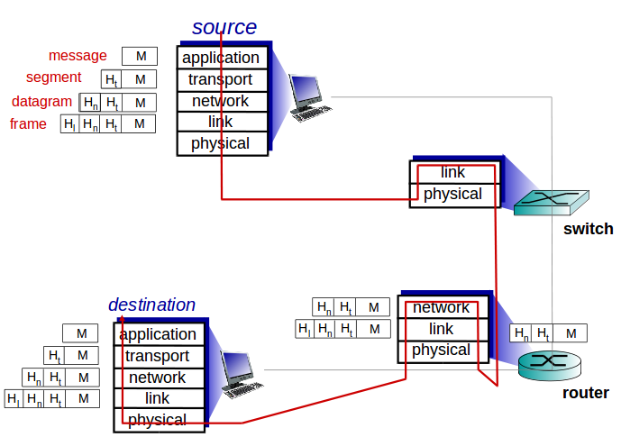

# Chapter 1: Computer Networks and the Internet

## 1.1 What is the Internet?

### 1.1.1 A Nuts-and-Bolts Description

> The **Internet** is a computer network that interconnects hundreds of millions of computing devices.

End systems (**hosts**) are connected together by a network of **communication links** and **packet switches**.

When one end system has data to send to another end system, the sending end system segments the data and adds header bytes to each segment. The resulting **packages** of information are then sent through the network to the destination end system, where they are reassembled into the original data.

A **packet switch** takes a packet arriving on one of its incoming communication links and **forwards** that packet on one of its outgoing communication links. Two most prominent types of packet switch in
today’s Internet are **routers** and **link-layer** switches.

1. Link-layer switches are typically used in access networks,
2. Rrouters are typically used in the network core.

The sequence of communication links and packet switches traversed by a packet from the sending end system to the destination is called a **route** or **path** through the network.

End systems access the Internet through **Internet Service Providers** (**ISPs**). Each ISP is in itself a network of:

1. Packet switches and
2. Communication links

End systems, packet switches, and other pieces of the Internet run **protocols** that control the sending and receiving of information within the Internet. Two most important protocols in the Internet are:

1. The **Transmission Control Protocol** (**TCP**)

2. The **Internet Protocol** (**IP**). 

	Specifies the format of the packets that are sent and received among routers and end systems.

The Internet’s principal protocols are collectively known as **TCP/IP**.

### 1.1.2 A Services Description

> The **Internet** is an infrastructure that provides services to applications.

### 1.1.3 What Is a Protocol?

> A **protocol** defines the format and the order of messages exchanged between
two or more communicating entities, as well as the actions taken by them.

## 1.2 The Network Edge

Hosts are sometimes further divided into two categories: **clients** and **servers**. 

### 1.2.1 Access Networks

The **access network** is the network that physically connects an end system to the first router (also known as the “edge router”) on a path from the end system to any other distant end system. 

#### Home Access: DSL, Cable, FTTH, Dial-Up, and Satellite

Today, the two most prevalent types of broadband residential access are **digital subscriber line** (**DSL**) and **cable**. 

##### 1. DSL Internet access can be obtained from the same local telephone company (telco) that provides its wired local phone access. Thus, when DSL is used, a customer’s telco is also its ISP.

##### 2. Cable Internet access makes use of the cable television company’s existing cable television infrastructure. 

One important characteristic of cable Internet access is that it is a shared broadcast medium: 

* So if several users are simultaneously downloading a video file, the actual rate at which each user receives will be significantly lower than the aggregate cable downstream rate.

* On the other hand, if there are only a few active users, then each of the users may actually receive data at the full cable downstream rate.

* A distributed multiple access protocol is needed to coordinate transmissions and avoid collisions.

An up-and-coming technology that promises even higher speeds is the deployment of **fiber to the home** (**FTTH**).

FTTH distribution networks:

* Direct fiber: one fiber leaving the central office for each home.
* Shared fiber: one fiber leaving the central office for mutilple home.
	Tow competing optical-distribution network architectures that perform this splitting:

		1. **Active optical networks** (**AONs*)
			(LINKTO Ethernet Chapter 5)

		2. **Passive optical networks** (**PONs**)
			* Each home has an optical network terminator (ONT) is connected by dedicated optical fiber to a neighborhood splitter.
			* The splitter combines a number of homes into a single, shared optical fiber.
			* The shared fiber connects to an optical line terminator (OLT) in the telco’s CO.
			* The OLT connects to the Internet via a telco router.

##### 3. A **satellite** link can also be used to connect a residence to the Internet
at speeds of more than 1 Mbps.

##### 4. **Dial-up access** over traditional phone lines is based on the same model as DSL—a home modem connects over a phone line to a modem in the ISP.

#### Access in the Enterprise (and the Home): Ethernet and WiFi

On corporate and university campuses, and increasingly in home settings, a local area network (LAN) is used to connect an end system to the edge router. 

### 1.2.2 Physical Media

Consider a bit traveling from one end system, this bit is transmitted from router to router (**transmitter-receiver pair**) many times to get to the destination. For each transmitter-receiver pair, the bit is sent by propagating electromagnetic waves or optical pulses across a **physical medium** (cable, wire, radio spectrum,... ). 

Physical media fall into two categories:

1. Guided media.
	Waves are guided along a **solid** medium, such as a fiber-optic cable, a twisted-pair copper wire, or a coaxial cable

2. Unguided media.
	waves propagate in the atmosphere and in outer space, such as in a **wireless** LAN or a digital satellite channel.

## 1.3 The Network Core

Two fundamental approaches to moving data through a network of links and switches:

1. Packet Switching.
2. Circuit Switching.

### 1.3.1 Packet Switching

Packet Switching:

* To send a message from a source end system to a destination end system, the source breaks long messages into smaller chunks of data known as **packets**.

* Between source and destination, each packet travels through communication **links** and **packet switches** (for which there are two predominant types, **routers** and **linklayer switches**).

* If a source end system or a packet switch is sending a packet of **L** bits over a link with transmission rate **R** bits/sec, then the time to transmit the packet is **L/R** seconds.

#### Store-and-Forward Transmission

**Store-and-forward transmission**: the packet switch must receive the entire packet before it can begin to transmit the first bit of the packet onto the
outbound link.

Delay formula

> d(end-to-end) = (N-1)*L/R + L/R = N*L/R

Which:
	**N**: number of links or packages.
	**L**: length.
	**R**: tranmission rate.

`(N-1)*L/R` are the time it takes to transmit N packages and `L/R` for forwarding delay.

#### Queuing Delays and Packet Los

Each packet switch has multiple links attached to it. For each attached link, the packet switch has an output buffer (also called an output queue), which stores packets that the router is about to send into that link. 

If an arriving packet needs to be transmitted onto a link but finds the link busy with the transmission of another packet, the arriving packet must wait in the output buffer. This is called **queuing delays**. 

If the buffer is completely full with other packets waiting for transmission, either the arriving packet or one of the already-queued packets will be dropped. This is called **packet loss**. 

#### Forwarding Tables and Routing Protocols

Forwarding process: 

* When a source end system wants to send a packet to a destination end system, the source includes the destination’s IP address in the packet’s header.

* When a packet arrives at a router, the router examines the address and searches its **forwarding table**, using this destination address, to find the appropriate outbound link. 

* Then the router directs the packet to this outbound link.

The Internet has a number of special **routing protocols** that are used to automatically set the forwarding tables. Routing protocols determine the shortest path and use the shortest path results to configure the forwarding tables in the routers.

### 1.3.2 Circuit Switching

Circuit Switching:

* The resources needed along a path to provide for communication between the end systems are reserved for the duration of the communication session.

TODO: Come back to this

### Packet Switching Versus Circuit Switching

Packet switching:

* Not suitable for real-time services.
* Better sharing of transmission capacity.
* Simpler, more efficient, and less costly to implement.
* Allocates link use on demand.

### 1.3.3 A Network of Networks

Users are connected to each other through ISPs and ISPs are also interconnected. This is called a ** network of networks**.

Network structures:

1. **Network Structure 1**, interconnects all of the access **ISPs** with a **single global transit ISP**.

2. **Network Structure 2** consists of the hundreds of thousands of access ISPs and multiple global transit ISPs.
	* Global transit providers (**tier-1 ISPs**):
		* **Regional ISP** provides Interter to access ISPs in the region.
	* Access ISPs

3. **Network Structure 3** is a multi-tier hierarchy.

A **points of presence** (**PoP**) is simply a group of one or more routers (at the same location) in the provider’s network where customer ISPs can connect into the provider ISP. 

**Multi-home** means that ISP can to connect to two or more provider ISPs. 

**Internet Exchange Point** (**IXP**) is a meeting point where multiple ISPs can peer together.

4. **Network Structure 4** consists of:
	Access ISPs, regional ISPs, tier-1 ISPs, PoPs, multi-homing, peering, and IXPs

5. **Network Structure 5** built on top of Network Structure 4 and **content provider networks**.

## 1.4 Delay, Loss, and Throughput in Packet-Switched Networks

### 1.4.1 Overview of Delay in Packet-Switched Networks

**Total nodal delay** formula:

> **Total nodal delay** = **nodal processing delay** + **queuing delay** + **transmission delay** + **propagation delay**

#### Processing Delay

Processing delay:

* Time required to examine the packet’s header and determine where to direct the packet.
* Check for bit-level errors in the packet that occurred in transmitting the packet’s bits.

#### Queuing Delay

Queuing delay it is a delay that occurs when packets wait to be transmitted onto the link.

* If the queue is empty and no other packet is currently being transmitted, then our packet’s queuing delay will be zero.
* On the other hand, if the traffic is heavy and many other packets are also waiting to be transmitted, the queuing delay will be long.

#### Transmission Delay

Since our packet can be transmitted only after all the packets that have arrived before it have been transmitted. Transmission delay is amount of time required to push (that is, transmit) all of the packet’s bits into the link. 

> **Transmission delay** = **L**/**R**

Which:

**L**: packet length (bits)

**R**: transmission rate(bits/sec)

#### Propagation Delay

**propagation delay** is the time required to propagate from the beginning of the link to router B.

> **Propagation delay** = **d**/**s**

Which:

**d**: distance (m)

**s**: speed (m/sec)

#### Comparing Transmission and Propagation Delay

Remember that **transmission delay** does not dependent on physical distance between 2 routers, it based on amount data can be process at a time. On the other hand, **propagation delay** is based on physical length of the two routers.

### 1.4.2 Queuing Delay and Packet Loss

Queuing delay factors:

* Traffic rate arrives at the queue.
* The transmission rate of the link.
* The nature of the arriving traffic
	Whether the traffic arrives periodically or arrives in bursts.

**Traffic intensity** formula:

> **Traffic intensity** = **La**/**R**

Which:

**a**: The average rate at which packets arrive at the queue (packets/sec)

**L**: packages length (bits).

**R**: Tranmission rate.

**Traffic intensity**:
	
	* **La**/**R** > 1:

		- The average rate at which bits arrive at the queue exceeds the rate at which the bits can be transmitted from the queue.
		- Delay is infinity.

	* **La**/**R** <= 1:
		* Packets arrive periodically:

			- If a packet arrives, it will be transmitted before another one arrives.
			- So, very packet will arrive at an empty queue and there will be no queuing delay.

		* Packets arrive in bursts but periodically:

			- The first packet will be transmitted with no queueing delay, but the second one has L/R seconds delay, and the *n*th will have (n-1)*L/R seconds delay.
			- A significant average queuing delay.

		1. **La**/**R** close to 0:

			* Queuing delay is close to 0.

		2. **La**/**R** close to 1:

			* Queuing delay is large.

#### Packet Loss

If a packet arrive and find out that the queue is full, with no place to store such a packet, the router will **drop** that packet and the packet will be **lost**.

### 1.4.3 End-to-End Delay

**End-to-End delay**: (assume that there is no queueing delay since it is more difficult to measure)

> **End-to-End delay** = (**nodal processing delay** + **transmission delay** + **propagation delay**)*N

Which:

	**N**-1: the number of nodes between source and destination.

### 1.4.4 Throughput in Computer Networks

The **instantaneous throughput** at any instant of time is the rate (in bits/sec) at which a host is receiving the file.

Think of bits as *fluid* and communication links as *pipes*. Clearly, the server cannot pump bits through its link at a rate faster than R*s* bps; and the router cannot forward bits at a rate faster than R*c* bps. If Rs < Rc, then the bits pumped by the server will “flow” right through the router and arrive at the client at a rate of R*s* bps, giving a **throughput** of R*s* bps and vice versa. This sittuation is called **bottleneck link**.

**Throughput formula**:

> **Throughput formula** = F/min{R*s*, R*c*}

## 1.5 Protocol Layers and Their Service Models

### 1.5.1 Layered Architecture

#### Protocol Layering

Network designers organize protocols — and the network hardware and software that implement the protocols— in **layers** and each protocol belongs to one of the layers.

Each layer provides its service by:

1. Performing certain actions within that layer, and by
2. Using the services of the layer directly below it

**Drawback of layering**:

1. Duplicate lower-layer functionality.
2. One layer may need information that is present only in another layer.

| Application  |							| Application  |
| Transport    |							| Presentation |
| Network      |							| Session      |
| Link         |							| Transport    |
| Physical     |							| Network      | 
											| Link         |
											| Physical     |

a.  Five-layer IPS 						b.  OSI reference model

Internet protocol stack

##### Internet protocol stack

Five layer:
* Application
* Transport
* Network
* Link
* Physical

###### 1. Application Layer

**Application layer** is where network applications and their application-layer protocols reside.

Application protocols:

* HTTP: Web document request and transfer.
* SMTP: e-mail messages transfer.
* FTP: transfer of files between two end systems.

**Message** is packet of information at the application layer.

###### 2. Transport Layer

The Internet’s **transport layer** transports application-layer messages between application endpoints. 

Transport protocols:

* TCP: provides connection-oriented service to its applications

	- Guarantee delivery 
	- Provides flow control 
	- Breaks long messages into shorter
	- Provides a congestion-control mechanism

* UDP: provides a connectionless service to its applications
	
	- No reliability
	- No flow control
	- No congestion control

**Segment**: a transport-layer packet.

###### 3. Network Layer

The Internet’s **network layer** (simply referred as ** IP layer**) is responsible for moving network-layer packets known as **datagrams** from one host to another. 

Network protocols:

* IP Protocol: 

	- Defines the fields in the datagram as well as how the end systems and routers act on these fields.
	- Only one IP Protocol

* Routing protocols:

	- Determine the routes that datagrams take between sources and destinations.
	- Many routing protocols.

###### 4. Link Layer

The network layer passes the datagram down to the **link layer**, which delivers the datagram to the next node along the route. 

Link-layer protocols:

	* Ethernet
	* WiFi

**Frames**: linklayer packets.

###### 5. Physical Layer

Move individual bits from end to end

##### The OSI Model

Five layers are similar as above.

###### 6. Presentation layer

**Presentation layer** provides services that allow communicating applications to interpret the meaning of data exchanged.

Services:

* Data compression
* Data encryption

###### 7. Session layer

**Session layer** provides for delimiting and synchronization of data exchange, including the means to build a checkpointing and recovery scheme.

### 1.5.2 Encapsulation

Routers and link-layer switches are both packet switches and they do not implement all of the layers in the protocol stack; they typically implement only the bottom layers. 

* Link-layer switches implement layers 1 and 2
* Routers implement layers 1 through 3.

Routers are capable of implementing the IP protocol and links are not.

### 1.6 Networks Under Attack

**Botnet**: compromised devices.

**Self-replicating**: Once it infects one host, from that host it seeks entry into other hosts over the Internet, and from the newly infected hosts, it seeks entry into yet more hosts.

#### Malware

* **Viruses**: malware that require some form of user interaction to infect the user’s device (You have to actually run a application or click on a link that contains virus).
* **Worms**: malware that can enter a device without any explicit user interaction.

#### Server and network attacks

**Denial-of-service** (**DoS**) attacks.

Most Internet DoS attacks fall into one of three categories:

* **Vulnerability attack** 

	This involves sending a few well-crafted messages to a vulnerable application or operating system running on a targeted host. If the right sequence of packets is sent to a vulnerable application or operating system, the service can stop or, worse, the host can crash

* **Bandwidth flooding**

	The attacker sends a deluge of packets to the targeted host—so many packets that the target’s access link becomes clogged, preventing legitimate packets from reaching the server.

* **Connection flooding**

	The attacker establishes a large number of half-open or fully open TCP connections (TCP connections are discussed in Chapter 3) at the target host. The host can become so bogged down with these bogus connections that it stops accepting legitimate connections.

##### Bandwidth-flooding attacks

If the server has an access rate of *R* bps, then the attacker will need to send traffic at a rate of approximately *R* bps to cause damage. If *R* is very large, a single attack source may not be able to generate enough traffic to harm the server. 

In a **distributed DoS** (**DDoS**) attack the attacker controls multiple sources and has each source blast traffic at the target.

#### Packet sniffer

A passive receiver that records a copy of every packet that flies by is called a **packet sniffer**.

#### Attackers can masquerade as someone you trust

The ability to inject packets into the Internet with a false source address is known as **IP spoofing**.