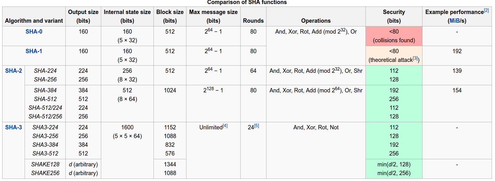

## Chapter 1

### 1.1 Computer security concepts

* **Information Security**: is about how to prevent attacks, or failing that, to detect attacks on information-based systems
* **Computer Security**: generic name for the collection of tools designed to protect data and to thwart hackers
* **Network Security**: measures to protect data during their transmission
* **Internet Security**: measures to protect data during their transmission over a collection of interconnected networks

Three key objectives of computer security:

1. **Confidentiality**:
  * **Data confidentiality**: assures that private or confidential infomation is not made available or disclosed to unauthorized individuals.
  * **Privacy**: Assures that individuals control or influence what information related to them may be collected and stored.
2. **Integrity**:
  * **Data integrity**: Assures that information and programs are changed only in a specified and authorized manner.
  * **System integrity**: Assures that a system performs its intended function in an unimpaired manner.
3. **Availability**: Assures that systems work promptly abd service us not denied to authorized users.

These are called **CIA triad**.

Definitions of a loss for each category:

* **Confidentiality**: Unauthorized disclosure of information.
* **Integrity**: Unauthorized modification or destruction of information.
* **Availability**: The disruption of access to or ues of information or information system.

#### Computer Security Challenges

1. not simple
2. must consider potential attacks
3. procedures used counter-intuitive
4. involve algorithms and secret info
5. must decide where to deploy mechanisms
6. battle of wits between attacker / admin
7. not perceived on benefit until fails
8. requires regular monitoring
9. too often an after-thought
10. regarded as impediment to using system

#### Computer Security vs. Network Security

**Computer Security**: deals with protecting a single machine.
**Network Security**: deals with protecting the communication and all participants in it.

### 1.2 The OSI security architerture

* **Threat**: a potential for violation of security; a possible danger that might exploit a vulnerability.
* **Attack**: an assault on system security that derives from an intelligent threat.

**Security Architecture**:
* Security Attack: Any action that compromises the security of information.
* Security Mechanism: A mechanism that is designed to detect, prevent, or recover from a security attack.
* Security Service: A service that enhances the security of data processing systems and information transfers. A security service makes use of one or more security mechanisms.

### 1.3 Security Attacks


Attacks:

1. **Passive attack** : attempts to learn or make use of information from the system but does not affect system resource.

 * **Release of the message contents**: read the contents of the message
 * **Traffic analysis**: observe the pattern of the massage
2. **Active attack**: attempts to alter system resources or affect their operation
 * **Masquerade**: one entity pretends to be a different entity
 * **Replay**: involves the passive capture of a data unit and its subsequent retransmission to produce an unauthorized effect
 * **Modification of message**: some portion of a legitimate message is altered, or that messages are delayed or reordered.
 * **The denial of service**: prevents or inhibits the normal use or management of communications facilities


* **Interruption**: This is an attack on availability
* **Interception**: This is an attack on confidentiality
* **Modification**: This is an attack on integrity
* **Fabrication**: This is an attack on authenticity

### 1.4 Security Services

* **Authentication**: assurance that the communicating entity is the one claimed
 * **Peer entity authentication**
 * **Data origin authentication**
* **Access control**: the ability to limit and control the access to host systems and application via links.
* **Confidentiality**: the protection of transmitted data from passive attacks
 * **Trafic flow**: the protection of traffic flow, prevents hacker from knowing message's source and destination.
* **Integrity**: assures that messages are received as sent with no duplication, insertion, modification, reordering, or replays.
* **Nonrepudiation**: prevents either sender or receiver from denying a transmitted message.
* **Availability**

### 1.5 Security Mechanisms

* **Encipherment**
* **Digitial Signature**
* **Access control**
* **Data Integrity**
* **Authentication Exchange**
* **Traffice Padding**: the insertion of bits into gaps in data stream to frustrate traffic analysis attemps;
* **Routing Control**: enable selections of physical secure routes.
* **Notarization**: the use of trusted third party to assure center properties for data exchange.

### 1.6 Network Security Model


Four basic tasks in designing a security service:

1. Design a suitable algorithm for the security transformation
2. Generate the secret information (keys) used by the algorithm
3. Develop methods to distribute and share the secret information
4. Specify a protocol enabling the principals to use the transformation and secret information

#### Network Access Security


1. Select appropriate gatekeeper functions to identify users
2. Implement security controls to ensure only authorised users access designated information or resources

## Chapter 2

### Terminologies

* **Plaintext** - original message
* **Ciphertext** - coded message
* **Cipher** - algorithm for transforming plaintext to ciphertext
* **Key** - info used in cipher known only to sender/receiver
* **Encipher** (encrypt) - converting plaintext to ciphertext
* **Decipher** (decrypt) - recovering ciphertext from plaintext
* **Cryptography** - study of encryption principles/methods
* **Cryptanalysis** (codebreaking) - study of principles/ methods of deciphering ciphertext without knowing key
* **Cryptology** - field of both cryptography and cryptanalysis

### 2.1 Symmetric Encryption Principles


Five ingredients for a symmetric encryption scheme:

1. **Plaintext**: original data.
2. **Encryption algorithm**
3. **Secret key**
4. **Ciphertext**: encrypted output from above three ingredient.
5. **Decryption algorithm**

Two requirements for secure use of symmetric encryption:

1. A strong encryption algorithm
2. Sender and receiver muse have obtained copies of secret keys in a secure fashion.

#### Cryptography

Three indepentdent dimemsions of cryptography:

1. The type of operations used for transforming plaintext to ciphertext:
 * **Substitution**: each element in the plaintext is mapped into another element.
 * **Transposition**: elements in plaintext is rearraged.
2. Number of keys used
 * One-key: symmetric, single-key, secret-key, or conventional encryption.
 * Multiply keys: asymmetric, two-key, or public-key encryption.
3. The way in which the plaintext is processed
 * **Block cipher**: one block at a time.
 * **Stream cipher**:

#### Cryptanalysis

* **Unconditional security**:  no matter how much computer power or time is available, the cipher cannot be broken since the ciphertext provides insufficient information to uniquely determine the corresponding plaintext.
* **Computational security**: given limited computing resources (eg time needed for calculations is greater than age of universe), the cipher cannot be broken.

1. **Brute-force attack**: Eve has caught a ciphertext and will try every
 * Possible key to try to decrypt it. This can be made infinitely hard by choosing a large keyspace.
2. **Cryptanalytic attacks**
 * **Cyphertext-only attack**: Eve can gather and analyze C’s to learn K2
  * Encryption algorithm is known
  * Ciphertext to be decoded is known
 * **Known-plaintext attack**
  * Encryption algorithm is known
  * Ciphertext to be decoded is known
  * One or more plaintext-ciphertext pairs formed with the secret key are known
 * **Chosen-plaintext attack**: Mallory can feed chosen messages M into encryption algorithm and look at resulting ciphertexts C. Thus she can attempt to learn either K2 or messages M that produce C.
  * Encryption algorithm is known
  * Ciphertext to be decoded is known
  * Purported message chosen by cryptanalyst, together with its corresponding ciphertext generated with the secret key
 * **Chosen-ciphertext attack**
  * Encryption algorithm is known
  * Ciphertext to be decoded is known
  * Purported ciphertext chosen by cryptanalyst, together with its corresponding decrypted plaintext generated with the secret key
 * **Chosen-text attack**:
  * Encryption algorithm is known
  * Ciphertext to be decoded is known
  * Plaintext message chosen by cryptanalyst, together with its corresponding ciphertext generated with the secret key
  * Purported ciphertext chosen by cryptanalyst, together with its corresponding decrypted plaintext generated with the secret key
3. **Man-in-the-middle attack**:
 * Mallory can modify messages
 * So that they have different meaning – Mallory can drop messages
 * Mallory can replay messages to Alice, Bob or the third party

### 2.2 Ciphers

#### Polyalphabetic Ciphers (Substitution)

**Polyalphabetic Ciphers** a substitution cipher in which the cipher alphabet changes during the encryption process. It  use uses a key to select which alphabet is used for each letter of the message and repeats from start until end of key is reached.

##### Vigenère Cipher

**Vigenère Cipher** is the simplest polyalphabetic substitution cipher:

* Having multiple letters long key, K = k<sub>1</sub> k<sub>2</sub> ... k<sub>i</sub> where i<sup>th</sup> letter specifies i<sup>th</sup> alphabet to use.

Example:
```
 key:       deceptivedeceptivedeceptive

 plaintext: wearediscoveredsaveyourself

 ciphertext:ZICVTWQNGRZGVTWAVZHCQYGLMGJ
```

##### One-Time Pad

If a truly random key as long as the message is used, the cipher will be secure since ciphertext bears no statistical relationship to the plaintext.

If only one of these rules is disregarded, the cipher is no longer unbreakable:

1. The key is at least as long as the message or data that must be encrypted.
2. The key is truly random (not generated by a simple computer function or such)
3. Key and plaintext are calculated modulo 10 (digits), modulo 26 (letters) or modulo 2 (binary)
4. Each key is used only once, and both sender and receiver must destroy their key after use.
5. There should only be two copies of the key: one for the sender and one for the receiver (some exceptions exist for multiple receivers)

#### Transposition Ciphers

Transposition Cipher's properties:

* Rearranging letters order without altering the actual letters used in plaintext.
• Can be recognized since it has the same frequency distribution as the original text.

##### Rail Fence cipher

**Rail Fence cipher**: write message letters out diagonally over a number of rows then read off cipher row by row

Example:

```
Plaintext: MEETMEAFTERTHETOGAPARTY

Cipher process:
m e m a t r h t g p r y

 e t e f e t e o a a t

Ciphertext: MEMATRHTGPRYETEFETEOAAT
```

##### Row Transposition Ciphers

**Row Transposition Ciphers** procedure:

1. Write letters of message out in rows over a specified number of columns.
2. Reorder the columns according to some key before reading off the rows.

```
Key:
            6 3 2 4 1 5
Plaintext:
            W E A R E D
            I S C O V E
            R E D F L E
            E A T O N C
            E Q K J E U
Ciphertext: EVLNE ACDTK ESEAQ ROFOJ DEECU WIREE
```

### 2.2 Symmetric Block Encryption Algorithm

**Diffusion**: dissipates statistical structure of plaintext over bulk of ciphertext.
**Confusion**: makes relationship between ciphertext and key as complex as possible.

#### Feistel Cipher Structure


**Feistel Cipher Structure** partitions input block into two halves, LE<sub>0</sub> and RE<sub>0</sub>
1. Each round *i* has has as inputs LE<sub>i-1</sub> and RE<sub>i-1</sub> from previous round as well as K<sub>i</sub> derived from K and a subkey generator algorithm.
2. A substitution is performed on the left half by applying a *round function* F to the right half and then taking the XOR kf the output of that function and the left half.
3. Permutation is performed which is consists of the interchange of the 2 halves.

All block ciphers used **Feistel Cipher Structure** as a general structure. Parameters for feature design:

* Block size: the larger the more secured. Common size: 128 bits.
* Key size: the larger the more secured. Common size: 128 bits.
* Number of rounds: the larger the more secured. Common size: 10-16 rounds.
* Subkey generation algorithm: the more complex the more secured.
* Round function: same as above.

Other considerations:

* Fast software en/decryption
* Ease of analysis

#### Data Encryption Standard

**Data Encryption Standard***:

* Used 64-bit data blocks
* 56-bit key, but only subkey is only 48 bits since 8 bits are for bit check function.
* 16 rounds processing
* Has initial and final permutation


Single round of DES


Single round structure of DES:

* Uses two 32-bit L & R halves
* As for any Feistel cipher can describe as:
 L<sub>i</sub> = R<sub>i–1</sub>
 R<sub>i</sub> = L<sub>i–1</sub> ⊕ F(R<sub>i–1</sub>, K<sub>i</sub>)
* F takes 32-bit R half and 48-bit subkey:
 * Expands R to 48-bits using permutation E
 * Ddds to subkey using XOR
 * Passes through 8 S-boxes to get 32-bit result
 * Finally permutes using 32-bit perm P

**Avalanche Effect**:

1. The output changes significantly (e.g., half the output bits flip) as a result of a slight change in input (e.g., flipping a single bit)
2. In "quality" block ciphers, such a small change in either the key or the plaintext should cause a strong change in the ciphertext.

#### Double-DES

Use 2 DES encrypts on each block: C = E<sub>K2</sub>(E<sub>K1</sub>(P))

##### Issue

Since X = E<sub>K1</sub>(P) = D<sub>K2</sub>(C), hackers can attack by encrypting P with all keys and store and then decrypt C with keys and match X value.

Only takes twice as long to break double DES using brute force => 2<sup>57</sup>

#### Triple-DES with Two-Keys

**Triple-DES with Two-Keys** uses 3 encryptions and 2 keys in sequence  E-D-E.

C = E<sub>k1</sub>(D<sub>k2</sub>(E<sub>k1</sub>(P)))

k1 must differ from k2 since if so, D<sub>k2</sub>(E<sub>k1</sub>(P)) = D<sub>k1</sub>(E<sub>k1</sub>(P)) = P

**Triple-DES with Three-Keys**

Similar to **Triple-DES with Two-Keys** but uses 3 keys

C = E<sub>k3</sub>(D<sub>k2</sub>(E<sub>k1</sub>(P)))

#### Advanced Encryption Standard (AES)

**AES** properties:

* Secret key symmetric block cipher.
* 128-bit data, 128/192/256-bit keys.
* Stronger & faster than Triple-DES.


**AES** specifications:

* AES does not use Feistel structure.
* Data block of 4 columns of 4 bytes is state.
* Key is expanded to an array of 44 words. 4 of them make up a round key.
* Both cipher and decipher begin with **Add round key** stage.
* Has 9/11/13 rounds in which state undergoes:
 * Byte substitution (1 S-box used on every byte)
 * Shift rows (permute bytes between groups/columns) mix columns (subs using matrix multipy of groups)
 * Mix columns: a substitution that alters each byte in a column as a function of all of the bytes in the column.
 * Add round key (XOR state with key material).
* Last round only has 3 stages.

#### Other Symmetric Block Ciphers

**International Data Encryption Algorithm**

* 128-bit key
* Used in PGP

**Blowfish**

* High execution speed
* Run in less than 5K of memory

**RC5**

* Suitable for hardware and software
* Fast, simple
* Adaptable to processors of different word lengths
* Variable number of rounds
* Variable-length key
* Low memory requirement
* High security
* Data-dependent rotations

### 2.4 Stream Ciphers

Stream cipher properties:

* The longer the period of repeat, the more secured
* Statistically random.
* Depends on large enough key.

#### RC4


**RC4** outline:

1. Initial State of **S**(state vector, initialized from key) and **T** (temporary vector)

 * **S**: a permutation of 8-bit numbers from 0 to 255.
```
/* Initialization of S and T */
for i = 0 to 255 do
 S[i] = i
 T[i] = K[i mod keylen])
```

2. Initial permutation of S

```
j = 0
for i = 0 to 255 do
 j = (j + S[i] + T[i]) mod 256
 swap (S[i], S[j])
```

3. Stream generation

```
/*stream generation */
i = j = 0
for i = 0 to 255 do
 j = (j + S[i]) mod 256
 swap(S[i], S[j])
 t = (S[i] + S[j]) mod 256
 k = S[t]

 Ci = Pi XOR k     // cipher
 Di = Ci XOR k     // or decipher
```

To encrypt, XOR the value k with the next byte of plaintext. To decrypt, XOR it with the next byte of the ciphertext.

Key is only used in first step

### 2.5 Cipher Block Modes of Operation

#### 1. Electronic Codebook (ECB)

Message is broken into independent blocks which are encrypted with same key.

Each block is encoded independently of the other blocks. C<sub>i</sub> = DES<sub>K1</sub>(P<sub>i</sub>)

**Codebook**: for a given, there is an unique ciphertext for b-bit block of plaintext.

If the same b-bit block appear repeatively, it always produce same ciphertext.

Uses: secure transmission of single values

#### 2. Cipher Block Chaining (CBC)


Same key is used for all blocks.

The input to the encryption is the XOR of the current plaintext abd the preceding ciphertext. Therefore, repeating patterns of b-bit are not exposed.

**Initial vector (IV)** must be known by sender and receiver and should be protected as well as key.

#### 3. Cipher FeedBack (CFB)

Using **Cipher FeedBack**, a block cipher can be transmitted to stream cipher.


#### 4. Counter (CTR)


### 2.6 Placement of Encryption

Two major placement alternatives:

1. Link encryption
 * Encryption occurs independently on every link
 * Implies must decrypt traffic between links
 * Requires many devices and keys
2. End-to-end encryption
 * Encryption occurs between original source and final destination
 * Need devices at each end with shared keys
 * Must leave headers in clear so network can correctly route information
 * Hence although contents protected, traffic pattern flows are not

Therefore, link encryption occurs at layers 1 or 2, end-to-end can occur at layers 3, 4, 6, 7

## Chapter 3: Public-key cryptography and message authentication

### 3.1. Theories

**Prime factorization** of a number `n` is when its written as a product of primes.

Two numbers are **relatively prime** if they have no common divisors apart from 1.

#### 3.1.1 Fermat's theorem

a<sup>p-1</sup> = 1 (mod p)

where `p` is prime and `gcd(a,p)=1`

Also

a<sup>p</sup> = a (mod p)

#### 3.1.2 Euler totient function

A number `n` has **complete set of residues** is :0..n-1.

**Reduced set of residues**: residues which are relatively prime to n

Number of elements in reduced set of residues is called the **Euler Totient Function ø(n)**

ø(n) is calculated as:
* For p (p prime): ø(p) = p -1
* For P*q (p,q prime): ø(p*q) = (p-1) * (q-1)

#### 3.1.3 Euler's Theorem

a<sup>ø(n)</sup> = 1 (mod 1)

for any `a, n` where `gcd(a, n) = 1`.

Example:

a = 3; n =10; ø(10) = ø(2*5) = (2-10) * (5-1) = 4

Hence 3<sup>4</sup> = 81 = 1 mod 10

#### 3.1.4 Primality Testing


### 3.2. Public-Key Cryptography

**Public-Key Cryptography** is developed to address two key issues:
* Key distribution – how to have secure communications in general without having to trust a KDC with your key
* Digital signatures – how to verify a message comes intact from the claimed sender

#### 3.2.1 Application for public-key cryptography

**Public-Key Cryptography** can be used in 3 categories:
* Encryption/decryption
* Digital signatures (provide authentication)
* Key exchange (of session keys)

#### 3.2.2 Requirements for public-key cryptography

Requirements:

1. Computationally easy for a party B to generate a pair (public key KUb, private key KR<sub>b</sub>)
2. Easy for sender to generate ciphertext: C = E<sub>KUb</sub>(M)
3.  Easy for the receiver to decrypt ciphertext using private key: M = D<sub>KRb</sub>(C) = DD<sub>KRb</sub>[ED<sub>KRb</sub>(M)]
4. Computationally infeasible to determine private key (KR<sub>b</sub>) knowing public key (KU<sub>b</sub>)
5. Computationally infeasible to recover message M, knowing KU<sub>b</sub> and ciphertext C
6. Either of the two keys can be used for encryption, with the other used for decryption: M D [E (M )] D [E (M )]

#### 3.2.3 Public-key cryptography algorithms

##### RSA

Key generation process:

1. Select p,q:       p and q both prime
2. Calculate:        n = p x q
3. Calculate:        Φ (n) = ( p − )(1 q − )1
4. Select integer e: gcd( Φ(n), e ) = 1; 1 < e < Φ(n)
5. Calculate d:      d = e<sup>-1</sup> mod Φ(n)
6. Public Key:       KU = {e,n}
7. Private key:      KR = {d,n}

Encryption:

1. Obtains public key of recipient PU={e,n}
2. Computes: C = M<sup>e</sup> mod n, where 0≤M<n

Decryption:

1. Uses their private key PR={d,n}
2. Computes: M = C<sup>d</sup> mod n

##### Example:

Key generation:

1. Select primes: `p` = 17 & `q` = 11
2. Compute `n` = `pq` = 17 x 11 = 187
3. Compute ø(`n`)=(`p`–1)(`q`-1)= 16 x 10 = 160
4. Select `e`: `gcd(e,160)` = 1; choose e = 7
5. Determine `d`: `de` = 1 mod 160 and `d` < 160 . Hence, `d` = 23 since 23 x 7 = 161 = 10 x 160 + 1
6. Publish public key `PU`={7,187}
7. Keep secret private key `PR`={23,187}

Given message M = 88 (88 < 187)

Encryption:

1. Obtains public key: `PU` = {7,187}
2. Computes: `C` = M<sup>e</sup> mod n = 88<sup>7</sup> mod 187 = 11

Decryption:
1. Uses their private key `PR` = {23,187}
2. Computes: `M` = C<sup>d</sup> mod n = 11<sup>23</sup> mod 187 = 88

##### RSA Security

Possible approaches to defeat RSA:
* Brute force key search.
* Refactoring `n` into two primes.

##### Diffie-Hellman Key Exchange

A public-key distribution scheme:
* cannot be used to exchange an arbitrary message
* rather it can establish a common key
* known only to the two participants

##### Diffie-Hellman Setup

Diffie-Hellman Setup:
* All users agree on global parameters:
  * A large prime number q
  * An integer a that is a primitive root of q
* Each user (eg. A) generates their key
  * Chooses a private key (number): x<sub>A</sub> < q
  * Compute their public key: y<sub>A</sub> = a<sup>x<sub>A</sub></sup> mod q
* Each user makes public that key y<sub>A</sub>

##### Diffie-Hellman Key Exchange

Shared session key for users A & B is KAB:
K<sub>AB</sub> = a<sup>x<sub>A</sub>.x<sub>B</sub></sup> mod q
= y<sub>A</sub><sup>x<sub>B</sub></sup> mod q (which B can compute)
= y<sub>B</sub><sup>x<sub>A</sub></sup> mod q (which A can compute)

K<sub>AB</sub> is used as session key in symmetric-key encryption scheme btw Alice and Bob

##### Example

* Users Alice & Bob who wish to swap keys:
* Agree on prime q=353 and a=3
* Select random secret keys:
  * A chooses x<sub>A</sub>=97, B chooses x<sub>B</sub>=233
* compute respective public keys:
  * y<sub>A</sub>=397 mod 353 = 40 (Alice)
  * y<sub>B</sub>=3233 mod 353 = 248 (Bob)
* compute shared session key as:
  * K<sub>AB</sub> = y<sub>A</sub><sup>x<sub>B</sub></sup> mod 353 = 24897 = 160 (Alice)
  * K<sub>AB</sub> = y<sub>B</sub><sup>x<sub>A</sub></sup> mod 353 = 40233 = 160 (Bob)

### 3.3. Digital signatures

### 3.4. Authentication

Requirements - must be able to verify that:

1. Message came from apparent source or author
2. Contents have not been altered
3. Sometimes, it was sent at a certain time or sequence.

**Approaches to Message Authentication**:
* Authentication Using Conventional Encryption
  * Only the sender and receiver should share a key
* Message Authentication without Message Encryption
  * An authentication tag is generated and appended to each message
* Message Authentication Code
  * Calculate the MAC as a function of the message and the key. MAC = F(K, M)

**Message Authentication Code (MAC)**:
* Generated by an algorithm that creates a small fixed-sized block
* Is appended to message as a signature
* Receiver performs same computation on message and checks it matches the MAC
* Provides assurance that message is unaltered and comes from sender

**MAC Properties**:
* MAC is a cryptographic checksum: MAC = C<sub>K</sub>(M)
  * A variable-length message M.
  * A secret key K
* Many-to-one function

### 3.5 Secure Hash function

Six properties of a HASH function:

1. Can be applied to any sized message M
2. Produces fixed-length output h
3. Easy to compute `h=H(M)` for any message M
4. Given `h` is infeasible to find `x` s.t. `H(x)=h`
5. Given `x` is infeasible to find `y` s.t. `H(y)=H(x)`
  * Weak collision resistance
6. Infeasible to find any `x`,`y` s.t. `H(y)=H(x)`
  * Strong collision resistance

#### 3.5.1 Secure Hash Algorithm (SHA)




**SHA-512** processing steps:

1. **Append padding bits**: the message is padded so that its length is congruent to 896 modulo 1024. Padding is always added, even if the message is already of the desired length.
2. **Append length**: a block of 128 bits is a appended. This block contains the length of the original message.
3. **Initialize hash buffer**: A 512 buffer is used to hold intermediate and final results of hash function. The buffer can be represented as 8 64-bit register (a, b, c, d, e, f, g, h)
4. **Process the message**: 80 processing rounds. Each takes input as 512-bit buffer
5. **Output**:
