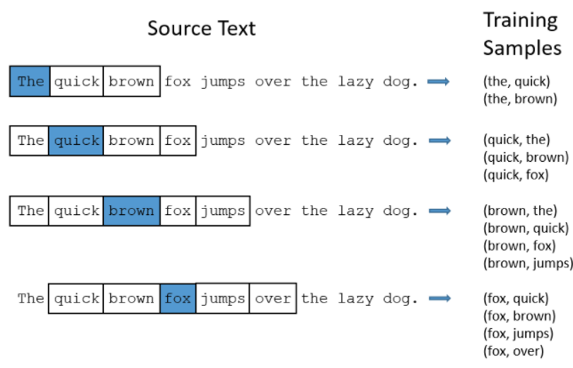
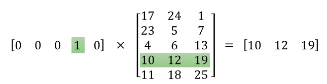
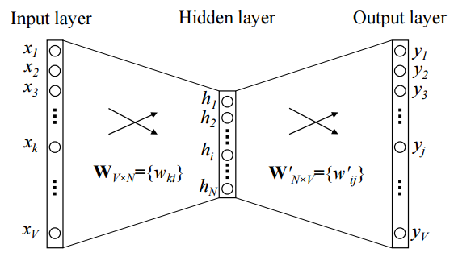
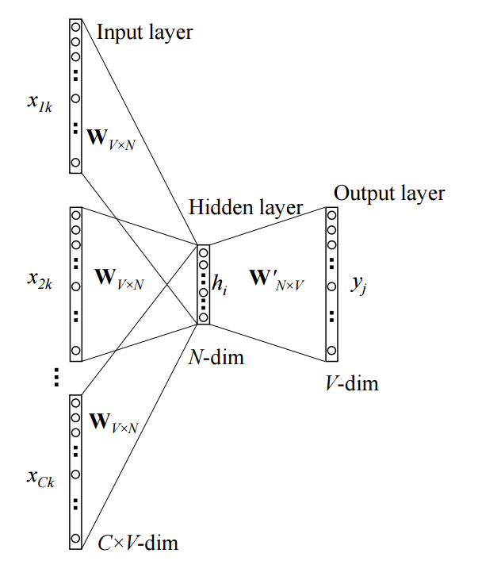

# Neural Networks

## 1. Word2Vec

### 1.1 Introduction

In a sense, Word2Vec tries to map human words to a vector space in which related or requently used words are located near to each other. A group of nearby or related words can be called a **Bag of Words**.

#### Word2Vec features

TODO: This section is personal perception

Bags of words are useful in predicting the next word in a setence. For example, image you are given a short phrase, "United States ___ America", a normal human being would be able to fill in the blank relatively easy. As a human, we look at nearby words of the missing and do a quick prediction.  

Word2Vec is relatively similar to above perspective. It also looks at nearby words, which is words that are in its **window size** hyperparameter, to group words together.

For example, a Word2Vec system can form a bag of words of "cat", "kitten", "dog", and "puppy" because they are all dosmestic animals.  

### 1.2 Terminologies

**Window size**: defines number of nearby words on one side of the word in a con text.

**Input**: a one-hot `n`-dimensional vector where `n` is the number of unique words. So, each input represents a word.

**Output**: a one-hot `n`-dimensional vector in training stage becaue we need  it to only represent a single word. But when evaluate the trained network the output will actually be a probability distribution vector which show all possible words, not just one.

Since the ouput is a `n`-dimensional vector for every iteration, the number of possible output sequence grows exponentially. To prevent this growth, we use a technique called **pruning** to eliminate majority of words and only keep ones high probability.

### 1.3 Skip Gram

For example, we tries to design and 2-layers skip gram model with `N` neurons in the hidden layers to map a text with a dictionary of size `V`

### 1.3.1 The Hidden Layer

Since we have `v` neurons in the input layer and `h` in the hidden, the weight matrix size between these two is `N`x`V`. Assume the network gets an input `x` as xk = 1 and xk' = 0 for k != k', we have:

<strong>h = xW = W(k,·)</strong>

Which technically copies a row of the weight matrix and uses it as activations for the hidden layer. So, the hidden layer acts as a lookup table. It sort of maps the original `V`-dimensional plane to a context `N`-dimentional plane to feed in the the output layer. Think of it as a word with no context and a word with context.

### 1.3.2 The Output Layer

The output layer for Skip Gram model is similar to normal neural network.

<strong>o = hW</strong>

## 1.4 Continuous Bag-of-Word Model

### 1.4.1 One-word context

Our assuption for this study is that the network only predicts one target word for each given context word.

Example of a CBOW model:

Where:
* `V`: size of the dictionary (number of unique words).
* `x`: `V`-dimentional input vector. xi value of `x` and ith position. The input is a one-hot encoded vector.
* `h`: `N`-dimensional vector represent neurons in hidden layer.
* `y`: `V`-dimentional output vector.
* `W`, `W'`: weights between layers. 

Denote row `i` of W as <strong>vwT</strong>. Assume the network gets an input `x` as xk = 1 and xk' = 0 for k != k', we have

<strong>h = WTx = WT(k,·) := vTwI</strong>

NOTE: some sections left out

### 1.4.2 Multi-word context

Example of a Multi-word CBOW model:

So the hidden layer is computed as:

<strong>h = WT(x1 + x2 + ... + xC) / C</strong>

## 2. Recurrent Neural Networks (RNNs)

One problem with vanilla neural nets and convolution neural nets is that they are fixed in term of input size, output size, and computational steps. For these types of network, for each input, a network will only produce one output which is undesirable in many fields such as Naural Language Processing (NPL). In NLP, one input usually requires multiple output values. For example, consider a word is a one hot N-dimensional vecor where N is the number of unique word in the entire dictionary.

TODO

## 3. Long Short Term Memorys (LSTMs)

## 4 Learning and Evaluation

### 4.1 Update functions

#### 4.1.1 Gradient descent

<strong>v = - learning_rate * dx</strong>

#### 4.1.2 Momentum update

The idea of momentum is based on previous gradient changes. For example, if the gradients have been going toward a certain direction (e.g same sign) for several time steps, it knows that the about-to-compute probably to go in that direction. So this method saves time by adding momentum for it so that gradients move faster toward convergence point.  

Because of the feature above momentum update usually overshoots but overall much better than vanila GD 

<strong>v = mu * v - learning_rate * dx</strong>
<strong>x += v</strong>

Where:
* `v`: gradient update (gradients velocity). 
* `mu`: momentum value, from 0 to 1, hyperparameter. Common values: 0.5, 0.9, 0.95, 0.99 but normally 0.9

> With Momentum update, the parameter vector will build up velocity in any direction that has consistent gradient.

#### 4.1.3 Nesterov Accelerated Gradient (nag)

This is an advanced version of Momentum. As explained before, the momentum sort of predicts where gradients are heading and adds some value to help they move faster. **nag** takes the same idea but it computes gradients at the predicted state instead of the current state.

<strong>
xahead = x + mu * v

v = mu * v - learning_rate * dxahead

x += v
</strong>

<strong>v_prev = v</strong>

<strong>v = mu * v - learning_rate * dx</strong>

<strong>x = -mu * v_prev + (1 + mu) * v</strong>

Vanila momentum computes gradients at current state (red dot) vs Nesterov computes at predicted state (the point at the end of green arrow)

In all methods above, learning rate is independent from the the network result and changes periodicaly with the same amount which require tuning learning rate. Many methods these days try to solve this problem by introducing result-driven learning rate. 

#### 4.1.4 AdaGrad update

AdaGrad ([Adaptative Gradient](http://www.jmlr.org/papers/volume12/duchi11a/duchi11a.pdf)): an adaptive learning rate method.

<strong>cache += dx2</strong>

<strong>x += -learning_rate * dx / sqrt(cache)</strong>

Notice that the weights that receive high gradients will have their effective learning rate reduced, while weights that receive small or infrequent updates will have their effective learning rate increased.

The main drawback of this method is that `cache` increases too aggressive, hence, the network stops learning too early.

#### 4.1.5 RMSprop

To utilize AdaGrad, Geoff Hinton proposed a method that effectively reduce AdaGrad's aggressiveness.

<strong>cache += decay_rate * cache + (1 - decay_rate) * dx2</strong>

<strong>x += -learning_rate * dx / sqrt(cache)</strong>

`decay_rate`: hyperparameter, typical values: 0.9, 0.99, 0.999

#### 4.1.6 Adam (Adadelta)

RMSProp with momentum. Another thing is that instead of using dx for the final update, `Adadelta` sort of smoothens the gradients by applying adaptative gradient

<strong>
m = beta1*m + (1-beta1)*dx

v = beta2*v + (1-beta2)*(dx**2)

x += - learning_rate * m / (np.sqrt(v) + eps)
</strong>

### 4.2 Annealing the learning rate 

Note: this section is taken directly from [cs231-neural networks 3](http://cs231n.github.io/neural-networks-3/)

In training deep networks, it is usually helpful to anneal the learning rate over time. Good intuition to have in mind is that with a high learning rate, the system contains too much kinetic energy and the parameter vector bounces around chaotically, unable to settle down into deeper, but narrower parts of the loss function. Knowing when to decay the learning rate can be tricky: Decay it slowly and you’ll be wasting computation bouncing around chaotically with little improvement for a long time. But decay it too aggressively and the system will cool too quickly, unable to reach the best position it can. There are three common types of implementing the learning rate decay:

* **Step decay**: Reduce the learning rate by some factor every few epochs. Typical values might be reducing the learning rate by a half every 5 epochs, or by 0.1 every 20 epochs. These numbers depend heavily on the type of problem and the model. One heuristic you may see in practice is to watch the validation error while training with a fixed learning rate, and reduce the learning rate by a constant (e.g. 0.5) whenever the validation error stops improving.
* **Exponential decay**: has the mathematical form <strong>α=α0e−kt</strong>, where <strong>α0,k</strong> are hyperparameters and tt is the iteration number (but you can also use units of epochs).
* **1/t**: decay has the mathematical form <strong>α=α0/(1+kt)α=α0/(1+kt)</strong> where a0,ka0,k are hyperparameters and tt is the iteration number.

In practice, we find that the step decay dropout is slightly preferable because the hyperparameters it involves (the fraction of decay and the step timings in units of epochs) are more interpretable than the hyperparameter kk. Lastly, if you can afford the computational budget, err on the side of slower decay and train for a longer time.

## Appendix A: Common terminologies

**ϴ**:

**μ** (Mu): Momentum value

**v**: Gradient update

**ϵ** (Epsilon):

**ϕ**: Updated weights

## References

[word2vec Parameter Learning Explained](http://www-personal.umich.edu/~ronxin/pdf/w2vexp.pdf)

[The Unreasonable Effectiveness of Recurrent Neural Networks](http://karpathy.github.io/2015/05/21/rnn-effectiveness/)

[Adam](https://arxiv.org/pdf/1412.6980v9.pdf)