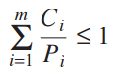
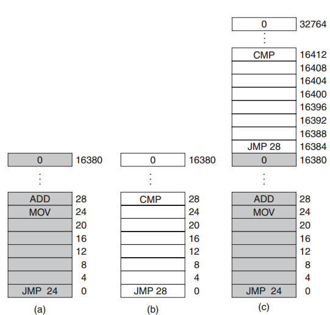
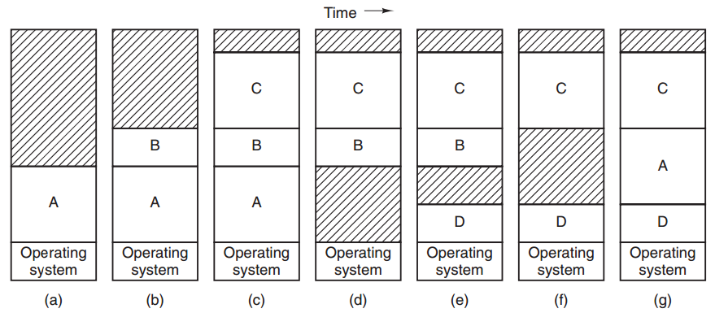
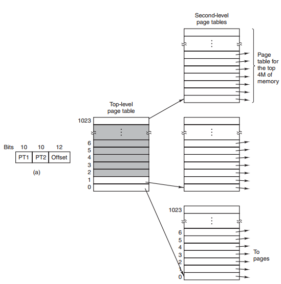

# Modern Operating Systems

---
## Chapter 2


### 2.3 INTERPROCESS COMMUNICATION

Three issues with **InterProcess Communication** (**IPC**):

1. How one process can pass information to another.
2. Making sure two or more processes do not get in each other’s way.
3. Proper sequencing

#### 2.3.3 Mutual Exclusion with Busy Waiting

##### The Test and Set Lock (TSL) Instruction

```
TSL RX,LOCK
```

1. Read the content at the memory address of lock into register `RX`.
2. Store a non-zero value at the memory address of `LOCK`.

Locking the memory bus is very different from disabling interrupts.

**Disabling interrupts** on processor 1 has no effect at all on processor 2.
**Locking memory bus** does not allow on processors to access the memory.

Use TSL to solve race condition:

1. When lock = 0, any process may set lock = 1 by using TSL instruction and go to its critical section.
2. When the process finish its critical section, set lock = 0 using the original move instruction.

```
enter region:
	TSL REGISTER,LOCK 			// copy lock to register and set lock to 1
	CMP REGISTER,#0				// was lock zero?
	JNE enter region			// if it was not zero, lock was set, so loop
	RET 						// return to caller; critical region entered
leave region:
	MOVE LOCK,#0 				// store a 0 in lock
	RET 						// return to caller
```

#### Busy waiting problems

Both Peterson’s solution and the TSL solution can solve race condition but they use a tight loop waiting to get into critical section which is wasting CPU time and cause **Priority Inversion problem**. 

Priority Inversion problem with busy waiting method:

* A computer with two processes P0 with high priorities, and P1 with low priorities.
* The scheduling rules are such that P0 get CPU time whenever it is in ready state.
* At a time moment, P1 is in critical section.
* P0 become to ready state. P0 posse CPU time and start to run.
* Since P1 is in critical section, P0 run busy waiting forever since P1 does not have a chance to get CPU time to finish its critical section.

#### 2.3.4 Sleep and Wakeup

Sleep and wakeup:

* Instead of busy waiting, it goes to sleeping state.
* Once a process finish its Critical section, it calls wakeup function which allows one of sleeping process get into its critical section.

##### The Producer-Consumer Problem

The **producer-consumer problem** (**bounded-buffer problem**):

* Two processes share a common, fixed-sized buffer.
* Producer puts information into the buffer, and consumer takes it out.
* When the producer wants to put a new item in the buffer, but it is already full.

	* Go to sleep, awakened by customer when customer has removed one or more items

* When the consumer tries to take a item from the buffer, but buffer is already empty.

	* Go to sleep, awakened by producer when producer has puts one or more items into buffer.

```cpp
void producer(void)
{
	int item;
	while (TRUE) { 								/* repeat forever */
		item = produce item( ); 				/* generate next item */
		if (count == N) sleep( ); 				/* if buffer is full, go to sleep */
		inser t item(item); 					/* put item in buffer */
		count = count + 1; 						/* increment count of items in buffer */
		if (count == 1) wakeup(consumer); 		/* was buffer empty? */
	}
}
void consumer(void)
{
	int item;
	while (TRUE) { 								/* repeat forever */
		if (count == 0) sleep( ); 				/* if buffer is empty, got to sleep */
		item = remove item( ); 					/* take item out of buffer */
		count = count − 1; 						/* decrement count of items in buffer */
		if (count == N − 1) wakeup(producer); 	/* was buffer full? */
		consume item(item); 					/* print item */
	}
}
```

Problems:

1. Initially buffer is empty, `count = 0`.
2. The consumer just reads `count = 0`, since the consumer’s CPU time is over, scheduler assigns a CPU time to producer.
3. Producer produces item and checks count, `count = 0`. Insert item to buffer.Increase `count = count +1`. Now, since `count = 1`, it calls wakeup(consumer). Since the consumer is not sleeping yet, consumer misses the wakeup signal.
4. Consumer gets CPU time. Consumer already read `count = 0`, consumer goes to sleep.
5. Producer keep produce items and finally buffer become full. The producer go to sleep. Both sleep forever.

Quick fix by adding wakeup waiting bit:

* When a wakeup is sent to a consumer that is still awake, this bit is set.
* When the consumer tries to go to sleep:
	* If the wakeup waiting bit is on, it will be turned off, but the process will stay awake.

### 2.3.5 Semaphores

> **Semaphore** is integer variable type that counts the number of wakeups saved for future use. 

Two operations on semaphores (generalizations of **sleep** and **wakeup**):

1. Down

	* Checks to see if the value is greater than 0:

		* If so, it decrements the value (i.e., uses up one stored wakeup) and just continues.
		* If the value is 0, the process is put to `sleep` without completing the `down` for the moment.
2. Up 

	* Increments the value of the semaphore addressed.
	* If one or more processes were sleeping on that semaphore (unable to complete an earlier down operation) one of them is chosen by the system and is allowed to complete its down.

Checking the value, changing it, and possibly going to sleep, are all done as a single, indivisible **atomic action**.

```cpp
#define N 100 							/* number of slots in the buffer */
typedef int semaphore;					/* semaphores are a special kind of int */
semaphore mutex = 1; 					/* controls access to critical region */
semaphore empty = N; 					/* counts empty buffer slots */
semaphore full = 0; 					/* counts full buffer slots */

void producer(void)
{
	int item;
	while (TRUE) { 						/* TRUE is the constant 1 */
		item = produce item( ); 		/* generate something to put in buffer */
		down(&empty); 					/* decrement empty count */
		down(&mutex); 					/* enter critical region */
		inser t item(item); 			/* put new item in buffer */
		up(&mutex); 					/* leave critical region */
		up(&full); 						/* increment count of full slots */
	}	
}
void consumer(void)
{
	int item;
	while (TRUE) {						/* infinite loop */
		down(&full); 					/* decrement full count */
		down(&mutex);					/* enter critical region */
		item = remove item( ); 			/* take item from buffer */
		up(&mutex); 					/* leave critical region */
		up(&empty); 					/* increment count of empty slots */
		consume item(item); 			/* do something with the item */
	}
}
```

> Semaphores that are initialized to 1 and used by two or more processes to ensure that only one of them can enter its critical region at the same time are called **binary semaphores** (semaphore that only has 2 values).

### 2.3.6 Mutexes

> A **mutex** is a shared variable that can be in one of two states: unlocked or locked.

When a thread (or process) needs access to a critical region, it calls **mutex lock**:

* If the mutex is currently unlocked (meaning that the critical region is available), the call succeeds and the calling thread is free to enter the critical region.

* If the mutex is already locked, the calling thread is blocked until the thread in the critical region is finished and calls mutex unlock.

* If multiple threads are blocked on the mutex, one of them is chosen at random and allowed to acquire the lock.

### 2.3.7 Monitors

> A **monitor** is a collection of procedures, variables, and data structures that are all grouped together in a special kind of module or package.

In monitor, only one process can be active in a monitor at any instant. Monitor uses **conditional variables** along with two operations on them, wait and signal.

When a monitor procedure discovers that it cannot continue (e.g., the producer finds the buffer full), it does a *wait* on some condition variable. This action causes the calling process to block.

On the other hand, the consumer can wake up its sleeping partner by doing a *signal* on the condition variable that its partner is waiting on.

This can cause two active processes at the same time so Hoare and Brinch Hansen proposed two solutions:

* Hoare: Letting the newly awakened process run, suspending the other one.
* Hansen: Requiring that a process doing a signal must exit the monitor immediately. If a signal is done on a condition variable on which several processes are waiting, only one of them, determined by the system scheduler, is revived.

## 2.4 SCHEDULING

When a computer is multiprogrammed, it frequently has multiple processes or threads competing for a CPU at the same time. If only one CPU is available, *scheduler* has to be made which process to run next by using **scheduling algorithm**. 

### 2.4.1 Introduction to Scheduling

In addition to picking the right process to run, the scheduler also has to worry about making efficient use of the CPU because process switching is expensive.

* First a switch from user mode to kernel mode must occur
* The state of the current process must be saved, including storing its registers in the process table so they can be reloaded later.
* A new process must be selected by running the scheduling algorithm.
* Then the memory management unit must be reloaded with the memory map of the new process.
* Finally, the new process must be started.
* In addition, the process switch may invalidate the memory cache and related tables, forcing it to be dynamically reloaded from the main memory twice.

##### Process Behavior

Process that spend most of their time computing are called **compute-bound** or **CPU-bound**, and processes that spend most of their time waiting for I/O are called **I/O bound**. 

##### When to Schedule

Situations in which scheduling is needed:

1. When a new process is created, a decision needs to be made whether to run the parent process or the child process.
2. When a process exits, some other process must be chosen from the set of ready processes
3. When a process blocks on I/O, on a semaphore, or for some other reasons.
4. When an I/O interrupt occurs.

Two categories of scheduling algorithms with respect to how they deal with clock interrupts:

1. A nonpreemptive scheduling algorithm picks a process to run and then just lets it run until it blocks or voluntarily releases the CPU.
2. A preemptive scheduling algorithm picks a process and lets it run for a maximum of some fixed time.

##### Categories of Scheduling Algorithms

Different scheduling algorithms are needed in different environments. Three environments worth distinguishing are:

1. Batch:

	* Nonpreemptive algorithms, or preemptive algorithms with long time periods for each process, are often acceptable
	* Reduces process switches and thus improves performance

2. Interactive:

	* With interactive users, preemption is essential to keep one process from hogging the CPU and denying service to the others

3. Real time:

	* Preemption is, oddly enough, sometimes not needed because the processes know that they may not run for long periods of time and usually do their work and block quickly

##### Scheduling Algorithm Goals

Some goals for a scheduling algorithm:

* All systems

	* Fair ness - giving each process a fair share of the CPU
	* Policy enforcement - seeing that stated policy is carried out
	* Balance - keeping all parts of the system busy

* Batch systems

	* Throughput - maximize jobs per hour
	* Turnaround time - minimize time between submission and termination
	* CPU utilization - keep the CPU busy all the time

* Interactive systems

	* Response time - respond to requests quickly
	* Propor tionality - meet users’ expectations

* Real-time systems

	* Meeting deadlines - avoid losing data
	* Predictability - avoid quality degradation in multimedia systems

#### 2.4.2 Scheduling in Batch Systems

##### First-Come, First-Served

Basically, there is a single queue of ready processes. All incomming processes will be push into the queue and executed in order.

Strengths:

* Easy to understand and equally easy to program
* Fair in the same sense that allocating scarce resources

Weaknesses:

* If some biggest requests come first the average delay will be very high

##### Shortest Job First

The scheduler picks the **shortest job first** (the process that can be done in the shortest time)

It is worth pointing out that shortest job first is optimal only when all the jobs are available simultaneously. Jobs arrive at different time, the scheduler only picks the shortest job available at a time which might not be optimal.

##### Shortest Remaining Time Next

A preemptive version of shortest job first is **shortest remaining time next**. With this algorithm, the scheduler always chooses the process whose remaining run time is the shortest. This scheme allows scheduler to pick the optimal solution.

#### 2.4.3 Scheduling in Interactive Systems

##### Round-Robin Scheduling

Round-Robin: each process is assigned a time interval, called its **quantum**, during which it is allowed to run. If the process is still running at the end of the quantum, the CPU is preempted and given to another process. If the process has blocked or finished before the quantum has elapsed, the CPU switching is done when the process
blocks, of course. 

One issue with Round-Robin is the length of quantum. 

* If the length of quantum is too short, scheduler has to switch from process to process in a very short period of time and switching operation is both unuseful and resource-consumming.

* If the length of quantum is too long, the whole system will experience delays since other processes have to wait for the running process to finish.

Setting the quantum too short causes too many process switches and lowers the CPU efficiency, but setting it too long may cause poor response to short interactive requests. 

##### Priority Scheduling

The basic idea is straightforward: each process is assigned a priority, and the runnable process with the highest priority is allowed to run. Even on a PC with a single owner, there may be multiple processes, some of them more important than others

To prevent high-priority processes from running indefinitely, the scheduler may decrease the priority of the currently running process at each clock tick which causes its priority to drop below that of the next highest process, so a process switch occurs.

Ways to define process priority:

* Internal way: based on the measurable quantity or quantities to compute the priority of a process.
* External way: based on the importance of the process

One problems with priority scheduling is the **Starvation** of lower priority process. Processes with lowest priority might never be executed if higher priority processes keep comming.

But it can be solved using **aging**. A aging is a technique of gradually increasing the priorities of processes that wait in the system for a long time.

### 2.4.4 Scheduling in Real-Time Systems

A real-time system is one in which time plays an essential role. Typically, one or more physical devices external to the computer generate stimuli, and the computer must react appropriately to them within a fixed amount of time.

Real-time systems are generally categorized as **hard real time**, meaning there are absolute deadlines that must be met—or else!— and **soft real time**, meaning that missing an occasional deadline is undesirable, but nevertheless tolerable. 

The events that a real-time system may have to respond to can be further categorized as **periodic** (meaning they occur at regular intervals) or **aperiodic** (meaning they occur unpredictably).

A real-time system is said to be **schedulable** if  



Where:

**m**: number of periodic events 
Event **i** occurs with period **Pi** and requires **Ci** sec of CPU time

Real-time scheduling algorithms can be:

* **Static**: make their scheduling decisions before the system starts running

	* Works only when there is perfect information available in advance about the work

* **Dynamic**: make scheduling decisions at run time, after execution has started

## Chapter 3: MEMORY MANAGEMENT

**Memory hierarchy**:

* Small, fast, very expensive registers,
* Volatile, expensive cache memory,
* Megabyte medium-speed, medium-speed RAM
* Huge size of slow cheap, non-volatile disk storage (Hard Disks)

**Memory management** is a part of operating system which manage the memory hierarchy. Its job is to efficiently manage memory: keep track of which parts of memory are in use, allocate memory to processes when they need it, and deallocate it when they are done.

### 3.1 NO MEMORY ABSTRACTION

Three options to organize memory:

* Operating system at the bottom of memory in RAM.
* OS in ROM (Read-Only Memory) at the top of memory.
* The device drivers may be at the top of memory in a ROM and the rest of the system in RAM down below


Models (a) and (c) have the disadvantage that a bug in the user program can wipe out the operating system, possibly with disastrous results.

##### Running Multiple Programs Without a Memory Abstraction

However, even with no memory abstraction, it is possible to do multiprogramming if the operating system saves the entire contents of memory to a disk file, then bring in and run the next program. This concept is called **swapping**.

With the addition of some special hardware, it is possible to run multiple programs concurrently, even without swapping. The early models of the IBM 360 solved the problem as follows. Memory was divided into 2-KB blocks and each was assigned a 4-bit protection key held in special registers inside the CPU. A machine with a 1-MB memory needed only 512 of these 4-bit registers for a total of 256 bytes of key storage. The PSW (Program Status Word) also contained a 4-bit key. The 360 hardware trapped any attempt by a running process to access memory with a protection code different from the PSW key. Since only the operating system could change the protection keys, user processes were prevented from interfering with one another and with the operating system itself.

The core problem here is that the two programs reference absolute physical
memory but what they actually mean is relative memory of the program as the following.



In this case, the program 2 (figure b), JMP to 28 which does CMP. But when loaded to memory, JMP to 28 means doing MOV instruction of program 1 (figure 1).

To solve this problem, the OS will automatically was loaded at address 16,384, 28 will be added to every program address during the load process so the instruction JMP 28 would be JMP 16,412 instead.

### 3.2 A MEMORY ABSTRACTION: ADDRESS SPACES

Exposing physical memory to processes has several major drawbacks:

* If user programs can address every byte of memory, they can easily trash the operating system, intentionally or by accident, bringing the system to a grinding halt
* It is difficult to have multiple programs running at once

#### 3.2.1 The Notion of an Address Space

> An **address space** is the set of addresses that a process can use to address memory. Each process has its own address space, independent of those belonging to other processes

##### Base and Limit Registers

The classical solution is to equip each CPU with two special hardware registers, usually called the **base** and **limit** registers.

When these registers are used, programs are loaded into consecutive memory locations wherever there is room and without relocation during loading.

When a process is running, the base register is loaded with the physical address where its program begins in memory and the limit register is loaded with the length of the program.

So in the last example, program 1 will have base and limit as 0 and 16,384, respectively, program 2 will have base and limit as 16,384 and 32,768, respectively. So that when the process run `JMP 28` it will be treated as `JMP 16412`.

In practice, the total amount of RAM needed by all the processes is often much more than can fit in
memory. Keeping all processes in memory all the time requires a huge amount of memory and cannot be done if there is insufficient memory.

Two general approaches to dealing with memory overload:

* **Swapping**: bringing in each process in its entirety, running it for a while, then putting it back on the disk. Idle processes are mostly stored on disk, so they do not take up any memory when they are not running.
* **Virtual memory**: allows programs to run even when they are only partially in main memory

#### 3.2.2 Swapping

There are two ways to allocate memory:

* **Fixed partition**: For each process, a fixed sized partition will be created in memory.

	* Fixed location, size, and number of processes in memory.
	* Simple to manage.

* **Variable partition**: 

	* The number, location, and size of the partitions vary dynamically
	* Need to keep track of partition information dynamically for memory allocation and deallocation
	* Might create multiple memory holes.

Since processes usually change theirs size variable partition is needed but it introduces another problem as shown below.



When swapping creates multiple holes in memory, it is possible to combine them all into one big one by moving all the processes downward as far as possible, which is known as **memory compaction**. But it is usually not done because it requires a lot of CPU time.

Solution for glowing space:

* Allocate extra memory for each process
* Use adjacent hole for managing the growing size
* If there is not enough room for a process to grow, it will be swapped out for killed.

#### 3.2.3 Managing Free Memory

When memory is assigned dynamically, the operating system must manage it and there are two ways to keep track of memory usage:

* Bitmaps
* Free lists

##### Memory Management with Bitmaps

With a bitmap, memory is divided into allocation units as small as a few words and as large as several kilobytes. Corresponding to each allocation unit is a bit in the bitmap, which is 0 if the unit is free and 1 if it is occupied. 

Issues with bitmap design:

* The smaller the allocation unit, the larger the bitmap.
* The larger the allocation unit, the smaller bitmap – But memory may be wasted in the last unit of the process if the process size is not an exact multiple of the allocation unit.

Advantage:

* Simple way to keep track of memory words in a fixed amount of memory

The main problem: 

* To allocate memory for the process with k unit size, the memory manager must search the bitmap to find a run of k consecutive 0 bits in the map and this is a slow operation.

##### Memory Management with Linked Lists

Another way of keeping track of memory is to maintain a linked list of allocated and free memory segments, where a segment either contains a process or is an empty hole between two processes. 

Each entry in the list specifies:

* A hole (H) or process (P)
* The address at which it starts
* The length
* A pointer to the next item.

Advantage: When a process terminates or is swapped out, updating the list is straightforward

When the processes and holes are kept on a list sorted by address, several algorithms can be used to allocate memory for a created:

* **First fit**: 
	
	* The memory manager scans along the list of segments until it finds a hole that is big enough.
	* The hole is then broken up into two pieces, one for the process and one for the unused memory.
	* Fast because it searches as little as possible.

* **Next fit**:
	
	* Like first fit but it starts searching the list from the place where it left off last time instead of always at the beginning, as first fit does.

* **Best fit**:

	* Searches the entire list, from beginning to end, and takes the smallest hole that is adequate.
	* Slower than the previous two because it has to search the whole list.
	* Waste more memory because it tends to create tiny, useless hole, while holes in the previous two can be used for short process.

* **Worst fit**:

	* Contrast to best fit, it take the largest available hole, so that the new hole will be big enough to be useful.
	* Not a very good idea either.

Four algorithms can be speed up by maintaining two lists: 

1. A list for processes: as discussed above.
2. A list for holes:  can be maintained with sorted by size. Best fit does not need search entire list.

With a hole list sorted by size, first fit and best fit are equally fast, and next fit is pointless.

Another allocation algorithm is **quick fit**, which maintains separate lists for some of the more common sizes requested. Quick fit is quick to finding a hole of required size but it also has the a disadvantage, maintain the separate lists for hole is expensive.

#### 3.3.1 Paging

On computers with virtual memory, when a program generate **virtual addresses**, the virtual addresses will be sent to a **MMU (Memory Management Unit)**  that maps the virtual addresses onto the physical memory address.

Example:

A computer generates 16-bit addresses (0 - 64KB). However, this computer only has 32KB of physical memory, so although it can handle 64KB but only 32KB of them can be loaded into memory at a time. Therefore, 64KB has to be written on the disk and devided into small pieces and those pieces can be brought in as needed.

The virtual address space consists of fixed-size units called **pages** and corresponding units in the physical memory are called **page frames**. The two are generally the same size. Assume that every page and page frame is 4KB so that we will have 64/4 = 16 pages and 32/4 = 8 page frames

**Page fault** is a sittuation in which a program references to an unmapped address. In this case the OS will pick a page with little useage and replace it with the unmapped address.

With a 16 pages and 4KB per page memory, we need 16-bit virtual address consists of 4-bit page number (2^4 = 16 pages) and 12-bit offset (2^12 = 4KB)

The page number is used as an index into the **page table**.  If the **Present/absent bit** is 0, the OS will remap page frame. If it is 1, the OS will find the corressponding address and put onto the memory bus.

#### 3.3.2 Page Tables

The mapping of virtual addresses onto physical address:

1. The virtual address is split into a virtual page number and
2. An offset

The page number is used to find corresponding page frame and offset is to find physical address.

##### Structure of a Page Table Entry

A typical page table entry:

1. Page frame number
2. Present/absent bit
3. Protection bits: what kinds of access are permitted
4. Modified bit. If the page has been modified, it will be written to the disk before is removed from page frame. If not, it can just be abandoned.
5. Referenced bit  is set whenever a page is referenced, either for reading or for writing. This bit is used to determine which page is evicted when a page fault occurs.
6. Cache disable bit

#### 3.3.3 Speeding Up Paging

Two issues which paging:

1. The mapping from virtual address to physical address must be fast.
2. If the virtual address space is large, the page table will be large.

##### Translation Lookaside Buffers

Using paging reduces the performance of computer since it requires additional reference to access page table. To tackle this perform, computer designers use a device called **TLB (Translation Lookaside Buffer)** or sometimes an **associative memory**.

How TLB works:

* When a virtual address is presented to the MMU for translation, the hardware check if its virtual page number is in TLB.
* If a match is found and the protection bit is not violated, the page frame is taken from TLB without going to the page table.
* If a match is found but the protection bit is violated, a protection fault is generated.
* If no match is found, MMU detects the miss and does an ordinary page table lookup. Then it wil replace one entry with the entry it looked up earlier.

#### 3.3.4 Page Tables for Large Memories

##### Multilevel Page Tables

Example:

We have 32-bit virtual address which is devided into 3 partitions: a 10-bit PT1 field, a 10-bit PT2 field, and a 12-bit Offset.

Since there are 12 bits offset, each page is 4KB and there are 2^10*2^10 = 2^20 of them

The point for having mutiple page table is to avoid keeping all the page table in memory all the time. 



In the figure above, the top-level contains 1024 entries. Assume a process needs 12 megabytes: the bottom
4 megabytes of memory for program text, the next 4 megabytes for data, and the top 4 megabytes for the stack. Therefore, we only need 3 entries from the top level page table. These entries reference to 3 second-level page tables which will be used as indexes for page frame. 

Example: Address space: 0x00403004 (0000000001 0000000011 000000000100) contains PT1: 1 (0000000001), PT2: 3 (0000000011), and offset 4 (000000000100).

It is possible for PT1 and PT2 to have different sizes and a page-table system can also be expanded to three or four level

### 3.4 PAGE REPLACEMENT ALGORITHMS

When a page fault occurs, the operating system has to choose a page to evict to make room for a new one. If the page is modified in the memory, it must be written to the disk before removed. If it is not modified, a new page will overwrite it.

#### 3.4.1 The Optimal Page Replacement Algorithm

The **optimal page replacement algorithm**: the page that will not be used for the longest period of time should be removed

This approach guarantee the optimal solution but impossible most the time since there is no way to OS can know about future usage.

#### 3.4.2 The Not Recently Used Page Replacement Algorithm

To collect useful page usage statistic, we can have two status bits:

* R is set whenever the page is referenced
* M is set when the page is written to

When a page fault occurs, the operating system inspects all the pages and divides them into four categories based on the current values of their R and M bits:

* Class 0: not referenced, not modified.
* Class 1: not referenced, modified.
* Class 2: referenced, not modified.
* Class 3: referenced, modified.

The NRU algorithm removes a page at random from the lowest numbered nonempty class.

#### 3.4.3 The First-In, First-Out (FIFO) Page Replacement Algorithm

The operating system maintains a list of all pages currently in memory, with the most recent arrival at the tail and the least recent arrival at the head. On a page fault, the page at the head is removed and the new page added to the tail of the list. 

This approach is rarely used since the oldest page may still be useful.

#### 3.4.4 The Second-Chance Page Replacement Algorithm

A simple modification to FIFO that avoids the problem of throwing out a heavily used page is to inspect the R bit of the oldest page. If it is 0, the page is both old and unused, so it is replaced immediately. If the R bit is 1, the bit is cleared, the page is put onto the end of the list of pages, and its load time is updated as though it had just arrived in memory. Then the search continues.

If every page is referenced the oldest will be evicted since the R bit is cleared when a page is moved.

#### 3.4.5 The Clock Page Replacement Algorithm

A modification of the second chance. Clock page replacement algorithm keeps all pages in a circular list so that a page does not need to be moved around like in the second chance.

#### 3.4.6 The Least Recently Used (LRU) Page Replacement Algorithm

**LRU (Least Recently Used)** paging: when a page fault occurs, throw out the page that has been unused for the longest time.

This approach yield almost optimal solution but create a lot overhead since maintaining a linked list of page, updating it, removing element from it every memory reference is time-consuming.

