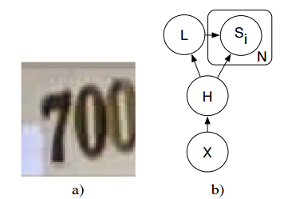

# Multi-digit Number Recognition from Street View Imagery using Deep Convolutional Neural Networks

## 1. Introduction

Key contributions of this paper are: 
1. a unified model to localize, segment, and recognize multidigit numbers from street level photographs. 
2. a new kind of output layer, providing a conditional probabilistic model of sequences. 
3. empirical results that show this model performing best with a
deep architecture. 
4. reaching human level performance at specific operating thresholds.

## 2. Related work

Omitted

## 3. Problem description

Omitted

## 4. Methods

Let **S** represent the output sequence and **X** represent the input image. Our goal is then to learn a model of **P(S | X)** by maximizing **log P(S | X)** on the training set.

To model **S**, we define **S** as a collection of N random variables S1, . . . , SN representing the elements of the sequence and an additional random variable **L** representing the length of the sequence. We assume that the identities of the separate digits are independent from each other, so that the probability of a specific sequence s = s1, . . . , sn is given by:

> P(S = s|X) = P(L = n | X) Πni=1 P(Si = si| X).

**L** has only 7 values (0, . . . , 5, and "more than 5") and each of the digit variables has 10 possible values.

**H**: input features extracted from X by a convolutional neural network.

Therefore, the model can be depicted as **P(S | X) = P(S | H)**.

To train the model, one can maximize log P(S | X) on the training set using a generic method like stochastic gradient descent. Each of the softmax models (the model for L and each Si) can use exactly the same backprop learning rule as when training an isolated softmax layer, except that a digit classifier softmax model backprops nothing on examples for which that digit is not present.

At test time, we predict:

> s = (l, s1, . . . , sl) = argmaxL,S1,...,Sl log P(S | X).

We then incrementally add up the log probabilities for each character. For each length **l**, the complete log probability is given by this running sum of character log probabilities, plus **log P(l | x)**. The total runtime is thus O(N).

We preprocess by subtracting the mean of each image.

## 5. Experiments

### 5.1 Public Street View House Numbers dataset

The Street View House Numbers (SVHN) dataset:  200k street numbers, along with bounding boxes for individual digits, giving about 600k digits total.

Preprocessing method:

1. Find the small rectangular bounding box that will contain individual character bounding boxes.
2. Expand this bounding box by 30% in both the x and the y direction, crop the image to that bounding box and resize the crop to 64 × 64 pixels.
3. Crop a 54 × 54 pixel image from a random location within the 64 × 64 pixel image.

This means we generated several randomly shifted versions of each training example, in order to increase the size of the dataset. Without this data augmentation, we lose about half a percentage point of accuracy. Because of the differing number of characters in the image, this introduces considerable scale variability – for a single digit street number, the digit fills the whole box, meanwhile a 5 digit street number will have to be shrunk considerably in order to fit.

Our best architecture consists of eight convolutional hidden layers, one locally connected hidden layer, and two densely connected hidden layers. All connections are feedforward and go from one layer to the next (no skip connections):

* The first hidden layer contains maxout units (with three filters per unit) while the others contain rectifier units 
* The number of units at each spatial location in each layer is [48, 64, 128, 160] for the first four layers and 192 for all other locally connected layers. The fully connected layers contain 3,072 units each.
* Each convolutional layer includes max pooling and subtractive normalization.
* The max pooling window size is 2 × 2. The stride alternates between 2 and 1 at each layer, so that half of the layers don’t reduce the spatial size of the representation.
* All convolutions use zero padding on the input to preserve representation size.
* The subtractive normalization operates on 3x3 windows and preserves representation size. 
* All convolution kernels were of size 5 × 5. 
* We trained with dropout applied to all hidden layers but not the input

### 5.2 Internal Street View data

We use automated method (beyond the scope of this paper) to estimate the centroid of each house number, then crop to a 128 × 128 pixel region surrounding the house number. We do not rescale the image because we do not know the extent of the house number

The network must also localize the house number, rather than merely localizing the digits within each house number. Also, because the training set is larger in this setting, we did not need augment the data with random translations

On this task, due to the larger amount of training data, we did not see significant overfitting like we saw in SVHN so we did not use dropout.

All hidden units were rectifiers.

Our best architecture for this dataset is similar to the best architecture for the public dataset, except we use only five convolutional layers rather than eight.

The locally connected layers have 128 units per spatial location, while the fully connected layers have 4096 units per layer.