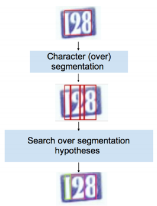

# Reading Digits in Natural Images with Unsupervised Feature Learning

### 6.2 Automatic detection and recognition of House Numbers in Street View images

Stages:
* Use a slidingwindow classifier based on a set of elementary features computed from image intensities and gradients (see [Large-scale Privacy Protection in Google Street View](https://static.googleusercontent.com/media/research.google.com/en//archive/papers/cbprivacy_iccv09.pdf))
* The building number detections are then sent to the recognition module which uses the character classification models described in section 3.1. The building number recognition module is based on a two-step character segmentation/classification approach commonly used for line recognition in Optical Character Recognition systems (see [The OCRopus Open Source OCR System](http://www.helsinki.fi/~mpsilfve/ocr_course/materials/2008-breuel-ocropus-open-source.pdf)). Input to the recognizer are the house-number patches obtained by cropping detection boxes from the full Street View images.  To handle larger rotations, affine/perspective distortions due to non-frontal shots or slanted fonts, a preliminary rectification/deskewing processing step would be needed
* The recognition consists of two steps:
  1. Character segmentation: where we find a set of candidate vertical boundaries between characters
  2. Character hypothesis search, where we incrementally search left-to-right the breakpoints pairs, for each pair evaluating the character classifier on the patch having the breakpoints as left and right boundaries, and for each evaluation keeping the top scoring character classes.

In order to limit memory and computational requirements, recognition is performed with a Beam Search approach [28], a modification to Breadth First search where at each step the number of open paths is bounded to the top-N according to an heuristic score function. Devising a good score function is crucial for the success of the approach: In our case the path score is computed from a combination of character classifier scores and a geometry-model score based on deviation of character bounding boxes sizes from a set of reference sizes obtained from typical fonts.