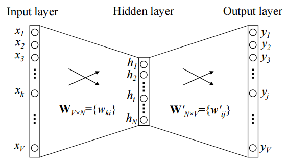
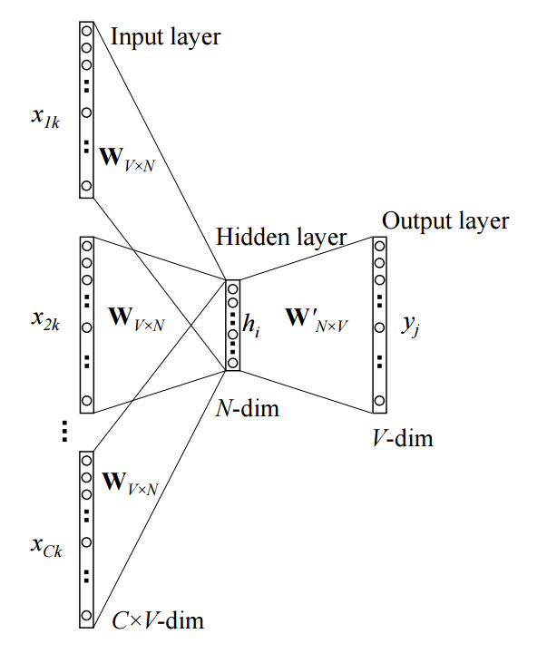

# word2vec Parameter Learning Explained

## 1 Continuous Bag-of-Word Model

### 1.1 One-word context

Our assuption for this study is that the network only predicts one target word for each given context word.

Example of a CBOW model:

Where:
* `V`: size of the dictionary (number of unique words).
* `x`: `V`-dimentional input vector. xi value of `x` and ith position. The input is a one-hot encoded vector.
* `h`: `N`-dimensional vector represent neurons in hidden layer.
* `y`: `V`-dimentional output vector.
* `W`, `W'`: weights between layers. 

Denote row `i` of W as <strong>vwT</strong>. Assume the network gets an input `x` as xk = 1 and xk' = 0 for k != k', we have

<strong>h = WTx = WT(k,·) := vTwI</strong>

NOTE: some sections left out

### 1.2 Multi-word context

Example of a Multi-word CBOW model:

So the hidden layer is computed as:

<strong>h = WT(x1 + x2 + ... + xC) / C</strong>

## 2 Skip-Gram Model

In this model, the hidden layer behaves as a lookup table just like in one-word context CBOW

[Souce](http://www-personal.umich.edu/~ronxin/pdf/w2vexp.pdf)